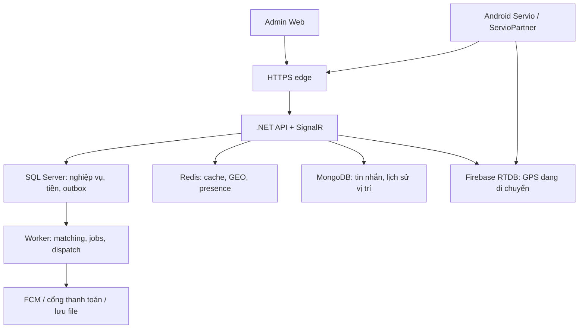

# SERVIO — KẾ HOẠCH PHÁT TRIỂN PHẦN MỀM

**Ứng dụng đặt dịch vụ sửa chữa & chăm sóc tại nhà (On-demand Home Service Marketplace)**

| Thuộc tính | Giá trị |
| --- | --- |
| Tên sản phẩm | Servio |
| Phiên bản tài liệu | v1.4 — thêm phạm vi đồ án đến 17/11/2026 (mục 0.2), sửa lỗ hổng nghiệp vụ và mâu thuẫn trên nền v1.3 |
| Loại tài liệu | Software Development Plan (SDP) + Technical Specification |
| Đối tượng đọc | Coding agent (AI), Dev team, PM, QA |
| Nền tảng | Android (Kotlin, MVVM, XML), Admin Web Dashboard, Backend ASP.NET Core (.NET 10) |
| Thị trường | Việt Nam |
| Nhóm thực hiện (đồ án) | Hà Cảnh Minh Hoàng (2415053122219) · Trần Đình Nguyên (2415053122225) · Nguyễn Hữu Hiệp (2415053122218) |

---

> **Cập nhật v1.4 — 25/09/2026:** (1) thêm **mục 0.2 — Phạm vi đồ án đến 17/11/2026** cho nhóm 3 người: luồng lõi end-to-end, stack rút gọn (ASP.NET Core .NET 10 + SQL Server + SignalR + FCM, admin Razor Pages, bản đồ OpenStreetMap, OTP cố định khi demo); trong phạm vi đồ án, mục 0.2 được ưu tiên hơn các mục khác. (2) Sửa ba lỗ hổng nghiệp vụ phát sinh từ v1.3: đơn tranh chấp UNPAID_CASH không chiếm slot nhận việc; khoản CREDIT của đối tác tự cấn trừ nợ hoa hồng; Finance đảo riêng phí huỷ mang theo khi khách chỉ không trả phần này. (3) Nâng .NET 8 lên .NET 10 LTS vì .NET 8 hết hỗ trợ ngày 10/11/2026. (4) Ước lượng lại S5 bị quá tải (tách S5b), sửa các chỗ không nhất quán và gắn nhãn *(Dữ liệu minh họa)* cho số liệu tự đặt. Chi tiết tại Phụ lục E. Kế hoạch thực hiện theo mốc môn học nằm ở `README.md`.

> **Cập nhật v1.3 — 24/09/2026:** ba thay đổi nghiệp vụ, đã sửa đồng bộ ở mục 0.1, 2, 5, 6, 7, 8, 10 và ghi tại Phụ lục C.2: (1) đơn COD hoàn tất ngay khi khách xác nhận/auto-confirm, hệ thống tự ghi công nợ hoa hồng, đối tác báo "Khách chưa thanh toán" để mở dispute; bỏ bước đối tác tự xác nhận đã thu tiền; (2) phí huỷ khách chưa trả được cộng vào đơn kế tiếp, sàn **không** ứng trước tiền bù, đối tác gốc chỉ nhận khi phí đã thu thật; thêm "Khách không có mặt"; (3) check-in vẫn chặn cứng GPS, thêm chặn vị trí giả/Play Integrity và đường mở khoá bằng khách xác nhận khi GPS không đạt. Xác nhận nhận đơn 10 phút giữ nguyên v1.2.

> **Cập nhật v1.2 — 22/09/2026:** rà soát toàn bộ bản v1.1, sửa trực tiếp các mục mâu thuẫn và bổ sung hợp đồng còn thiếu. Giữ Trang chủ tập trung đăng yêu cầu, không gợi ý đối tác/banner, theo dõi đơn bằng nút tròn mở rộng. Các quyết định thống nhất ở mục 0.1; bảng chỉ rõ vấn đề trước sửa và cách xử lý ở Phụ lục C. Đây là đặc tả đã hiệu chỉnh; chưa phải kết quả triển khai hay kiểm thử ứng dụng.

## 0. HƯỚNG DẪN SỬ DỤNG TÀI LIỆU (dành cho AI coding agent)

Tài liệu này được viết để một agent khác có thể "cầm và code" mà không cần hỏi lại. Quy ước bắt buộc:

1. **Hợp đồng thống nhất**: mục 0.1 chốt phạm vi; mục 2 chốt nghiệp vụ; mục 5–6 hiện thực nghiệp vụ bằng dữ liệu/API; mục 7–10 phải dùng cùng hợp đồng. Không dùng thứ tự ưu tiên DB → API để bỏ qua mâu thuẫn. Khi thay đổi, cập nhật đồng thời các mục liên quan và trường hợp kiểm thử.
2. **Quy ước đặt tên**:
   - Database (SQL Server): bảng `PascalCase` số nhiều (`ServiceRequests`), cột `PascalCase`, khóa chính `Id` kiểu `uniqueidentifier` (GUID do backend sinh bằng `Guid.CreateVersion7()` trên .NET 10; vẫn sắp xếp theo `CreatedAt, Id`, không suy thứ tự từ GUID), khóa ngoại `<Entity>Id`.
   - API: path `kebab-case`, số nhiều, prefix `/api/v1/`. JSON body `camelCase`.
   - Kotlin: package `vn.servio.<module>.<feature>` theo cấu trúc mục12 (core chia common/network/domain/data/...); class PascalCase, XML snake_case.
   - C#: namespace `Servio.<Module>.<Layer>`.
3. **Thứ tự triển khai khuyến nghị**: Backend (Domain → EF Core Migration → API) → Android core/shared module → Customer module → Partner module → Admin Web → Realtime → Payment.
4. **Enum SQL lưu `tinyint`/`int`, API dùng chuỗi HOA_GẠCH_DƯỚI.** MongoDB dùng chuỗi cho enum; `Roles` API là mảng lấy từ `UserRoles`. `SystemConfigs.Key` là ngoại lệ cho quy tắc PK GUID; AdministrativeUnits có Id GUID và Code dữ liệu nguồn.
5. **Đơn vị tiền tệ**: VND, kiểu `decimal(18,2)` trong DB, `long` (số nguyên đồng) trong API/JSON. Không dùng `float/double` cho tiền. Mọi số tiền có phần thập phân bằng 0; làm tròn hoa hồng đến 1 đồng bằng `AwayFromZero` ở cấp assignment rồi cộng tổng.
6. **Thời gian**: lưu `datetimeoffset` UTC trong DB, truyền ISO-8601 có offset trong API. Hiển thị theo `Asia/Ho_Chi_Minh` ở client.
7. **Toạ độ**: `decimal(9,6)` cho latitude/longitude; cột `geography` vật lý được cập nhật cùng transaction, SRID 4326, dùng spatial index. `latitude` trong [−90, 90], `longitude` trong [−180, 180].
8. **Định danh**: `userId` luôn là `Users.Id`; `customerId` là `CustomerProfiles.Id`; `partnerId`/`partnerProfileId` là `PartnerProfiles.Id`; `assignmentId` là `OrderAssignments.Id`. Không hoán đổi các ID này. API tiền dùng số nguyên; tỷ lệ, tọa độ và điểm số được phép dùng số thập phân.
9. **Thay đổi có điều kiện**: mọi ví dụ UI/UC thuộc P1/P2 chỉ bật khi server công bố capability tương ứng; client không tự bật tính năng từ cấu hình local.
10. **Phạm vi đồ án (v1.4)**: khi triển khai đồ án đến 17/11/2026, mục 0.2 quyết định phần được làm, stack và nghiệp vụ rút gọn. Nếu mục 0.2 khác các mục khác, áp dụng mục 0.2; các mục khác giữ vai trò đặc tả cho hướng phát triển thực tế. Mã chức năng, mã màn hình, số endpoint và tên bảng vẫn dùng chung để tra cứu chéo.

---

### 0.1. Các quyết định thống nhất (v1.2, cập nhật v1.3)

| Chủ đề | Quyết định áp dụng xuyên suốt |
| --- | --- |
| Mô hình chính | Khách đăng việc → đối tác đủ điều kiện báo giá/chat → khách chấp nhận báo giá → đối tác xác nhận nhận đơn. Trang chủ không phải danh sách lựa chọn đối tác. |
| Phạm vi MVP (S1–S5) | Post & Quote, đúng 1 đối tác/đơn, COD, sổ công nợ và hoa hồng, chat, tracking, phát sinh, huỷ có phí, khiếu nại cơ bản, đánh giá. P0 không phụ thuộc ví nạp tiền hoặc cổng online. |
| P1 | VNPay/đối soát/hoàn tiền qua cổng và HOLD/RELEASE tối thiểu (S6), payout (S7), công cụ vận hành nâng cao/TrustScore (S8), nhiều đối tác, voucher, Instant Booking (S9), media video và các tiện ích theo mục 9. |
| P2 | Ví nạp/chi tiêu tự do, VoIP/ẩn số, bảo hành bằng đơn con, các thử nghiệm chưa đủ hợp đồng. Không có màn/API hoạt động trước khi đặc tả riêng được chốt. |
| Nhiều đối tác | Một lần chọn nguyên tử 1–`maxPartners` báo giá, tạo 1 Order và N assignment. Không thêm/bù người vào đơn đã tạo. Hủy một assignment không hủy phần việc của người khác. |
| Mốc thời gian | Đối tác xác nhận trong 10 phút từ lúc tạo assignment; auto-confirm sau 24h từ lúc mọi assignment còn hiệu lực báo xong; được mở dispute sớm trong lúc thực hiện và đến hết 72h sau `Orders.CompletedAt`; thời điểm hoàn tất thanh toán không bị reset khi đóng dispute. |
| Giữ thu nhập | Thu nhập online ở HOLD đến `CompletedAt + 72h`; dispute/hoàn tiền đang xử lý ngăn giải ngân. Không thu tiền cọc trước khi làm (từ v1.2). |
| Phí huỷ | Khách: trước di chuyển 0 đ; đang di chuyển 20.000 đ/assignment; đã đến nhưng chưa làm hoặc khách không có mặt sau 15 phút: max(30.000 đ, 20% giá báo đã chốt). Từ IN_PROGRESS xử lý qua Support/dispute. **v1.3**: phí chưa trả tự cộng vào đơn kế tiếp (khách thấy và đồng ý ở CS-18); sàn không ứng trước; đối tác gốc chỉ được ghi bù sau khi phí đã thu thật. |
| Hoàn tất đơn COD (v1.3) | Khách xác nhận hoặc auto-confirm 24h → Order COMPLETED ngay, hệ thống tự ghi giao dịch CASH (giả định đã thu) và công nợ hoa hồng. Không có bước đối tác bấm "Đã nhận tiền mặt". Đối tác báo chưa thanh toán trong 24h sau CompletedAt → dispute UNPAID_CASH. Chặn nhận việc khi nợ hoa hồng > 200.000 đ. AWAITING_PAYMENT chỉ dùng cho thanh toán online P1. |
| Công nợ đối tác (v1.4) | (1) Assignment đang có dispute UNPAID_CASH hoặc ở AWAITING_PAYMENT sau UNPAID_CASH **không** chiếm slot 3 việc (F-FEED-10), vì đối tác là bên bị nợ. (2) Mọi khoản CREDIT vào Available của đối tác trước hết tự cấn trừ DebtBalance vai PARTNER, phần dư mới ở lại Available (2.6.1). (3) Khách chỉ không trả phí huỷ mang theo → Finance đảo riêng O_i (REVERSE_CARRY_OVER), không đảo tiền công (2.5.3). Ngưỡng chặn nợ giữ 200.000 đ. |
| Check-in (v1.3) | Chặn cứng: GPS ≤ 60s, accuracy ≤ 100m, cách địa chỉ ≤ 200m; chặn vị trí giả và thiết bị không đạt Play Integrity. GPS không đạt → đối tác nhờ khách xác nhận đã đến; Support là phương án cuối. |
| Công thức tiền | Hoa hồng tính trên tiền công + phát sinh đã duyệt, trước voucher sàn; phí nền tảng thu khách không trừ lần nữa vào thu nhập đối tác. Quy tắc và ví dụ mục 2.6.1. |
| Đánh giá | Gửi trong 5 ngày từ `CompletedAt`; blind review là P1 và mở khi đủ hai bên hoặc hết cùng cửa sổ 5 ngày. |
| Matching | Kỹ năng được duyệt và điều kiện khách là bắt buộc; tối đa 50 người/lần, bán kính hiệu lực min(bán kính đối tác, bán kính bài), bài mặc định 10km, tối đa 20km khi khách chủ động mở rộng. |
| Nguồn realtime | Trạng thái nghiệp vụ: SQL; Online/heartbeat: backend + Redis; chat/typing: SignalR; GPS đang di chuyển: Firebase RTDB có ACL do backend quản lý. |
| Thời lượng | v1.4: S0–S13 cộng S5b = 15 sprint = 30 tuần; MVP gồm S0–S5b là 14 tuần với nguồn lực mục 9.1. Đây là ước lượng lập kế hoạch. Đồ án nhóm 3 người đến 17/11/2026 dùng phạm vi rút gọn ở mục 0.2, không dùng lộ trình sprint này. |

Các quyết định trên là phương án hiệu chỉnh tài liệu, không khẳng định đã có trong source code. Giữ Kotlin/XML của bản gốc; backend nâng từ .NET 8 lên .NET 10 LTS (v1.4) vì .NET 8 hết hỗ trợ ngày 10/11/2026. Các phiên bản dependency ở mục 4 là baseline cần khóa và kiểm tra tương thích khi triển khai.

---

### 0.2. Phạm vi đồ án đến 17/11/2026 (v1.4)

Mục này là hợp đồng triển khai cho đồ án môn Lập trình di động. Mục tiêu: chạy hoàn chỉnh 2 app Android (Servio, ServioPartner) và trang quản trị trên **luồng lõi end-to-end**, với nguồn lực 3 người trong khoảng 7,5 tuần (25/09 → 17/11/2026). Kế hoạch từng giai đoạn và checklist công việc nằm trong `README.md`. Phần không có trong mục này được giữ ở các mục 1–12 làm đặc tả cho hướng phát triển thực tế.

#### 0.2.1. Nguồn lực và mốc

| STT | Thành viên | MSSV | Phụ trách |
| --- | --- | --- | --- |
| 1 | Hà Cảnh Minh Hoàng | 2415053122219 | Backend ASP.NET Core, CSDL SQL Server, SignalR/FCM phía server, trang quản trị Razor Pages |
| 2 | Trần Đình Nguyên | 2415053122225 | App Servio (khách hàng); hạ tầng Android dùng chung: network, token, SignalR client, màn xác thực |
| 3 | Nguyễn Hữu Hiệp | 2415053122218 | App ServioPartner (đối tác); design system và giao diện chat dùng chung; báo cáo, slide, Trello |

| STT | Mốc | Ngày | Yêu cầu của môn học |
| --- | --- | --- | --- |
| 1 | BC1 | 29/09/2026 | Giới thiệu nhóm, đề tài, mô tả nội dung xây dựng; slide + Trello phân công |
| 2 | BC2 | 13/10/2026 | Danh sách màn hình; demo chạy thử các flow màn hình; slide + Trello |
| 3 | BC3 | 10/11/2026 | Chạy app phần giao diện; Trello |
| 4 | BC cuối | 17/11/2026 | Chạy app hoàn chỉnh (2 app + trang quản trị) |

#### 0.2.2. Stack rút gọn

| STT | Thành phần | Đặc tả đầy đủ (mục 3–4) | Đồ án v1.4 | Lý do |
| --- | --- | --- | --- | --- |
| 1 | Backend | .NET 8, modular monolith nhiều project, MediatR, Hangfire | .NET 10 LTS; solution gồm `Servio.Api` (Controllers, Hubs, Pages/Admin, Services, Data, Jobs) và `Servio.Tests` | .NET 8 hết hỗ trợ ngày 10/11/2026; một người phụ trách backend nên dùng một project, ranh giới module giữ bằng thư mục |
| 2 | CSDL | SQL Server + MongoDB + Redis | Chỉ SQL Server 2022 (Developer/Express). Script `CREATE TABLE` chạy trên SSMS, dựng Database Diagram, sau đó EF Core scaffold (Database-First) | Một nguồn dữ liệu duy nhất; dữ liệu demo nhỏ |
| 3 | Khoảng cách | Cột `geography`, spatial index, Redis GEO | Lat/lng `decimal(9,6)`; lọc theo khung toạ độ rồi tính Haversine trong C# | Đủ cho vài trăm bản ghi; thêm `geography` khi dữ liệu lớn |
| 4 | Realtime | SignalR + Redis backplane; Firebase RTDB cho GPS | SignalR một instance cho feed, báo giá, chat, trạng thái đơn và vị trí GPS | Bỏ Firebase RTDB và ACL; quyền nhận vị trí kiểm tra tại hub theo assignment |
| 5 | Chat | MongoDB `messages` | Bảng SQL `Messages` (0.2.5) | Bỏ MongoDB |
| 6 | Tác vụ nền | Hangfire | `BackgroundService` quét mỗi 30 giây: hết hạn xác nhận 10 phút, auto-confirm, hết hạn bài | Không thêm dependency; mốc thời gian đọc từ SystemConfigs, rút ngắn được khi demo |
| 7 | Lưu file | Blob, presigned URL, quét mã độc | `POST /files` multipart; kiểm tra MIME bằng magic bytes và kích thước; lưu `wwwroot/uploads`; ảnh KYC lưu thư mục không public, tải qua endpoint kiểm quyền | Không cần dịch vụ cloud |
| 8 | Push | FCM HTTP v1 | FCM HTTP v1 (Firebase gói Spark miễn phí) | Giữ nguyên |
| 9 | OTP | SMS qua eSMS/Twilio | Luồng OTP đầy đủ phía server; mã cố định `Otp:FixedCode` (mặc định `123456`) chỉ bật ở môi trường Development/Demo | Không tốn phí SMS; thay SMS thật về sau mà không đổi API |
| 10 | Bản đồ | Google Maps SDK, Places, Routes | osmdroid (OpenStreetMap); chọn vị trí bằng ghim kèm địa chỉ nhập tay; ETA = khoảng cách Haversine ÷ 25 km/h *(Dữ liệu minh họa)* | Nhóm không có thẻ để bật billing Google Cloud. Tuân thủ chính sách tile OSM: User-Agent riêng của app, ghi "© OpenStreetMap contributors", không tải trước tile |
| 11 | Check-in | GPS + chặn vị trí giả + Play Integrity | GPS ≤ 200 m, accuracy ≤ 100 m, điểm ≤ 60 s, từ chối `isMock`; `integrity.checkin_required=false`; đường "khách xác nhận đã đến" (#178/#179) | APK cài ngoài Google Play luôn nhận verdict `UNRECOGNIZED_VERSION`, nên Integrity không dùng được khi demo |
| 12 | Admin web | React + TypeScript + Ant Design, Admin API #109–#143 | ASP.NET Core Razor Pages trong `Servio.Api`, cookie auth riêng cho AdminUsers, gọi thẳng service | Nhóm đã quen Razor Pages; không cần API admin riêng |
| 13 | Cấu trúc Android | 14 module Gradle + product flavor | 3 module: `:core` (library), `:customer` (app `vn.servio.customer`), `:partner` (app `vn.servio.partner`); package trong mỗi module theo MVVM: `data/model`, `data/repository`, `ui/<feature>`, `utils` | Hai người làm Android; vẫn ra 2 APK dùng chung core |
| 14 | Thư viện Android | Mục 4.1 | Kotlin, XML + ViewBinding, Navigation Component, Coroutines + StateFlow, Hilt, Retrofit + OkHttp + kotlinx.serialization, Coil, SignalR Java client, FCM, Play Services Location, osmdroid; chọn/chụp ảnh bằng Photo Picker và Intent camera | Bỏ Room, CameraX, Compressor vì đồ án không có chat offline và không cần máy ảnh tuỳ biến |
| 15 | Môi trường demo | Azure/VPS, CI/CD | Backend và admin chạy trên laptop; 2 điện thoại thật cùng Wi-Fi hoặc hotspot; `BASE_URL` theo IP LAN đặt trong `local.properties` | Không phát sinh chi phí hạ tầng |
| 16 | Kiểm thử | Coverage 80%, Testcontainers, k6 | xUnit cho state machine, công thức tiền (ví dụ 2.6.1 cột P0), lọc matching, giới hạn quote/slot; kiểm thử thủ công theo 0.2.8 | Tập trung vào logic dễ sai nhất |

#### 0.2.3. Chức năng trong phạm vi

| STT | Module | Làm trong đồ án | Để hướng phát triển thực tế |
| --- | --- | --- | --- |
| 1 | M1 Auth & Hồ sơ | F-AUTH-01, 02 (OTP cố định), 05 (rotate refresh, chưa phát hiện tái sử dụng), 06, 07; F-PROF-01 cơ bản (tên, avatar), 02 (ghim bản đồ), 03, 04, 05, 06 rút gọn (bán kính + điểm neo, không chọn tỉnh/phường), 07 (heartbeat khi app đang mở), 09 | F-AUTH-03, 04; F-PROF-08, 10; xác thực email |
| 2 | M2 Đăng bài | F-REQ-01..07; F-REQ-09 rút gọn (0.2.7 ý 1); F-REQ-10 chỉ huỷ; F-REQ-11 | F-REQ-08, 12, 13, 14; sửa bài/revision; gia hạn |
| 3 | M3 Newsfeed | F-FEED-01 (không offline opt-in), 02, 03, 05 (danh mục, khoảng cách), 07, 08 (không sửa quote), 09 (không trừ điểm), 10 | F-FEED-04 matchScore, 06, 11, 12 |
| 4 | M4 Chat | F-CHAT-01, 02, 03, 04 rút gọn (SENT/READ, không typing/delivered), 05, 06; READ_ONLY cho hội thoại người không được chọn | F-CHAT-07, 08, 09, 10 (đóng băng 72h), 11 |
| 5 | M5 Đơn & Tracking | F-ORD-01 (1 đối tác), 02, 03 (qua SignalR), 04 (osmdroid, marker, không vẽ tuyến), 05 (Haversine), 06 (chat + gọi số thật sau ACCEPTED qua Intent quay số), 07 (không Integrity), 08, 09, 10 (COD), 11 (gồm khách không có mặt #180, không mang phí sang đơn sau), 12 | F-ORD-13, 14; phí huỷ mang sang đơn sau; đường Support xác nhận đến (#153) |
| 6 | M6 Thanh toán | F-PAY-01 (COD; UNPAID_CASH #177 làm nếu kịp); F-PAY-02 rút gọn (bucket AVAILABLE/DEBT + cấn trừ v1.4); F-PAY-07; trả nợ bằng chuyển khoản + admin xác nhận | F-PAY-03..06, 08, 10, 11; hoàn tiền trong app (F-PAY-09) |
| 7 | M7 Đánh giá | F-REV-01, 02, 03; F-REV-05 rút gọn (trung bình cộng) | F-REV-04, 06, 07, 08 |
| 8 | M8 Quản trị | F-ADM-01 (số liệu cơ bản), 02, 03, 04 (ẩn bài), 05 (xem đơn + timeline), 06 rút gọn (0.2.7 ý 10), 07 (danh mục), 13 (AuditLog cho duyệt KYC, khoá tài khoản, xác nhận trả nợ); F-ADM-14 nếu kịp | F-ADM-08..12; can thiệp đơn qua interventions |
| 9 | M9 Thông báo | F-NOTI-01, 02, 03 (các loại thuộc phạm vi) | F-NOTI-04, 05, 06 |
| 10 | M10 Nền tảng | F-SYS-01 rút gọn (0.2.2 dòng 7); F-SYS-04 chỉ cho OTP (RateLimiter có sẵn); F-SYS-05 (ILogger) | F-SYS-02, 03, 06, 07 |

#### 0.2.4. API trong phạm vi

Giữ nguyên quy ước mục 6.1 (envelope, mã lỗi, `/api/v1`). Số hiệu theo mục 6:

- **M1**: #1, #2, #5, #6, #9, #10, #12–#23, #25–#28. #24 không dùng; vùng hoạt động = bán kính quanh vị trí hiện tại/điểm neo lưu qua #18.
- **M2**: #29, #30, #36–#38, #40, #42, #43. #35 thay bằng `POST /files` (multipart, trả `{ fileId, url }`); #144/#145 không dùng. Body #43 rút gọn: `{ quoteIds: [1 id], quoteVersions, paymentMethod: "CASH" }`; hàng rào chống tạo trùng là UNIQUE `Orders.ServiceRequestId` và rowversion, Idempotency-Key tuỳ chọn.
- **M3**: #46 (tham số `page/pageSize` hoặc cursor, `categoryIds`, `maxDistanceKm`, `sort=distance|newest`), #50, #52, #53.
- **M4**: #54–#59, #61. Hub `/hubs/chat`: `JoinConversation`, `SendMessage`, `MarkRead`, `ReceiveMessage`, `MessageAck`, `MessageRead`.
- **M5**: #62–#74, #76, #77, #79, #151, #152, #178–#180. #67 trả `{ status }`, không cấp Firebase token. #75 thay bằng hub method `UpdateLocation(assignmentId, latitude, longitude, accuracy, capturedAt)` trên `/hubs/orders`: server kiểm tra người gọi là chủ assignment đang ON_THE_WAY, lưu điểm mới nhất vào OrderAssignments và phát `PartnerLocationUpdated` tới `user:{customerUserId}`.
- **M6**: #87, #88, #155, #156 (rút gọn: `{ debtIds[], bankTransferReference, evidenceFileId }` tạo Transaction DEBT_PAYMENT PENDING). #157 thay bằng trang admin Công nợ. #177 làm nếu kịp.
- **M7**: #95, #96, #100. **Khiếu nại**: #146–#148 (không có DisputeMessages). **M9**: #101–#104.
- **Admin**: #109–#143 không làm dạng REST; thay bằng trang Razor Pages ở 0.2.6.

Trạng thái đơn dùng trong đồ án: PENDING, ACCEPTED, ON_THE_WAY, ARRIVED, IN_PROGRESS, COMPLETED_BY_PARTNER, COMPLETED, CANCELLED, DISPUTED. Chưa dùng AWAITING_PAYMENT (trừ khi làm #177), REFUNDED, SEARCHING.

#### 0.2.5. Bảng dữ liệu trong phạm vi

33 bảng, dùng đúng tên và kiểu ở mục 5.2, bỏ cột thuộc tính năng ngoài phạm vi:

- **Identity & Profile**: Users, UserRoles, CustomerProfiles, PartnerProfiles (bỏ cột `geography` và thông tin ngân hàng), PartnerDocuments, PartnerSkills, Addresses (bỏ ProvinceCode/WardCode/DistrictCode và `geography`), UserDevices, RefreshTokens, OtpCodes, AdminUsers (bỏ 2FA).
- **Catalog**: ServiceCategories.
- **Booking**: ServiceRequests (bỏ `geography`, mã hành chính, gia hạn; Revision luôn 1), ServiceRequestImages, Quotes, Orders, OrderAssignments, OrderStatusHistories, OrderExtraCharges, OrderImages, ArrivalConfirmationRequests, CancellationCharges (bỏ các cột Carried*).
- **Chat**: Conversations, Messages (bảng mới, định nghĩa dưới).
- **Payment**: Wallets, WalletTransactions, Transactions.
- **Review & Dispute**: Reviews, Disputes.
- **Hệ thống**: Notifications, SystemConfigs, AuditLogs, UploadedFiles.

**`Messages`** (chỉ dùng trong đồ án, thay collection MongoDB `messages`):

| Cột | Kiểu | Mô tả |
| --- | --- | --- |
| Id | uniqueidentifier PK | |
| ConversationId | uniqueidentifier FK → Conversations | |
| SenderUserId | uniqueidentifier FK → Users NULL | NULL khi Type=SYSTEM |
| ClientMessageId | uniqueidentifier | Client sinh, dùng dedupe và ack |
| Type | tinyint | 1=TEXT, 2=IMAGE, 3=SYSTEM |
| Content | nvarchar(2000) | |
| AttachmentUrl | nvarchar(500) NULL | Ảnh đã upload qua `POST /files` |
| CreatedAt | datetimeoffset | |
| ReadAt | datetimeoffset NULL | |

*Unique*: (`ConversationId`, `SenderUserId`, `ClientMessageId`); *Index*: (`ConversationId`, `CreatedAt`, `Id`).

**Cột bổ sung cho `OrderAssignments`** (đồ án): `LastLatitude`/`LastLongitude` decimal(9, 6) NULL, `LastLocationAccuracy` int NULL, `LastLocationAt` datetimeoffset NULL — vị trí mới nhất nhận qua `UpdateLocation`, thay node Firebase.

#### 0.2.6. Màn hình trong phạm vi

- **App khách (31 màn)**: CS-01, CS-03–CS-23, CS-26–CS-34. CS-12 và CS-21 dùng osmdroid, CS-21 không vẽ tuyến đường. CS-30 rút gọn: phí huỷ còn nợ + khai báo đã chuyển khoản. CS-32 chỉ gồm đăng xuất. CS-34 là trang tĩnh (hotline). Bỏ: CS-24, CS-25; CS-02 làm nếu kịp.
- **App đối tác (24 màn)**: PS-01–PS-08, PS-10–PS-21, PS-23, PS-24, PS-27, PS-28. Bán kính nhận việc đặt trong PS-23. Bỏ: PS-09, PS-22, PS-25; PS-26 làm nếu kịp.
- **Admin Razor Pages (9 trang)**: AW-01 Đăng nhập, AW-02 Dashboard, AW-03 Người dùng (khoá/mở), AW-04 Duyệt KYC + kỹ năng, AW-06 Bài đăng (ẩn), AW-07 Đơn hàng + timeline, AW-08 Khiếu nại, AW-11 Danh mục, **AW-18 Công nợ** (trang mới: xác nhận giao dịch trả nợ). AW-15 Cấu hình làm nếu kịp.

#### 0.2.7. Nghiệp vụ rút gọn

1. **Đăng bài**: server chặn SĐT/URL trong tiêu đề và mô tả; đạt thì chuyển OPEN ngay, không có hàng chờ kiểm duyệt tay. Admin ẩn bài vi phạm (REJECTED_BY_MODERATION). Không sửa bài, không gia hạn.
2. **Matching**: đối tác có User ACTIVE, KYC APPROVED, kỹ năng cấp 2 APPROVED; khoảng cách từ vị trí gần nhất ≤ min(ServiceRadiusKm, SearchRadiusKm); đạt điều kiện kinh nghiệm/rating của bài; tối đa 50 người. Chỉ đối tác Online (heartbeat trong 10 phút) mới gửi được báo giá. Feed sắp xếp theo khoảng cách hoặc thời gian đăng.
3. **Chọn báo giá**: một SQL transaction kiểm tra request OPEN, quote PENDING, đối tác còn slot (≤ 3, theo quy tắc v1.4 ở F-FEED-10) và không chồng lịch; tạo Order + 1 assignment PENDING; các quote khác REJECTED; hội thoại người không được chọn chuyển READ_ONLY.
4. **Đơn hàng**: state machine mục 2.5.1 với các trạng thái ở 0.2.4; timeout xác nhận 10 phút; auto-confirm 24 giờ (giá trị đọc từ SystemConfigs, được rút ngắn khi demo).
5. **Tracking**: đối tác bấm Bắt đầu di chuyển → foreground service gửi vị trí 10 giây/lần qua hub; khách mở CS-21 nhận `PartnerLocationUpdated`. Dữ liệu cũ hơn 30 giây hiển thị "Chưa cập nhật". Dừng gửi khi ARRIVED, CANCELLED hoặc DISPUTED.
6. **Check-in**: như 0.2.2 dòng 11. GPS không đạt → nhờ khách xác nhận (#178/#179, hạn 300 giây, tối đa 3 lần). Không có đường Support.
7. **COD**: #71 hoặc auto-confirm → Order COMPLETED; cùng transaction ghi Transaction CASH SUCCESS (IsPresumed=1) và tăng DebtBalance thêm N_i (trong đồ án N_i = K_i vì F = D = O = 0), BusinessEventKey `cod-settle:{assignmentId}`. Chặn gửi quote/nhận việc mới khi nợ > 200.000 đ.
8. **Huỷ**: khách huỷ theo bảng 2.5.2 → CancellationCharge DUE; tổng DUE > 100.000 đ chặn đăng bài mới (OUTSTANDING_DEBT). Không mang phí sang đơn sau. Khách trả phí bằng chuyển khoản, admin xác nhận; lúc đó đối tác gốc được CREDIT và khoản CREDIT tự cấn trừ nợ hoa hồng (2.6.1, v1.4). Khách không có mặt (#180) áp dụng như 2.5.2.
9. **Trả nợ**: người nợ khai báo chuyển khoản kèm ảnh chứng từ (#156 rút gọn) → Transaction DEBT_PAYMENT PENDING → admin xác nhận trên AW-18 → SUCCESS, giảm DebtBalance hoặc chuyển charge PAID; ghi AuditLog.
10. **Khiếu nại**: mở trong lúc thực hiện hoặc ≤ 72 giờ sau CompletedAt; Order DISPUTED, dừng thao tác. Admin chốt RESOLVED/REJECTED kèm ghi chú → Order về PreviousOrderStatus; nếu là COMPLETED_BY_PARTNER thì auto-confirm chạy tiếp với thời gian còn lại. Không hoàn tiền trong app; khoản hoàn tiền mặt thoả thuận ngoài app được ghi vào ghi chú.
11. **Đánh giá**: gửi trong 5 ngày, công bố ngay; rating = trung bình cộng các review đang hiển thị.
12. **Thông báo**: ghi Notifications rồi gửi FCM sau khi commit (không dùng outbox); gửi FCM lỗi thì chỉ ghi log, inbox vẫn đúng.

#### 0.2.8. Tiêu chí nghiệm thu BC cuối (17/11/2026)

- **Thiết bị**: 2 điện thoại Android thật (1 máy cài Servio, 1 máy cài ServioPartner) và laptop chạy backend + admin, cùng Wi-Fi hoặc hotspot.
- **Luồng demo**: (1) đối tác đăng ký, nộp KYC, admin duyệt; (2) khách đăng ký bằng OTP, đăng bài có ảnh, đối tác thấy bài trong ≤ 3 giây; (3) đối tác chat và báo giá 450.000 đ, khách thấy báo giá realtime và chọn; (4) đối tác xác nhận, bắt đầu di chuyển, khách thấy vị trí trên bản đồ; (5) đối tác đã đến bằng GPS hoặc khách xác nhận; (6) ảnh trước → phát sinh 180.000 đ, khách duyệt → ảnh sau → khách xác nhận hoàn thành và đã trả 630.000 đ tiền mặt; (7) công nợ đối tác tăng đúng 94.500 đ (ví dụ 2.6.1); (8) hai bên đánh giá; (9) ở một đơn khác, khách huỷ lúc đối tác đang di chuyển, phí 20.000 đ; (10) admin xem đơn, xử lý một khiếu nại và xác nhận một giao dịch trả nợ.
- **Ổn định**: không crash trong toàn bộ luồng; mất mạng thì hiển thị thông báo, không treo app.
- **Kiểm thử**: unit test backend cho state machine và công thức tiền chạy đạt.

#### 0.2.9. Rủi ro riêng của đồ án

- **Rủi ro dồn tích hợp về cuối**: BC3 (10/11) chỉ yêu cầu giao diện, BC cuối (17/11) yêu cầu app hoàn chỉnh → nếu đến BC3 mới nối backend thì chỉ còn 1 tuần sửa lỗi. Giảm thiểu: nối API theo từng luồng từ 14/10; Swagger chốt hợp đồng trước khi Android làm.
- **Rủi ro mạng khi demo**: Wi-Fi trường có thể chặn kết nối giữa các thiết bị → điện thoại không gọi được backend trên laptop. Giảm thiểu: dùng hotspot riêng, kiểm tra trước buổi báo cáo.
- **Rủi ro hệ điều hành dừng service**: Xiaomi/Oppo/Vivo hay dừng foreground service → mất vị trí trong lúc demo. Giảm thiểu: tắt tối ưu pin cho app; Android 14+ khai báo `foregroundServiceType="location"`.
- **Rủi ro check-in trong lớp**: điện thoại đối tác không ở gần địa chỉ đơn → bị chặn "Đã đến". Giảm thiểu: dùng đường khách xác nhận hoặc tạo địa chỉ demo tại trường.
- **Rủi ro quá tải backend**: một người làm toàn bộ API, hub và admin → Android phải chờ endpoint. Giảm thiểu: làm endpoint theo thứ tự luồng demo; Android dùng dữ liệu giả cho tới khi endpoint sẵn sàng; phần "nếu kịp" chỉ làm sau khi luồng 0.2.8 chạy trọn.

---

## 1. TỔNG QUAN SẢN PHẨM & PHÂN TÍCH TÁC NHÂN

### 1.1. Định vị sản phẩm

Servio là **marketplace hai chiều (two-sided marketplace) theo mô hình on-demand**, kết nối người có nhu cầu dịch vụ tại nhà với đội ngũ đối tác đã được xác minh danh tính và tay nghề.

Khác biệt so với các nền tảng rao vặt / nhóm Facebook:

| Tiêu chí | Rao vặt truyền thống | Servio |
| --- | --- | --- |
| Xác minh đối tác | Không | KYC bắt buộc ( CCCD và thông tin cá nhân, ảnh chân dung, chứng chỉ nghề nếu có) |
| Giá | Thoả thuận ngoài luồng | Bảng giá tham chiếu + báo giá minh bạch trong app |
| Theo dõi tiến trình | Không | Order state machine + tracking GPS realtime |
| Thanh toán | Tiền mặt | Tiền mặt / ví điện tử / cổng thanh toán, giữ thu nhập online sau thanh toán (P1), không thu tiền cọc |
| Tranh chấp | Tự xử lý | Quy trình khiếu nại có Admin can thiệp |
| Uy tín | Không đo lường | Rating 2 chiều, điểm uy tín, tỷ lệ huỷ đơn |

### 1.2. Nhóm dịch vụ mục tiêu (ServiceCategories gốc)

1. **Điện – Nước**: sửa điện dân dụng, chống thấm, sửa ống nước, lắp thiết bị vệ sinh.
2. **Điện lạnh**: vệ sinh/bảo dưỡng/sửa máy lạnh, tủ lạnh, máy giặt.
3. **Điện tử – CNTT**: sửa laptop, PC, cài đặt phần mềm, lắp camera, mạng wifi.
4. **Vệ sinh nhà cửa**: dọn nhà theo giờ, tổng vệ sinh, giặt sofa/nệm.
5. **Nội thất – Xây dựng nhỏ**: mộc, sơn, khoan cắt, lắp ráp nội thất.
6. **Làm đẹp tại nhà**: cắt tóc, gội đầu, trang điểm, nail, chăm sóc da.
7. **Chăm sóc**: giúp việc theo giờ, chăm người già, chăm thú cưng.

### 1.3. Hai mô hình đặt dịch vụ (Post & Quote ở MVP; Instant ở P1)

- **Mô hình A — Instant Booking (đặt nhanh theo bảng giá)**: Khách chọn `ServiceItem` có giá niêm yết → hệ thống tự broadcast tới đối tác trong bán kính → đối tác đầu tiên bấm "Nhận" sẽ được gán đơn. Dùng cho dịch vụ chuẩn hoá (vệ sinh máy lạnh, dọn nhà theo giờ).
- **Mô hình B — Post & Quote (đăng bài & báo giá)**: Khách đăng `ServiceRequest` mô tả tự do + ảnh → hiện lên Newsfeed đối tác → nhiều đối tác gửi `Quote` (báo giá + thời gian + ghi chú) → khách chat hỏi thêm → khách chọn 1 đối tác ở MVP; có thể chọn **nhiều** đối tác cùng thực hiện khi bật P1. Dùng cho việc phức tạp, khó ước lượng (sửa chữa hỏng hóc, cải tạo nhỏ).

> **Lưu ý cho coding agent**: Mô hình B là luồng chính được mô tả trong Mục 8. Mô hình A là một biến thể rút gọn dùng chung `Orders` table, với `ServiceRequests.BookingType = INSTANT` và bỏ qua bước `Quote`. Mỗi Instant vẫn có ServiceRequest để lưu địa chỉ/lịch, nhưng không xuất hiện trong feed Post & Quote; assignment nhận Instant chuyển thẳng `ACCEPTED`.

### 1.4. Phân tích tác nhân (Actors)

#### 1.4.1. Khách hàng (Customer)

| Thuộc tính | Mô tả |
| --- | --- |
| Mục tiêu chính | Tìm được thợ đáng tin, giá hợp lý, đến đúng hẹn |
| Kênh sử dụng | Android app — module `customer` - có tên là Servio |
| Điều kiện kích hoạt | Đăng ký + xác thực số điện thoại (OTP) |
| Mối quan tâm | An toàn (người lạ vào nhà), minh bạch giá, bảo hành công việc |

**Quyền hạn**:
- Tạo/sửa/hủy ServiceRequest theo F-REQ-09/10; chỉ sửa OPEN trước khi tạo Order.
- Xem danh sách `Quote` nhận được, chat với người đã có báo giá hoặc hội thoại hợp lệ cho bài của mình.
- Chọn 1 đối tác (P0), nhiều đối tác khi bật P1 → sinh `Order`.
- Theo dõi vị trí từng assignment `ON_THE_WAY`, kể cả Order tổng đã IN_PROGRESS do người khác.
- Xác nhận hoàn thành, thanh toán, đánh giá đối tác. Với COD, xác nhận hoàn thành đồng thời là xác nhận đã trả tiền mặt cho đối tác (v1.3).
- Xác nhận "Thợ đã đến" khi đối tác gửi yêu cầu vì GPS không đạt (v1.3).
- Mở khiếu nại trong vòng 72 giờ sau khi đơn hoàn thành.
- Quản lý địa chỉ, lịch sử đơn, sổ nghĩa vụ (phí huỷ còn nợ); mã khuyến mãi là P1.
- **Không được**: xem CCCD đối tác, xem báo giá/bài đăng riêng của khách khác, tự thay đổi trạng thái đơn ngoài chuyển tiếp được phép. Chủ bài được xem mọi báo giá của chính bài đó; đối tác chỉ xem báo giá của mình và số lượng báo giá hợp lệ.

#### 1.4.2. Đối tác (Partner)

| Thuộc tính | Mô tả |
| --- | --- |
| Mục tiêu chính | Nhận được đơn phù hợp kỹ năng và gần vị trí, thu nhập ổn định |
| Kênh sử dụng | Android app — module `partner` - Có tên là ServioPartner |
| Điều kiện kích hoạt | Đăng ký + OTP + hoàn tất KYC + được Admin duyệt (`PartnerProfiles.VerificationStatus = APPROVED` và `Users.Status = ACTIVE`) |
| Mối quan tâm | Không bị "bom" đơn, được trả tiền đúng hạn, phí hoa hồng rõ ràng |

**Quyền hạn**:
- Cập nhật hồ sơ nghề, kỹ năng (`ServiceCategories` đăng ký), khu vực hoạt động, bán kính nhận đơn.
- Bật/tắt trạng thái `Online/Offline`: online để gửi quote/nhận việc mới; offline vẫn xem/xử lý đơn đã nhận.
- Xem Newsfeed các `ServiceRequest` khớp danh mục + khu vực.
- Gửi `Quote`, chat với khách, huỷ `Quote` khi chưa được chọn.
- Cập nhật trạng thái đơn: `ACCEPTED → ON_THE_WAY → ARRIVED → IN_PROGRESS → COMPLETED_BY_PARTNER`.
- Đề xuất phát sinh chi phí (`OrderExtraCharge`) — cần khách duyệt trong app.
- Xem sổ thu nhập/công nợ hoa hồng và trả nợ; yêu cầu rút tiền (payout) là P1.
- Đánh giá lại khách hàng.
- Báo "Khách chưa thanh toán" cho đơn COD trong 24h sau CompletedAt; báo "Khách không có mặt" sau 15 phút ở ARRIVED (v1.3).
- **Không được**: xem SĐT thật trước khi assignment ACCEPTED; trước đó chỉ chat. Không tự đánh dấu Order COMPLETED: với COD, System hoàn tất khi khách xác nhận/auto-confirm; với online (P1), System hoàn tất khi thanh toán thành công. Không tự xác nhận đã thu tiền để thay đổi công nợ.

#### 1.4.3. Admin / Vận hành

Chia thành 4 vai trò con (RBAC); không có quan hệ kế thừa giữa Operator, Finance và Support:

| Vai trò | Phạm vi |
| --- | --- |
| `SUPER_ADMIN` | Toàn quyền, quản lý tài khoản admin, cấu hình hệ thống, phí hoa hồng |
| `OPERATOR` | Duyệt KYC đối tác, kiểm duyệt bài đăng, hỗ trợ đơn hàng, khoá/mở tài khoản |
| `FINANCE` | Đối soát giao dịch, duyệt payout, báo cáo doanh thu, xử lý hoàn tiền |
| `SUPPORT` | Xử lý khiếu nại, xem lịch sử chat khi có tranh chấp, gửi thông báo |

**Quyền hạn**: xem dữ liệu theo đúng vai trò trong ma trận; SuperAdmin có quyền tổng. Không sửa/xoá sổ cái đã ghi; điều chỉnh bằng bút toán mới có AuditLog. Operator/Support không tự xác nhận đã thu tiền hoặc tự thực hiện refund.

#### 1.4.4. Tác nhân hệ thống (System Actors)

| Tác nhân | Vai trò |
| --- | --- |
| `MatchingWorker` | Lọc & broadcast bài đăng tới đối tác có khu vực phù hợp |
| `PaymentGateway` | P1: VNPay / MoMo / ZaloPay — xử lý thanh toán, gửi IPN callback |
| `NotificationService` | FCM push + in-app notification; admin có inbox/connection riêng theo RBAC |
| `SchedulerWorker` | Auto-expire bài đăng, auto-confirm đơn (kèm settlement COD), nhắc lịch hẹn, tính payout; v1.3: hết hạn yêu cầu khách xác nhận đã đến, ghi bù phí huỷ mang theo cho đối tác gốc khi đơn mang phí qua 24h không UNPAID_CASH |
| `GeoService` | Google Maps Routes API / Geocoding |

### 1.5. Ma trận phân quyền tổng hợp (RBAC Matrix)

| Chức năng | Customer | Partner | Operator | Finance | Support | SUPER_ADMIN |
| --- | :--: | :--: | :--: | :--: | :--: | :--: |
| Tạo ServiceRequest | ✅ | ❌ | ❌ | ❌ | ❌ | ❌ |
| Xem Newsfeed / danh sách bài đăng | ❌ | ✅ | ✅(read, #118) | ❌ | ❌ (chỉ bài gắn với vụ việc, #121/#124; v1.4) | ✅ |
| Gửi Quote | ❌ | ✅ | ❌ | ❌ | ❌ | ❌ |
| Chọn đối tác | ✅ | ❌ | ❌ | ❌ | ❌ | ❌ |
| Cập nhật trạng thái đơn | ✅(confirm) | ✅ | ✅(can thiệp có điều kiện) | ❌ | ✅(can thiệp có điều kiện) | ✅ |
| Xem chat | ✅(của mình) | ✅(của mình) | ❌ | ❌ | ✅(khi có dispute) | ✅ |
| Duyệt KYC | ❌ | ❌ | ✅ | ❌ | ❌ | ✅ |
| Duyệt payout | ❌ | ❌ | ❌ | ✅ | ❌ | ✅ |
| Hoàn tiền | ❌ | ❌ | ❌ | ✅ | ❌ | ✅ |
| Cấu hình hoa hồng | ❌ | ❌ | ❌ | ❌ | ❌ | ✅ |
| Khoá tài khoản | ❌ | ❌ | ✅ | ❌ | ❌ | ✅ |

---

## 2. DANH SÁCH CHỨC NĂNG CHI TIẾT THEO MODULE

Mỗi chức năng có mã `F-<MODULE>-<số>` để coding agent tham chiếu chéo với API (Mục 6) và màn hình (Mục 7). Cột **Ưu tiên**: `P0` = bắt buộc trong MVP, `P1` = bản mở rộng 1, `P2` = về sau.

### 2.1. Module M1 — Auth & Hồ sơ

| Mã | Chức năng | Mô tả & quy tắc nghiệp vụ | Ưu tiên |
| --- | --- | --- | :--: |
| F-AUTH-01 | Đăng ký bằng số điện thoại | Nhập SĐT VN, chuẩn hoá về `+84...` (pattern: `0` hoặc `+84` + đầu số 3/5/7/8/9 + 8 chữ số) → gửi OTP 6 số qua SMS. OTP sống 5 phút, tối đa 5 lần/giờ/SĐT | P0 |
| F-AUTH-02 | Xác thực OTP | Sai 5 lần → vô hiệu challenge và khoá gửi/xác thực OTP 30 phút. Thành công → tạo hoặc lấy User hiện có, thêm profile đúng app nếu thiếu; accessToken 15 phút, refreshToken 30 ngày | P0 |
| F-AUTH-03 | Đăng nhập | SĐT + OTP (passwordless) hoặc SĐT + mật khẩu nếu user đã đặt | P0 |
| F-AUTH-04 | Đăng nhập Google | Firebase Auth → đổi idToken lấy token Servio | P1 |
| F-AUTH-05 | Refresh token | Rotate refresh token, phát hiện tái sử dụng token cũ → thu hồi toàn bộ session | P0 |
| F-AUTH-06 | Đăng xuất / đăng xuất tất cả thiết bị | Thu hồi refresh token, xoá `UserDevice` | P0 |
| F-AUTH-07 | Chọn vai trò khi đăng ký | `CUSTOMER` hoặc `PARTNER` phụ thuộc vào việc đăng ký qua ứng dụng Servio/ServioPartner. Một SĐT có thể có cả 2 vai trò (1 `User`, 2 profile) | P0 |
| F-PROF-01 | Hồ sơ khách hàng | Tên/avatar/ngày sinh/giới tính P0; email tùy chọn, chưa verify không gửi biên nhận; xác thực email P1 | P0 cơ bản / P1 email |
| F-PROF-02 | Sổ địa chỉ | CRUD địa chỉ, chọn trên bản đồ (lat/lng), gắn nhãn (Nhà/Cơ quan), đặt mặc định. Tối đa 10 địa chỉ | P0 |
| F-PROF-03 | Hồ sơ đối tác — thông tin cơ bản | Họ tên, ảnh chân dung, giới thiệu bản thân, năm kinh nghiệm | P0 |
| F-PROF-04 | KYC đối tác | Upload ảnh CCCD mặt trước/sau + selfie cầm CCCD. Lưu vào private blob, chỉ Operator/SuperAdmin được xem có AuditLog. Trạng thái: `PENDING → APPROVED/REJECTED` (kèm lý do) | P0 |
| F-PROF-05 | Đăng ký kỹ năng | Chọn nhiều `ServiceCategory` (tối đa 5), upload chứng chỉ nghề (tuỳ chọn). Mỗi kỹ năng có trạng thái duyệt riêng | P0 |
| F-PROF-06 | Khu vực & bán kính hoạt động | Chọn tỉnh/phường hoạt động + bán kính nhận đơn (3/5/10/20 km) quanh vị trí hiện tại hoặc điểm neo | P0 |
| F-PROF-07 | Bật/tắt Online | Toggle. Khi Online, app bắt đầu gửi heartbeat vị trí mỗi 30s. Auto-Offline sau 10 phút không heartbeat | P0 |
| F-PROF-08 | Lịch làm việc | Khai báo khung giờ rảnh theo thứ trong tuần, dùng để lọc newsfeed | P1 |
| F-PROF-09 | Trang hồ sơ công khai của đối tác | Ảnh, tên, rating trung bình, số đơn hoàn thành, kỹ năng, album ảnh công việc, review gần đây | P0 |
| F-PROF-10 | Xoá tài khoản | Soft delete + ẩn danh hoá PII sau 30 ngày, giữ dữ liệu giao dịch cho kế toán | P1 |

### 2.2. Module M2 — Đăng bài / Đặt dịch vụ

| Mã | Chức năng | Mô tả & quy tắc nghiệp vụ | Ưu tiên |
| --- | --- | --- | :--: |
| F-REQ-01 | Chọn danh mục dịch vụ | Cây danh mục 2 cấp. Cấp 2 quyết định tập đối tác được broadcast | P0 |
| F-REQ-02 | Nhập mô tả yêu cầu | Tiêu đề 5–150 ký tự; mô tả 20–2000. Chặn SĐT/link trong tiêu đề và mô tả ở server và client | P0 |
| F-REQ-03 | Đính kèm ảnh | Tối đa 6 ảnh, ≤ 5MB/ảnh, cạnh dài ≤ 1600px sau nén. Một video ≤ 30s, ≤ 30MB là P1, tính riêng giới hạn ảnh | P0 ảnh / P1 video |
| F-REQ-04 | Chọn địa chỉ | Từ sổ địa chỉ hoặc chọn mới trên bản đồ. Bắt buộc có lat/lng | P0 |
| F-REQ-05 | Chọn khung giờ mong muốn | `NOW` (ngay trong 2h) hoặc `SCHEDULED` (chọn ngày + khung giờ 2 tiếng). Không cho đặt quá 30 ngày | P0 |
| F-REQ-06 | Ngân sách dự kiến | Nhập khoảng `budgetMin`–`budgetMax` hoặc chọn "Để đối tác báo giá". Hiển thị giá tham chiếu trung bình của danh mục | P0 |
| F-REQ-07 | Yêu cầu kinh nghiệm | Checkbox: yêu cầu đối tác có ≥ N năm kinh nghiệm / có chứng chỉ / rating ≥ 4.5. Dùng làm điều kiện lọc khi broadcast | P0 |
| F-REQ-08 | Cho phép nhiều đối tác | P0 cố định `allowMultiplePartners=false,maxPartners=1`; P1 toggle cho phép nhiều và `maxPartners=2..5`, chọn 1..maxPartners báo giá một lần | P1 |
| F-REQ-09 | Đăng bài | Tạo DRAFT chờ kiểm duyệt; tự động đạt → OPEN; bị gắn cờ giữ DRAFT; bị từ chối → REJECTED_BY_MODERATION. Chỉ broadcast sau khi OPEN | P0 |
| F-REQ-10 | Sửa / huỷ bài đăng | Chủ bài sửa OPEN trước khi có Order: tăng Revision, đưa quote PENDING cũ về EXPIRED và kiểm duyệt lại; không tự giữ giá cũ. Huỷ OPEN/DRAFT → CANCELLED. Cảnh báo >2 lần/ngày; hạn chế đăng 24h nếu >5 lần/7 ngày | P0 |
| F-REQ-11 | Tự động hết hạn | Tính từ PublishedAt: NOW → ScheduledEndAt (PublishedAt+2h); SCHEDULED → min(PublishedAt+24h, ScheduledStartAt). OPEN tới ExpiresAt → EXPIRED và quote PENDING → EXPIRED | P0 |
| F-REQ-12 | Instant Booking | Chọn `ServiceItem` giá cố định → tạo luôn `Order` trạng thái `SEARCHING`, broadcast 60s, ai nhận trước được đơn | P1 |
| F-REQ-13 | Đặt riêng đối tác cũ | P2 cần đặc tả cửa sổ mời và broadcast sau đó; P0 chỉ Đăng lại bài mới công khai có SourceRequestId, không tự hứa độc quyền | P2 |
| F-REQ-14 | Mã khuyến mãi | Nhập/chọn voucher tại bước xác nhận, validate điều kiện (danh mục, giá trị tối thiểu, số lần dùng) | P1 |

### 2.3. Module M3 — Newsfeed & Matching

| Mã | Chức năng | Mô tả & quy tắc nghiệp vụ | Ưu tiên |
| --- | --- | --- | :--: |
| F-FEED-01 | Lọc đối tác phù hợp | User ACTIVE; KYC APPROVED; kỹ năng cấp 2 APPROVED; nằm trong vùng hoạt động; distance ≤ min(ServiceRadiusKm, request.SearchRadiusKm); đạt yêu cầu kinh nghiệm/chứng chỉ/rating; không bị chặn. Online để gửi quote/nhận đơn; offline opt-in chỉ nhận gợi ý và xem bài | P0 |
| F-FEED-02 | Broadcast realtime | Tối đa 50 đối tác hợp lệ/lần, SignalR `partner:{partnerId}`; FCM nếu không có kết nối realtime hoặc offline opt-in có điểm neo. Backend kiểm tra lại điều kiện khi đọc/gửi quote | P0 |
| F-FEED-03 | Newsfeed dạng danh sách | Infinite scroll, cursor-based pagination, sắp xếp mặc định theo `matchScore` giảm dần | P0 |
| F-FEED-04 | Công thức matchScore | Điểm xếp bài cho từng đối tác: 0.4×proximity + 0.25×categoryExactMatch + 0.15×partnerRating + 0.1×budgetFit + 0.1×recency; từng thành phần [0, 1], định nghĩa tại mục 3.3.1 | P0 |
| F-FEED-05 | Bộ lọc thủ công | Lọc theo danh mục, khoảng cách, khoảng ngân sách, thời gian (hôm nay / ngày mai / trong tuần) | P0 |
| F-FEED-06 | Chế độ bản đồ | Hiển thị bài đăng dạng marker/cluster trên bản đồ quanh vị trí đối tác | P1 |
| F-FEED-07 | Xem chi tiết bài đăng | Ảnh, mô tả, khoảng cách, thời gian đăng, số đối tác đã báo giá (ẩn danh: "3 đối tác đã báo giá") | P0 |
| F-FEED-08 | Gửi báo giá (Quote) | Nhập giá đề xuất, thời gian có mặt dự kiến, ghi chú ≤ 500 ký tự. 1 đối tác chỉ gửi 1 Quote/bài/revision, được sửa 2 lần trong revision đó | P0 |
| F-FEED-09 | Rút báo giá | Chỉ PENDING; chuyển WITHDRAWN, cập nhật QuoteCount. Nếu bật TrustScore P1: từ lần rút thứ 4 trong 7 ngày, trừ 1 điểm/lần | P0 thao tác / P1 điểm |
| F-FEED-10 | Giới hạn đồng thời | Tối đa 5 quote PENDING và 3 assignment từ PENDING đến AWAITING_PAYMENT (đơn DISPUTED vẫn chiếm chỗ); **v1.4**: không tính assignment của đơn đang có dispute UNPAID_CASH và assignment AWAITING_PAYMENT sau UNPAID_CASH, vì đối tác là bên bị nợ và công việc đã xong; lịch không chồng. Chỉ1 assignment ON_THE_WAY/ARRIVED/IN_PROGRESS tại một thời điểm | P0 |
| F-FEED-11 | Ẩn bài đăng | Đối tác vuốt để ẩn bài không quan tâm (lưu `ServiceRequestBroadcasts.IsHidden`; upsert nếu chưa có bản ghi) | P1 |
| F-FEED-12 | Gợi ý giá cho đối tác | Hiển thị khoảng giá trung bình 30 ngày gần nhất của danh mục + khu vực | P2 |

### 2.4. Module M4 — Chat

| Mã | Chức năng | Mô tả & quy tắc nghiệp vụ | Ưu tiên |
| --- | --- | --- | :--: |
| F-CHAT-01 | Tạo hội thoại | Một Conversation/request/partner khi gửi Quote hoặc đối tác hợp lệ nhắn hỏi. Chủ bài có thể trả lời trước khi có quote; khách chỉ chủ động mở chat với người đã có quote/hội thoại của bài mình | P0 |
| F-CHAT-02 | Gửi tin nhắn văn bản | ≤ 2000 ký tự, qua WebSocket (SignalR), fallback HTTP POST khi mất kết nối | P0 |
| F-CHAT-03 | Gửi ảnh | Upload trước lấy URL → gửi message type `IMAGE` | P0 |
| F-CHAT-04 | Trạng thái tin nhắn | SENDING là local; SENT sau server ack; DELIVERED sau thiết bị người nhận ack; READ sau đánh dấu đọc. Typing qua SignalR, không dùng Firebase cho typing | P0 |
| F-CHAT-05 | Danh sách hội thoại | Sắp xếp theo tin nhắn cuối, badge số chưa đọc, hiển thị trạng thái đơn liên quan | P0 |
| F-CHAT-06 | Tin nhắn hệ thống | Message type `SYSTEM` tự sinh khi đơn đổi trạng thái ("Đối tác đã xác nhận đơn", "Đối tác đang trên đường") | P0 |
| F-CHAT-07 | Đồng bộ offline | Lưu message vào Room DB, gửi lại khi có mạng, dedupe bằng `clientMessageId` (UUID do client sinh) | P0 |
| F-CHAT-08 | Lọc nội dung nhạy cảm | Cảnh báo khi phát hiện SĐT/số tài khoản: "Giao dịch ngoài ứng dụng không được bảo vệ" (không chặn cứng ở MVP) | P1 |
| F-CHAT-09 | Gọi thoại trong app | VoIP hoặc gọi ẩn số qua Stringee/Twilio | P2 |
| F-CHAT-10 | Đóng băng hội thoại | Sau cửa sổ khiếu nại 72h kể từ CompletedAt và không còn dispute/hoàn tiền mở → READ_ONLY; đơn hủy/bài hết hạn không có Order → READ_ONLY. Dispute trao đổi qua DisputeMessages. v1.4: READ_ONLY cho hội thoại người không được chọn khi request MATCHED (3.3.2 bước 5) và bài hết hạn/huỷ không có Order là P0; đóng băng sau 72h là P1 | P0 cơ bản / P1 đóng băng 72h |
| F-CHAT-11 | Báo cáo hội thoại | Gửi report cho Support, kèm snapshot 50 tin nhắn gần nhất | P1 |

### 2.5. Module M5 — Order Tracking & Bản đồ

| Mã | Chức năng | Mô tả & quy tắc nghiệp vụ | Ưu tiên |
| --- | --- | --- | :--: |
| F-ORD-01 | Tạo Order | Chấp nhận quote một lần nguyên tử; MVP 1 assignment, P1 nhiều assignment. Chỉ một Order/request; muốn tìm người thay thế thì tạo request mới có SourceRequestId | P0 đơn / P1 nhiều người |
| F-ORD-02 | State machine đơn hàng | Xem mục 2.5.1. Mọi chuyển tiếp đều ghi `OrderStatusHistory` (ai, khi nào, lý do) | P0 |
| F-ORD-03 | Chia sẻ vị trí đối tác | Khi `ON_THE_WAY`, app đối tác đẩy vị trí lên Firebase RTDB mỗi 10s (foreground service) | P0 |
| F-ORD-04 | Bản đồ theo dõi cho khách | Google Maps + marker đối tác di chuyển mượt (interpolation), vẽ polyline tuyến đường, hiển thị ETA & khoảng cách | P0 |
| F-ORD-05 | ETA | Google Routes API, cache 60s để tiết kiệm quota | P0 |
| F-ORD-06 | Liên hệ nhanh | Chat P0; gọi số thật chỉ trong assignment ACCEPTED trở đi và chưa kết thúc. Gọi ẩn số/VoIP và chia sẻ hành trình ngoài app cần đặc tả P2; không hiển thị nút khi chưa hỗ trợ | P0 cơ bản / P2 mở rộng |
| F-ORD-07 | Check-in khi đến nơi | Đối tác bấm "Đã đến" — chặn cứng: GPS ≤ 60s, accuracy ≤ 100m, cách địa chỉ ≤ 200m; từ chối vị trí giả (mock) và thiết bị không đạt Play Integrity. GPS không đạt → "Nhờ khách xác nhận đã đến"; khách xác nhận thì ARRIVED. Support là phương án cuối (v1.3) | P0 |
| F-ORD-08 | Bắt đầu / kết thúc | Bắt buộc ≥ 1 ảnh BEFORE để start-work và ≥ 1 ảnh AFTER để complete cho từng assignment; chỉ nhận file đã upload, xác thực và thuộc đối tác | P0 |
| F-ORD-09 | Phát sinh chi phí | Đối tác tạo `OrderExtraCharge` (mô tả + số tiền + ảnh chứng từ) → khách duyệt/từ chối trong app. Không duyệt → không tính vào tổng tiền | P0 |
| F-ORD-10 | Khách xác nhận hoàn thành | Sau khi tất cả assignment chưa hủy báo xong, khách có 24h xác nhận. COD: xác nhận/auto-confirm → COMPLETED, hệ thống ghi thu CASH giả định và công nợ hoa hồng; đối tác có 24h sau CompletedAt để báo chưa thanh toán (v1.3). Online P1: xác nhận/auto-confirm → AWAITING_PAYMENT, không giả lập thanh toán. Dispute mở tạm dừng job | P0 |
| F-ORD-11 | Huỷ đơn | Xem chính sách huỷ mục 2.5.2; gồm "Khách không có mặt" và cộng phí chưa trả vào đơn sau (v1.3) | P0 |
| F-ORD-12 | Lịch sử đơn | Tab: Đang diễn ra / Đã hoàn thành / Đã huỷ. Chi tiết đơn có timeline trạng thái | P0 |
| F-ORD-13 | SOS / Báo cáo khẩn cấp | Nút SOS trong màn tracking → gửi cảnh báo tới Support + vị trí hiện tại | P1 |
| F-ORD-14 | Bảo hành công việc | Đơn hoàn thành có thời hạn bảo hành theo danh mục (7–30 ngày); khách tạo yêu cầu bảo hành → đơn con `WARRANTY` miễn phí | P2 |

#### 2.5.1. State machine và quy tắc tổng hợp (hợp đồng bắt buộc)

**OrderStatus/AssignmentStatus dùng cùng mã lưu SQL**: `1=PENDING, 2=ACCEPTED, 3=ON_THE_WAY, 4=ARRIVED, 5=IN_PROGRESS, 6=COMPLETED_BY_PARTNER, 7=AWAITING_PAYMENT, 8=COMPLETED, 9=CANCELLED, 10=DISPUTED, 11=REFUNDED, 12=SEARCHING`. SEARCHING chỉ dành cho Order Instant P1. Assignment chỉ dùng PENDING, ACCEPTED, ON_THE_WAY, ARRIVED, IN_PROGRESS, COMPLETED_BY_PARTNER, AWAITING_PAYMENT, COMPLETED, CANCELLED; trạng thái tranh chấp/hoàn tiền tổng nằm ở Order và PaymentStatus.

| Đối tượng | Từ → Sang | Ai | Điều kiện bắt buộc |
| --- | --- | --- | --- |
| Order Instant P1 | SEARCHING → ACCEPTED | System khi Partner nhận | CAS nhận đầu tiên trong 60s, tạo đúng 1 assignment ACCEPTED; timeout → CANCELLED |
| Assignment báo giá | PENDING → ACCEPTED | Chính Partner | Trước AcceptanceDeadlineAt = CreatedAt +10 phút; kiểm tra năng lực và lịch |
| Assignment | PENDING → CANCELLED | Partner/Customer/System | Từ chối, khách hủy hoặc timeout; không hồi sinh assignment |
| Assignment | ACCEPTED → ON_THE_WAY | Partner | Còn quyền thực hiện, không dispute mở; chỉ có 1 assignment của partner ở ON_THE_WAY/ARRIVED/IN_PROGRESS |
| Assignment | ON_THE_WAY → ARRIVED | Partner (ArrivalMethod=GPS) | Chặn cứng: GPS mới ≤ 60s, accuracy ≤ 100m, distance ≤ 200m, không phải vị trí giả, Play Integrity đạt khi bật |
| Assignment | ON_THE_WAY → ARRIVED | Customer (ArrivalMethod=CUSTOMER) | Đối tác đã có ít nhất 1 lần #68 bị từ chối vì khoảng cách/độ tin cậy GPS trong 10 phút gần nhất và gửi yêu cầu xác nhận còn hạn; khách chủ đơn bấm xác nhận. Lần từ chối vì vị trí giả/Integrity không được dùng đường này |
| Assignment | ON_THE_WAY → ARRIVED | Support (ArrivalMethod=SUPPORT) | Phương án cuối qua #153 và intervention CONFIRM_ARRIVAL, có bằng chứng/AuditLog |
| Assignment | ARRIVED → IN_PROGRESS | Partner | ≥ 1 ảnh BEFORE đã xác thực |
| Assignment | IN_PROGRESS → COMPLETED_BY_PARTNER | Partner | ≥ 1 ảnh AFTER; không còn phát sinh PENDING (phải duyệt/từ chối trước) |
| Assignment | PENDING/ACCEPTED/ON_THE_WAY/ARRIVED → CANCELLED | Customer/Partner | Phí và chế tài mục 2.5.2; Partner chỉ hủy assignment của mình |
| Assignment | ARRIVED → CANCELLED (CUSTOMER_NO_SHOW) | Partner | ArrivalMethod là GPS hoặc SUPPORT; đã chờ ≥ 15 phút từ ArrivedAt; đối tác đã gửi ít nhất 1 tin nhắn cho khách sau ArrivedAt; tính phí mức ARRIVED cho khách, không phạt đối tác (v1.3) |
| Order + assignment còn hiệu lực, PaymentMethod=CASH | COMPLETED_BY_PARTNER → COMPLETED | Customer/System | Mọi assignment còn hiệu lực đã xong, khách xác nhận hoặc tới AutoConfirmAt; không dispute mở. Cùng transaction: ghi Transaction CASH SUCCESS (IsPresumed=1) theo từng assignment, công nợ N_i, tất toán phí huỷ mang theo, CompletedAt một lần (v1.3) |
| Order + assignment còn hiệu lực, thanh toán online (P1) | COMPLETED_BY_PARTNER → AWAITING_PAYMENT | Customer/System | Mọi assignment còn hiệu lực đã xong, khách xác nhận hoặc tới AutoConfirmAt; không dispute mở |
| Assignment | AWAITING_PAYMENT → COMPLETED | System | Phần tiền được thanh toán thành công qua cổng, hoặc Finance ghi thu sau khi xử lý dispute UNPAID_CASH |
| Order | AWAITING_PAYMENT → COMPLETED | System | Mọi phần tiền của assignment còn hiệu lực đã PAID; tổng số tiền khớp; ghi CompletedAt một lần (không ghi lại nếu đã có) |
| Order | ACCEPTED/ON_THE_WAY/ARRIVED/IN_PROGRESS/COMPLETED_BY_PARTNER/AWAITING_PAYMENT/COMPLETED → DISPUTED | Customer hoặc Partner liên quan | Vụ việc hợp lệ, chưa có dispute mở; nếu CompletedAt đã có thì không quá 72h |
| Order | DISPUTED → trạng thái tiếp tục/COMPLETED/REFUNDED/CANCELLED | System qua quyết định Support và kết quả Finance | Theo mục 2.5.3, không tự tạo sự kiện thanh toán |

**Tổng hợp Order trước khi thanh toán** (áp dụng cả MVP 1 người): bỏ assignment CANCELLED khỏi tập A. Nếu A rỗng → CANCELLED. Nếu có dispute mở → DISPUTED, lưu PreviousOrderStatus, không đổi trạng thái công việc của assignment. Nếu A toàn COMPLETED_BY_PARTNER → COMPLETED_BY_PARTNER và đặt AutoConfirmAt. Nếu đã bắt đầu xác nhận/thanh toán online → giữ AWAITING_PAYMENT đến khi mọi A đã PAID; đơn CASH không đi qua AWAITING_PAYMENT trừ khi dispute UNPAID_CASH được xác nhận (v1.3). Nếu có người IN_PROGRESS hoặc COMPLETED_BY_PARTNER và còn người chưa xong → IN_PROGRESS. Nếu chưa ai bắt đầu, lấy trạng thái tiến xa nhất trong ARRIVED > ON_THE_WAY > ACCEPTED > PENDING; UI vẫn hiển thị số người chưa xác nhận. Order COMPLETED có thể gồm assignment CANCELLED nhưng phải có ít nhất 1 assignment đã hoàn thành.

Không lấy IN_PROGRESS chỉ vì "có assignment chưa xong". Một người hủy/timeout không được hủy những người khác. SubTotal, phát sinh, giảm giá và thu nhập được tính lại từ assignment còn hiệu lực trước khi chốt hóa đơn. Mỗi order có đúng một IsPrimary trong tập còn hiệu lực, dùng cho liên hệ; không được thu tiền thay người khác.

Sau tạo Order, ServiceRequest giữ MATCHED cả khi Order bị hủy. Khách chủ động "Đăng lại" tạo request mới liên kết SourceRequestId, có kiểm duyệt/quote mới. Không mở lại bản ghi cũ đã có ràng buộc UNIQUE Order.ServiceRequestId. Request OPEN không có Order được gia hạn tối đa 1 lần, thêm 1–24h và không vượt ScheduledStartAt (SCHEDULED) / ScheduledEndAt (NOW), không hồi sinh quote đã hết hạn.

`GET /orders/me?status=ACTIVE` gồm SEARCHING (P1), PENDING, ACCEPTED, ON_THE_WAY, ARRIVED, IN_PROGRESS, COMPLETED_BY_PARTNER, AWAITING_PAYMENT, DISPUTED. COMPLETED chỉ gồm COMPLETED; CANCELLED chỉ gồm CANCELLED; REFUNDED có bộ lọc riêng và hiển thị trong nhóm lịch sử đã hoàn tất. Response có totalCount cho toàn bộ tập lọc, assignments theo quyền và trạng thái, không bỏ đơn chờ xác nhận/thanh toán/khiếu nại.

#### 2.5.2. Chính sách huỷ đơn thống nhất

| Người huỷ | Trạng thái assignment | Phí hoặc xử lý |
| --- | --- | --- |
| Khách | PENDING/ACCEPTED | 0 đ |
| Khách | ON_THE_WAY | 20.000 đ/assignment |
| Khách | ARRIVED | max(30.000 đ, round(Amount ×20%)) / assignment |
| Khách không có mặt (đối tác báo, v1.3) | ARRIVED ≥ 15 phút, ArrivalMethod GPS/SUPPORT | Như mức ARRIVED; khách khiếu nại qua Support trong 24h, Support có thể WAIVED |
| Khách | Từ IN_PROGRESS | Không tự huỷ; mở dispute để thỏa thuận phần công đã làm |
| Đối tác | PENDING từ chối/timeout | Không thu phí khách, ghi AcceptanceRate; không tự quay SEARCHING |
| Đối tác | ACCEPTED | Hủy assignment của mình; khi bật TrustScore P1 trừ 5 điểm |
| Đối tác | ON_THE_WAY/ARRIVED | Hủy assignment của mình; P1 trừ 10 điểm; 3 lần/30 ngày tạm khóa 7 ngày |
| Đối tác | Từ IN_PROGRESS | Không tự huỷ; đề nghị Support xử lý |

`POST /orders/{id}/cancel` là khách hủy toàn bộ phần việc chưa kết thúc; từ chối nếu có assignment đã làm/đang chờ thanh toán, dùng dispute. Partner hủy qua endpoint assignment riêng. Server có cancel-preview với phí, phiên bản và hạn hiệu lực; request cancel gửi expectedRowVersion, phiên bản thay đổi trả 409 để khách xem lại phí. Instant SEARCHING hủy miễn phí.

Phí hủy là khoản phải thu riêng, không biến đơn CANCELLED thành COMPLETED. Tạo CancellationCharge cho từng assignment, chỉ ghi thu nhập bù hủy cho đối tác **sau khi thu được tiền thật**; không tự CREDIT từ khoản nợ chưa thu. **Sàn không ứng trước tiền bù** (v1.3): khoản chưa thu không bao giờ tạo tiền cho đối tác, nên tài khoản khách giả tự đặt rồi tự huỷ không rút được tiền. P0 không thu trước tiền công nên không có hoàn trước tiền công khi hủy; khoản đã thanh toán được xử lý qua dispute/refund.

**Thu phí huỷ bằng đơn kế tiếp (v1.3)** — thay cho quy tắc "không tự trừ vào đơn sau" của v1.2:

- Khách có CancellationCharge DUE vẫn được tạo request mới khi tổng DUE ≤ `cancellation.max_carry_over_amount` (mặc định 100.000 đ); vượt ngưỡng → OUTSTANDING_DEBT, phải trả qua #156 trước.
- Khi chấp nhận báo giá (#43), server gom mọi charge DUE của khách, trả trong preview và bắt buộc body gửi `acknowledgedCarryOverTotal` khớp; lệch → 409 RESOURCE_VERSION_CONFLICT. CS-18 hiển thị dòng "Phí huỷ đơn trước". Charge chuyển CARRIED, gắn CarriedOrderId và assignment chính (IsPrimary) của đơn mới.
- CarryOverFee cộng vào CustomerPayable của assignment chính, **không** thuộc tiền công G, không tính hoa hồng, không áp voucher. Đối tác của đơn mới thu hộ bằng tiền mặt, nên công nợ COD của họ tăng đúng khoản này (2.6.1).
- Đơn mới COMPLETED (COD) → charge PAID, CollectedTransactionId là giao dịch CASH của assignment chính. Đối tác gốc chỉ được CREDIT tiền bù khi hết cửa sổ báo chưa thanh toán 24h của đơn mới mà không có dispute UNPAID_CASH; có dispute thì chờ kết quả.
- Assignment chính bị huỷ hoặc đơn mới huỷ trước khi thu → charge trở về DUE, xoá liên kết CarriedOrderId; nếu đơn còn assignment khác thì chuyển sang primary mới trước khi chốt tiền. Phí huỷ phát sinh ở đơn mới là charge riêng, không gộp.
- Khách vẫn có thể chủ động trả nợ qua #156 bất cứ lúc nào. Khách không đồng ý phí mở SupportTicket CANCELLATION_FEE_APPEAL; Support có thể WAIVED (charge đang CARRIED thì tách khỏi đơn trước khi chốt tiền).

Giới hạn đăng bài/huỷ bài dùng F-REQ-10. Hủy Order >3 lần/7 ngày cảnh báo, >5 lần tạm hạn chế đăng 24h; TrustScore −10 chỉ một lần khi vượt ngưỡng 3 nếu P1 bật, lưu TrustScoreEvent để không phạt lặp. Đối tác báo "Khách không có mặt" > 3 lần/30 ngày → gắn cờ cho Operator rà soát (v1.3).

#### 2.5.3. Khiếu nại, hoàn tiền và mốc kết thúc

P0 có tạo/xem/trao đổi/xử lý dispute với SLA 48h, giữ lịch sử chat và bằng chứng. Có đúng 1 dispute đang mở/order. Hai bên chỉ xem hồ sơ vụ việc của đơn mình, không xem internal note. Support xác định kết quả, Finance thực hiện/đối soát phần tiền. Đối tác không thấy quote/thu nhập của người khác trong đơn nhiều người.

- Dispute mở: lưu trạng thái Order trước đó, đưa Order về DISPUTED, dừng thao tác công việc, auto-confirm, payment mới, release/payout phần đang tranh chấp; assignment giữ tiến trình thực. Không xóa CompletedAt hoặc mở lại cửa sổ 72h.
- Bác bỏ/NO_REFUND: nếu tiền chưa trả và mọi phần việc đã xong → online: AWAITING_PAYMENT; CASH chưa hoàn tất: về COMPLETED_BY_PARTNER, tiếp tục auto-confirm với thời gian còn lại rồi settlement theo 2.5.1 (v1.3); nếu chưa xong → tính lại trạng thái từ assignment; nếu đã trả đủ → COMPLETED. Khởi động lại hạn auto-confirm với phần thời gian còn lại đã lưu, không đặt lại 24h tùy ý.
- FULL_REFUND/PARTIAL_REFUND chỉ hoàn phần **đã thu**, giới hạn theo từng transaction gốc trừ tổng đã hoàn. Support tạo đề nghị chờ Finance; giữ DISPUTED đến khi refund thành công. Partial refund đã xong và không còn khoản phải thu → PaymentStatus PARTIAL_REFUND, Order COMPLETED; hoàn toàn bộ tiền đã thu và chấm dứt mọi nghĩa vụ còn lại → PaymentStatus REFUNDED, Order REFUNDED.
- Chưa thu tiền thì điều chỉnh giá trị phải trả bằng bút toán/biên bản, không tạo REFUND giả; chấm dứt chưa trả → CANCELLED, còn phải trả → AWAITING_PAYMENT. Mọi giảm tiền công, giảm commission và phân bổ trợ giá phải được PricingAdjustmentLines ghi rõ.
- COD: khoản hoàn do đối tác chuyển trả trực tiếp, Finance chỉ ghi SUCCESS sau có chứng từ và xác nhận nhận tiền của khách. Online: refund về giao dịch gốc qua adapter cổng. Không mặc định đẩy tiền hoàn vào ví tự do.
- **UNPAID_CASH (v1.3)**: đối tác báo chưa thanh toán qua #177 từ COMPLETED_BY_PARTNER đến CompletedAt + `order.unpaid_report_window_hours` (24h). Báo trước khi hoàn tất → dispute mở, pause auto-confirm như thường. Báo sau COMPLETED → Order DISPUTED. Support xem bằng chứng hai bên (chat, chứng từ chuyển khoản, GPS):
  - Khách đã trả → REJECTED/NO_REFUND, Order về COMPLETED, công nợ giữ nguyên.
  - Xác nhận chưa trả → Finance ghi Transaction PAYMENT_REVERSAL tham chiếu giao dịch CASH giả định và bút toán đảo công nợ N_i (kèm đảo phần phí huỷ mang theo, charge về DUE). Assignment về AWAITING_PAYMENT, PaymentStatus UNPAID; Order giữ DISPUTED. Khách trả trực tiếp cho đối tác (tiền mặt/chuyển khoản) và nộp chứng từ vào case; Support xác nhận → Finance ghi Transaction CASH mới (IsPresumed=0) và công nợ lại → assignment/Order COMPLETED, CompletedAt giữ nguyên.
  - Khách không trả trong SLA → đóng case với khoản phải trả của khách còn mở, khách bị OUTSTANDING_DEBT không tạo request mới; sàn không bù thay khách ở P0. Assignment AWAITING_PAYMENT này không chiếm slot nhận việc của đối tác (F-FEED-10, v1.4).
  - **Khách chỉ chưa trả phí huỷ mang theo (v1.4)**: khách đã trả tiền công C_i nhưng không trả O_i → Finance dùng action REVERSE_CARRY_OVER (#182): ghi bút toán đảo riêng O_i khỏi công nợ N_i của đối tác thu hộ, charge mang theo về DUE và bỏ liên kết CarriedOrderId; không tạo PAYMENT_REVERSAL cho tiền công; assignment và Order về COMPLETED, CompletedAt giữ nguyên. Đối tác gốc không được CREDIT.
- Báo UNPAID_CASH sai sự thật (khách có chứng từ đã trả) được tính là dispute có lỗi của đối tác (TrustScore −10 khi P1 bật).
- Khắc phục trong P0/P1 được ghi vào DisputeMessages và bằng chứng vụ việc. Đơn con WARRANTY là P2, không phải bước bắt buộc để đóng dispute.

Hoàn tiền có thể diễn ra sau khi assignment đã được thu tiền trong đơn nhiều người; chưa xử lý hết phần chưa thu thì giữ DISPUTED. Support phải chốt khoản còn phải trả/miễn trả trước khi đưa về AWAITING_PAYMENT hoặc trạng thái kết thúc. Release chỉ chạy khi CompletedAt đã có, hết 72h, không dispute/hoàn tiền mở và khoản HOLD còn dương.

### 2.6. Module M6 — Thanh toán

| Mã | Chức năng | Mô tả & quy tắc nghiệp vụ | Ưu tiên |
| --- | --- | --- | :--: |
| F-PAY-01 | Tiền mặt (COD) | Khách trả phần tiền phải thu cho từng đối tác. Khi khách xác nhận hoàn thành hoặc auto-confirm, System tự ghi thu CASH giả định cho từng assignment và công nợ theo mục 2.6.1; đối tác không có thao tác xác nhận thu. Đối tác báo chưa thanh toán trong 24h → dispute UNPAID_CASH (v1.3). AvailableBalance không âm | P0 |
| F-PAY-02 | Sổ số dư nội bộ | Wallet ghi công nợ/thu nhập, không mặc định là ví điện tử nạp và chi tiêu. Có Available/Hold/Debt theo bucket; WalletTransaction append-only và idempotent | P0 |
| F-PAY-03 | Nạp ví | P2 chưa bật; cần đặc tả, đối soát và điều kiện vận hành riêng. Thanh toán công nợ P0/P1 là trả nghĩa vụ đã phát sinh, không phải nạp số dư tự do | P2 |
| F-PAY-04 | Thanh toán qua cổng | Chỉ khởi tạo tại AWAITING_PAYMENT; MVP chỉ CASH, VNPay S6, MoMo/ZaloPay S10. Một payment attempt chưa kết thúc cho phần tiền chưa thu; xử lý callback theo mục 6.12 | P1 |
| F-PAY-05 | Idempotency & đối soát | Mọi ghi tiền P0 idempotent theo nghiệp vụ; webhook P1 dedupe theo provider + merchant reference, kiểm tra mã cổng. Đối soát giao dịch quá 30 phút mỗi 5 phút và đối soát tổng ngày 02:00 Asia/Ho_Chi_Minh | P0 sổ cái / P1 cổng |
| F-PAY-06 | Giữ thu nhập online | Sau thanh toán thành công, thu nhập vào HOLD; chỉ RELEASE khi CompletedAt+72h và không còn dispute/refund. Không thu tiền cọc trước khi thực hiện | P1 |
| F-PAY-07 | Hoa hồng | Mặc định 15%; lấy ServiceCategories.CommissionRate nếu có, nếu null dùng commission.default_rate. Snapshot lúc chọn quote; công thức tại 2.6.1 | P0 |
| F-PAY-08 | Rút tiền (Payout) | Đối tác yêu cầu rút về tài khoản ngân hàng, tối thiểu 100.000 đ, Finance duyệt, xử lý T+1 | P1 |
| F-PAY-09 | Hoàn tiền | Support đề nghị; Finance/SuperAdmin xử lý full/partial phần đã trả. COD đối soát chứng từ ở P0; cổng tự động ở P1. Transaction REFUND tham chiếu giao dịch gốc | P0 COD / P1 online |
| F-PAY-10 | Hoá đơn / biên nhận | Sinh biên nhận điện tử (PDF hoặc màn hình) sau khi đơn hoàn tất | P1 |
| F-PAY-11 | Voucher sàn | Chỉ sàn tài trợ ở P1; giảm tiền khách trả, không giảm tiền công tính commission. Voucher do đối tác phát hành là P2 chưa bật | P1 |

#### 2.6.1. Công thức tiền và quyết toán (số nguyên VND)

Với assignment i còn hiệu lực: `G_i = Amount_i + ApprovedExtra_i + ServiceAdjustment_i`; `K_i = round((Amount_i + ApprovedExtra_i) × CommissionRateSnapshot_i /100) + CommissionAdjustment_i`; `E_i = G_i − K_i`; `F_i` là phần phí nền tảng thu khách sau điều chỉnh; `D_i` là phần voucher sàn phân bổ sau điều chỉnh. Trước dispute mọi Adjustment=0. Điều chỉnh có dấu lấy tổng từ PricingAdjustmentLines được Finance phê duyệt; không dùng tiền hoàn làm một khoản giảm lần hai. `C_i = G_i + F_i − D_i` là tiền dịch vụ khách trả đối tác i. `O_i` (v1.3) là tổng phí huỷ đơn trước được mang theo, chỉ khác 0 ở assignment chính; `CustomerPayable_i = C_i + O_i` là số khách trả đối tác i khi CASH. O_i nằm ngoài G/K/E/D.

`SubTotal = Σ Amount_i`; `ExtraChargeTotal = Σ ApprovedExtra_i`; `CommissionAmount = Σ K_i`; `PartnerEarning = Σ E_i`; `TotalAmount = SubTotal + ExtraChargeTotal + ServiceAdjustmentTotal + PlatformFee − DiscountAmount = Σ C_i`; `CarryOverFeeTotal = Σ O_i`; `CustomerPayableTotal = TotalAmount + CarryOverFeeTotal` (v1.3). Báo cáo GMV/commission dùng TotalAmount, không cộng O_i.

Khi chốt tiền lần đầu, lưu OriginalPricingSnapshot bất biến. Sau dispute, giá hiệu lực chỉ đổi qua PricingAdjustmentLines, giữ bản chốt gốc và từng TransactionAllocation để đối chiếu. CommissionAdjustment phải làm tổng commission bằng round(G sau điều chỉnh×tỷ lệ snapshot), trừ khoản phạt tách ledger riêng. Số phải thu còn lại = TotalAmount hiệu lực − tổng PAYMENT SUCCESS + tổng REFUND SUCCESS; không âm khi đã giải quyết, khoản âm còn treo là tiền cần hoàn. Refund SUCCESS không tự trừ TotalAmount thêm lần nữa. CustomerPayable và UI thể hiện phần phải trả sau điều chỉnh; lịch sử vẫn giữ hóa đơn ban đầu.

- PlatformFee mặc định 0, P1 mới bật khác 0. Discount không vượt tổng G, không tính giảm riêng phí nền tảng. D và F phân bổ theo tỷ trọng G: lấy phần nguyên, phân phối đồng dư theo phần lẻ giảm dần rồi assignmentId tăng dần để tổng khớp. Chốt lại trước lần thanh toán đầu; sau đó không sửa giá/phân bổ bằng thao tác phát sinh thường.
- Quote đã accept có Amount/commission snapshot, sửa cấu hình không hồi tố. Phát sinh dùng cùng tỷ lệ snapshot. Voucher giữ giá trị đã được xác thực tại chọn quote, không tự tăng khi có phát sinh; nếu người bị hủy làm thay đổi điều kiện thì xác thực lại và cho khách xem lại tổng trước thanh toán.
- Online: khách trả TotalAmount; sàn ghi HOLD cho từng E_i. Khoản trợ giá sàn tài trợ không trừ E_i. Không ghi CREDIT Available cùng lúc với HOLD.
- COD: đối tác đã giữ C_i + O_i bằng tiền mặt. `N_i = C_i + O_i − E_i = K_i + F_i − D_i + O_i` (v1.3). Công nợ ghi tự động khi Order COMPLETED theo 2.5.1, BusinessEventKey `cod-settle:{assignmentId}`, không chờ đối tác xác nhận thu. N_i>0 → tăng DebtBalance của đối tác N_i; N_i<0 → sàn nợ đối tác −N_i, ghi HOLD khoản trợ giá (P1), giải ngân theo cửa sổ 72h; N_i=0 không tạo dòng ledger bằng 0. Không cộng lại toàn bộ E_i vào ví của người đã cầm tiền mặt.
- DebtBalance luôn không âm; CREDIT/DEBIT là tăng/giảm **bucket được chỉ định**, không dùng "ví âm". Thu nợ phải có Transaction DEBT_PAYMENT thành công mới giảm DebtBalance (kể cả DEBT_PAYMENT nội bộ cấn trừ, v1.4).
- **Cấn trừ tự động (v1.4)**: mọi khoản CREDIT vào Available của đối tác (bù phí huỷ, release HOLD, điều chỉnh) trước hết giảm DebtBalance vai PARTNER. Trong cùng transaction: ghi CREDIT Available X; nếu Debt > 0 thì tạo Transaction DEBT_PAYMENT, Provider=INTERNAL_OFFSET, SUCCESS với số tiền m = min(X, Debt), kèm cặp bút toán DEBIT Available m / DEBIT Debt m, BusinessEventKey `offset:{walletTransactionId nguồn}`. Phần dư X − m ở lại Available. Lý do: ở P0 chưa có payout nên khoản CREDIT không cấn trừ sẽ không dùng được, trong khi đối tác vẫn bị chặn vì nợ. HOLD không tham gia cấn trừ cho tới khi release. Chặn nhận quote/assignment mới khi nợ hoa hồng > `partner.max_commission_debt` (200.000 đ từ v1.3), không chặn xử lý đơn đang thực hiện.
- Payout P1: chỉ đối tác có Available đủ, Debt=0; atomically chuyển Available sang PayoutReservedBalance khi tạo yêu cầu. Cancel/reject trả reserve về Available; SUCCESS trừ reserve đúng một lần; không trừ lần hai khi Finance duyệt.

**Ví dụ chuẩn dùng xuyên UC-04/06/07**:

| Khoản | P0 không voucher | P1 voucher sàn 50.000 đ |
| --- | ---: | ---: |
| Báo giá | 450.000 | 450.000 |
| Phát sinh đã duyệt | 180.000 | 180.000 |
| Tiền công G | 630.000 | 630.000 |
| Phí nền tảng | 0 | 0 |
| Giảm giá | 0 | 50.000 |
| Khách trả C | 630.000 | 580.000 |
| Hoa hồng K = G×15% | 94.500 | 94.500 |
| Đối tác thực nhận E | 535.500 | 535.500 |
| Công nợ COD N = C−E | 94.500 | 44.500 |

Với riêng báo giá 450.000 đ chưa phát sinh: commission 67.500 đ, E=382.500 đ; có voucher 50.000 đ thì C=400.000 đ, công nợ COD 17.500 đ. Không dùng 87.000 đ/493.000 đ từ phép tính trên giá sau voucher.

**Ví dụ phí huỷ mang theo (v1.3)**: khách còn nợ 20.000 đ phí huỷ (huỷ lúc đối tác A đang di chuyển). Đơn mới P0 với đối tác B: G=630.000, K=94.500, E=535.500, O=20.000 → khách trả B 650.000 tiền mặt; công nợ COD của B N=94.500+20.000=114.500. A được CREDIT 20.000 khi hết 24h cửa sổ báo chưa thanh toán của đơn B mà không có dispute UNPAID_CASH. Nếu lúc đó A đang nợ hoa hồng 94.500, khoản 20.000 cấn trừ tự động: DebtBalance của A còn 74.500, Available không đổi (v1.4). Nếu khách trả B 630.000 nhưng không trả 20.000 phí mang theo, Finance dùng REVERSE_CARRY_OVER: công nợ của B về 94.500, charge 20.000 về DUE, A không được CREDIT.

### 2.7. Module M7 — Đánh giá

| Mã | Chức năng | Mô tả & quy tắc nghiệp vụ | Ưu tiên |
| --- | --- | --- | :--: |
| F-REV-01 | Đánh giá 2 chiều | Sau `COMPLETED`, cả hai được đánh giá trong 5 ngày | P0 |
| F-REV-02 | Đánh giá đối tác | 1–5 sao tổng thể + tiêu chí con (Đúng giờ, Tay nghề, Thái độ, Giá cả) + comment ≤ 500 ký tự + tối đa 3 ảnh | P0 |
| F-REV-03 | Đánh giá khách hàng | 1–5 sao + thẻ nhanh (Thanh toán đúng hẹn / Mô tả chính xác / Thân thiện) | P0 |
| F-REV-04 | Blind review | P1: chỉ công bố sau cả hai bên cùng assignment đã đánh giá hoặc hết 5 ngày từ Order.CompletedAt; rating aggregate chỉ tính review đã công bố và không bị ẩn | P1 |
| F-REV-05 | Tính rating trung bình | Trung bình có trọng số: 20 đơn gần nhất trọng số 2, các đơn cũ trọng số 1. Cập nhật async qua worker | P0 |
| F-REV-06 | Phản hồi review | Đối tác trả lời 1 lần/review, ≤ 300 ký tự | P1 |
| F-REV-07 | Báo cáo review sai sự thật | Gửi Support; Support có thể ẩn review vi phạm | P1 |
| F-REV-08 | TrustScore | P1, 0–100, khởi tạo 70. +1 khi đơn/assignment hoàn tất có thanh toán, đúng 1 lần (không cộng lúc viết review); −5/−10 theo 2.5.2, −10 khi dispute xác định có lỗi; <40 hạn chế nhận việc | P1 |

### 2.8. Module M8 — Quản trị (Admin Web Dashboard)

| Mã | Chức năng | Mô tả | Ưu tiên |
| --- | --- | --- | :--: |
| F-ADM-01 | Dashboard tổng quan | GMV, số đơn theo trạng thái, đối tác online, tỷ lệ hoàn thành, top danh mục — biểu đồ theo tháng/năm | P0 |
| F-ADM-02 | Quản lý người dùng | Tìm kiếm, xem chi tiết, khoá/mở, xem lịch sử đơn & giao dịch | P0 |
| F-ADM-03 | Duyệt KYC đối tác | Hàng đợi `PENDING`, xem ảnh giấy tờ, duyệt/từ chối kèm lý do, gửi notification | P0 |
| F-ADM-04 | Kiểm duyệt bài đăng | Danh sách bài bị flag tự động hoặc bị báo cáo → ẩn/khôi phục | P0 |
| F-ADM-05 | Quản lý đơn hàng | Tra cứu timeline; Operator/Support can thiệp đúng chuyển tiếp qua endpoint `/admin/orders/{id}/interventions`, note+bằng chứng+AuditLog. Không force COMPLETED khi chưa thanh toán | P0 |
| F-ADM-06 | Xử lý khiếu nại | Hàng đợi dispute, xem chat + ảnh bằng chứng, quyết định: hoàn tiền toàn phần/một phần/bác bỏ, SLA 48h | P0 |
| F-ADM-07 | Quản lý danh mục dịch vụ | CRUD `ServiceCategories`, `ServiceItems`, icon, giá tham chiếu, % hoa hồng riêng | P0 |
| F-ADM-08 | Tài chính & đối soát | Danh sách giao dịch, lọc theo cổng/trạng thái, đối soát chênh lệch, export Excel/CSV | P1 |
| F-ADM-09 | Duyệt payout | Hàng đợi yêu cầu rút tiền, duyệt hàng loạt, export file ngân hàng | P1 |
| F-ADM-10 | Quản lý khuyến mãi | Tạo voucher, điều kiện áp dụng, ngân sách, theo dõi hiệu quả | P1 |
| F-ADM-11 | Gửi thông báo broadcast | Theo phân khúc (tất cả / khách / đối tác / theo khu vực / theo danh mục) | P1 |
| F-ADM-12 | Báo cáo & phân tích | Doanh thu theo danh mục/khu vực, cohort retention, thời gian phản hồi trung bình | P1 |
| F-ADM-13 | Audit log | Mọi thao tác admin ghi lại: ai, khi nào, thực thể nào, giá trị trước/sau | P0 |
| F-ADM-14 | Cấu hình hệ thống | Hoa hồng, phí huỷ, bán kính mặc định, thời gian timeout, bật/tắt tính năng (feature flags) | P0 |

### 2.9. Module M9 — Thông báo

| Mã | Chức năng | Mô tả | Ưu tiên |
| --- | --- | --- | :--: |
| F-NOTI-01 | Push notification (FCM) | FCM là thông báo best-effort, inbox SQL là nguồn; hỗ trợ data/notification payload theo nền tảng, deeplink đúng appFlavor, đồng bộ khi mở lại | P0 |
| F-NOTI-02 | In-app notification center | Danh sách thông báo, đánh dấu đã đọc, badge | P0 |
| F-NOTI-03 | Danh mục thông báo | `NEW_POST_MATCH`, `NEW_QUOTE`, `QUOTE_ACCEPTED`, `ORDER_STATUS_CHANGED`, `NEW_MESSAGE`, `PAYMENT`, `REVIEW`, `KYC_RESULT`, `PROMOTION`, `SYSTEM` | P0 |
| F-NOTI-04 | Cài đặt thông báo | Bật/tắt theo nhóm, giờ yên lặng (22h–7h, trừ thông báo đơn đang chạy) | P1 |
| F-NOTI-05 | SMS fallback | Gửi SMS khi push thất bại với các sự kiện quan trọng (đơn được nhận, đối tác đã đến) | P2 |
| F-NOTI-06 | Email | Biên nhận, báo cáo thu nhập hằng tháng cho đối tác | P2 |

### 2.10. Module M10 — Nền tảng (Platform / Cross-cutting)

| Mã | Chức năng | Mô tả | Ưu tiên |
| --- | --- | --- | :--: |
| F-SYS-01 | Upload file | Presigned URL tới object storage, validate mime/size, sinh thumbnail async | P0 |
| F-SYS-02 | Feature flags & remote config | Server chặn P1/P2 chưa triển khai từ P0; client ẩn theo app-config. Console quản trị thử nghiệm nâng cao là P1 | P0 nền tảng / P1 nâng cao |
| F-SYS-03 | Force update / maintenance mode | API `/app-config` trả `minVersion`, `maintenanceMode` | P0 |
| F-SYS-04 | Rate limiting | Theo IP + userId, cấu hình riêng cho OTP, đăng bài, gửi quote | P0 |
| F-SYS-05 | Logging & tracing | Structured log (Serilog) + correlationId xuyên suốt request, OpenTelemetry | P0 |
| F-SYS-06 | i18n | vi-VN mặc định, chuẩn bị sẵn en-US (strings.xml + resource file BE) | P1 |
| F-SYS-07 | Health check & metrics | `/health/live`, `/health/ready`, Prometheus metrics | P0 |

---

## 3. KIẾN TRÚC HỆ THỐNG TỔNG THỂ

### 3.1. Nguyên tắc kiến trúc

1. **Modular Monolith trước, Microservices sau**: Backend là một solution .NET duy nhất nhưng chia module theo bounded context với ranh giới rõ ràng (không tham chiếu chéo trực tiếp giữa các module, chỉ qua interface hoặc domain event). Khi lưu lượng tăng, tách `Chat`, `Matching`, `Tracking` ra service riêng mà không phải viết lại domain logic.
2. **API-first**: Mọi client dùng chung REST API + SignalR. Backend quyết định nghiệp vụ; client được validate sớm/hiển thị ước tính nhưng không quyết định tổng tiền, quyền hoặc trạng thái.
3. **Phân tách dữ liệu nóng/lạnh**: Dữ liệu giao dịch (transactional, cần ACID) → SQL Server. Dữ liệu ghi nhiều đọc nhiều dạng luồng (chat, log vị trí) → MongoDB / Firebase RTDB / Redis.
4. **Event-driven nội bộ**: Các thay đổi trạng thái quan trọng phát domain event (`OrderStatusChangedEvent`, `QuoteAcceptedEvent`) → ghi OutboxMessages cùng transaction SQL → worker xử lý idempotent việc gửi notification, cập nhật rating, ghi analytics. Không coi ghi SQL + Mongo/FCM/Firebase là một transaction ACID.
5. **Idempotency mọi nơi có tiền**: Client gửi Idempotency-Key cho tạo request/chọn quote/ghi tiền; callback cổng không cần header này, backend dùng provider + merchant reference và loại nghiệp vụ để dedupe.

### 3.2. Sơ đồ thành phần



Mỗi bounded context có thư mục riêng trong Domain/Application/Infrastructure; phần dùng chung chỉ gồm hợp đồng và primitive. Đường phụ thuộc project tại mục 12.2 áp dụng cho cấu trúc này; đây là module logic trong monolith, không phải mỗi module một microservice. Backend quản lý ACL tracking, Android chỉ gửi/nhận GPS theo quyền.

### 3.3. Luồng dữ liệu chi tiết

#### 3.3.1. Đăng bài → matching → newsfeed

1. Client upload file, complete-upload để server xác thực; POST ServiceRequest bằng JSON chỉ chứa fileUrl/fileId do server cấp và đã READY. DRAFT qua kiểm duyệt → OPEN; đặt PublishedAt và ExpiresAt theo F-REQ-11. Chỉ phát event qua SQL outbox khi OPEN.
2. MatchingWorker chọn kỹ năng APPROVED cấp 2; kinh nghiệm từ PartnerSkills tương ứng; chứng chỉ APPROVED khi bài/danh mục yêu cầu; User ACTIVE, KYC APPROVED. Lọc vùng và bán kính, block, điều kiện khách. Loại chính tài khoản khách khỏi danh sách đối tác để tránh tự giao dịch.
3. Backend lấy IsOnline và LastHeartbeatAt ở SQL làm trạng thái nghiệp vụ; Redis GEO/presence là cache loại bỏ mục quá hạn. Online dùng Redis GEO `partners:online:{provinceCode}` và heartbeat còn hạn. Offline opt-in dùng AnchorLocation trong SQL geography; không thể lấy người offline bằng index online. Vùng hoạt động là tập tỉnh/phường, không phụ thuộc quận legacy. Chỉ online mới gửi quote/nhận assignment; đang offline vẫn thực hiện đơn đã nhận.
4. `radiusKm=min(ServiceRadiusKm, SearchRadiusKm)`. `proximity=clamp(1-distance/radius,0,1)`; categoryExactMatch=1 với kỹ năng hợp lệ; partnerRating=AverageRating/5 (chưa có review dùng 0.5, không hiện rating 5 giả); budgetFit=1 nếu budget chưa khai báo hoặc giao khoảng giá tham chiếu, 0 nếu không giao, 0.5 nếu thiếu tham chiếu; recency=clamp(1-ageHours/24, 0, 1). Đây là công thức baseline, category/rating có thể không phân biệt nhiều bài cùng partner; tối ưu ở S13.
5. Mỗi lần chọn tối đa 50 người phù hợp, sort matchScore giảm, distance tăng, partnerId tăng; upsert Broadcasts. MatchScore là điểm **phù hợp bài–đối tác**, không phải thứ tự báo giá cho khách. Không tự bỏ yêu cầu rating/kinh nghiệm hoặc vượt bán kính của đối tác. Sau 30 phút chưa ai báo giá, đề nghị khách sửa yêu cầu; mở rộng tới 20km chỉ khi khách chủ động xác nhận.
6. Gửi NewPost tới partner:{partnerId}; FCM khi không có SignalR hoặc offline opt-in. Đọc feed xét lại trạng thái/expiry, không tin cache đã broadcast. App giữ vị trí cuộn, gom sự kiện thành chip mới, dedupe requestId/revision.
7. Feed sort mặc định matchScore giảm, PublishedAt giảm, Id giảm; cursor chứa khóa cuối và feedSnapshotAt, cố định điểm trong một lượt phân trang. Refresh bắt đầu snapshot mới. Redis ZSET là cache ứng viên; backend chịu trách nhiệm lọc/điểm/khóa cursor. P0 truy vấn SQL; S11 mới thêm fan-out cache.

#### 3.3.2. Báo giá → chọn đối tác → tạo đơn

1. Partner online gửi quote hợp lệ cho request OPEN chưa hết hạn, revision hiện tại. Tối đa 5 quote PENDING; lưu EstimatedEndAt từ AvailableFrom + EstimatedDurationMinutes.
2. SQL lưu Quote, upsert Conversation, cập nhật QuoteCount (số quote PENDING còn hợp lệ) và outbox; gửi NewQuote tới user:{customerUserId} sau commit.
3. Khách chỉ dùng `POST /service-requests/{id}/accept-quotes` cả 1 hoặc nhiều quote: quoteIds, quoteVersions, requestRevision, paymentMethod, promotionCode?, acknowledgedCarryOverTotal (v1.3, bắt buộc, 0 nếu không nợ phí huỷ) và Idempotency-Key. Nhiều quote/voucher chỉ P1.
4. Một SQL transaction khóa request/quote và đối tác theo thứ tự ID ổn định: kiểm tra chủ bài; request OPEN/expiry/revision; quote PENDING đúng bài; online/đủ điều kiện; lịch không chồng và không vượt 3 assignment đang chạy tính cả PENDING giữ chỗ (trừ assignment liên quan UNPAID_CASH theo F-FEED-10, v1.4). Cùng partner được phục vụ nhiều khách nếu không chồng lịch và còn giới hạn. Unique/CAS ở DB là hàng rào chính, Redis lock chỉ hỗ trợ.
5. Đóng băng giá và policy snapshot, Quote chọn → ACCEPTED, quote PENDING khác → REJECTED, request → MATCHED, QuoteCount=0. Tạo đúng 1 Order PENDING và N assignment PENDING với deadline riêng; link Conversation của người được chọn tới Order; hội thoại người không được chọn chuyển READ_ONLY khi request MATCHED; ghi history/outbox trong cùng commit.
6. Worker báo cho từng đối tác và lên lịch AutoCancelUnacceptedAssignment theo assignmentId + deadline. Job luôn đọc lại status/version trước khi hủy; việc huỷ job chỉ là tối ưu. SĐT chỉ lộ cho assignment từ ACCEPTED, không lộ lúc Order vừa PENDING.

#### 3.3.3. Tracking vị trí

Partner bấm start-moving khi app ở foreground và đã cấp quyền → backend đổi assignment ON_THE_WAY, tạo ACL Firebase cho customerUserId và partnerUserId tương ứng → cấp custom token với uid=Users.Id. App ghi `/tracking/{orderId}/{assignmentId}` khoảng 10s/lần trong TrackingForegroundService. Một partner chỉ có 1 assignment đang di chuyển/làm việc cùng lúc; một Order có thể theo dõi nhiều người độc lập.

Backend đọc GPS live gần nhất khi cần ETA, cache theo orderId+assignmentId trong 60s. App gửi batch location-snapshot mỗi 60s để lưu lịch sử Mongo; mẫu GPS đều có accuracy, thời điểm đo và server receivedAt. Nếu dữ liệu live >30s hiển thị "Chưa cập nhật", không tiếp tục đếm ETA; snapshot lịch sử có thể gửi bù nhưng không ghi đè GPS live bằng điểm cũ.

ARRIVED/CANCELLED hoặc mở dispute: backend tắt `canTrack` ACL trước khi/xen với xoá node đúng assignment, không xóa node người khác. Nếu backend/Firebase cập nhật lỗi, outbox retry; ACL có lease 60s không được gia hạn khi không ON_THE_WAY để chặn quyền tồn tại vô hạn. Ứng dụng dừng chia sẻ đúng assignment; presence Online 30s dùng dịch vụ PresenceForegroundService dùng chung vòng lấy vị trí, không dừng Online chỉ vì đã ARRIVED.

Firebase là transport live; SQL là quyền và tiến trình. Rules, ACL và kiểm thử quyền tại 5.4, không chỉ tin một claim orderId do client giữ.

#### 3.3.4. Luồng chat

```
App ──SignalR("SendMessage")──► ChatHub ──► Lưu MongoDB (messages)
                                    │       Cập nhật projection SQL có retry (LastMessage*)
                                    ├──► Clients.Group("conv:{id}").ReceiveMessage
                                    └──► FCM nếu người nhận không online
```
- `clientMessageId` (UUID sinh ở client) dùng để dedupe và ack. Server trả `MessageAck { clientMessageId, messageId, sentAt }`.
- Client lưu message vào Room DB với trạng thái `SENDING`, cập nhật khi nhận ack. Reconnect → gọi `GET /conversations/{id}/messages?after=<opaqueCursor>` để lấy mới theo (createdAt, messageId) tăng dần. Cursor do server trả, không dùng timestamp đơn lẻ dễ bỏ tin trùng thời điểm. Mongo unique (conversationId, senderId, clientMessageId); retry khác nội dung cùng khóa trả 409. Metadata SQL là projection có retry/reconcile từ Mongo, không rollback tin nhắn đã ack chỉ vì cập nhật preview lỗi.

#### 3.3.5. Thanh toán online (P1)

1. Chỉ khởi tạo khi Order AWAITING_PAYMENT, không dispute, tổng tiền đã chốt. Server tính phần chưa trả; client không quyết định amount. Transaction PENDING liên kết các assignment qua TransactionAllocations.
2. IPN server-to-server theo đúng verb/schema của provider, kiểm chữ ký, merchant, mã tham chiếu, amount/currency, trạng thái. Xử lý idempotent trong SQL: SUCCESS chỉ một lần, phân bổ PAID và HOLD theo 2.6.1; Order COMPLETED khi đã thu đủ mọi phần việc còn hiệu lực.
3. App quay lại qua allowlisted return URL và hỏi GET /payments/{transactionId}; không coi return/deeplink là bằng chứng đã trả.
4. Callback muộn sau dispute/cancel không được đưa Order sang COMPLETED; ghi nhận tiền đã thu vào trạng thái xử lý tài chính, đối soát/hoàn tiền theo vụ việc. Callback FAILED muộn không ghi đè SUCCESS; attempt cũ thành công ngoài dự kiến phải có luồng hoàn tiền dư, không tính hai lần.
5. ReconciliationWorker mỗi 5 phút kiểm tra PENDING/PROCESSING quá 30 phút; báo cáo tổng 02:00 Asia/Ho_Chi_Minh. ReleaseEscrow chỉ sau CompletedAt+72h và không còn dispute/refund; payout chưa triển khai thì khoản thu nhập vẫn giữ nguyên trong sổ.

### 3.4. Bảo mật

| Lớp | Biện pháp |
| --- | --- |
| Truyền tải | TLS 1.2+ bắt buộc, certificate pinning trên Android (OkHttp `CertificatePinner`) |
| Xác thực | JWT RS256, access 15 phút, refresh rotation 30 ngày, lưu refresh token hash trong DB |
| Lưu trữ client | Kho token mã hóa dựa Android Keystore, triển khai qua TokenManager; chọn thư viện sau kiểm tra SDK tương thích, không lưu token trong plain DataStore/log |
| Phân quyền | Policy-based authorization (`[Authorize(Policy = "PartnerOnly")]`), kiểm tra quyền sở hữu tài nguyên ở tầng application |
| Dữ liệu nhạy cảm | Ảnh CCCD lưu private container, truy cập qua SAS URL hết hạn 5 phút, chỉ role Operator/SuperAdmin |
| PII | Che số điện thoại trong log, ẩn số thật giữa khách–đối tác (chỉ lộ khi đơn `ACCEPTED`) |
| Input | FluentValidation toàn bộ DTO, chặn SQL injection bằng EF Core parameterized, chống XSS ở Admin Web |
| Upload | Kiểm tra magic bytes chứ không chỉ extension, quét mã độc (ClamAV) với file giấy tờ |
| Rate limit | OTP 5/giờ/SĐT, đăng bài 10/ngày, quote 30/ngày, API chung 100 req/phút/user |
| Realtime | SignalR yêu cầu JWT qua cơ chế client hỗ trợ; query token chỉ trên HTTPS/WSS cho hub và phải che trong log. Kiểm quyền từng Join/Send và thu hồi nhóm khi quyền đổi |
| Firebase | Security Rules chặt chẽ, custom token uid=Users.Id và ACL theo assignment do backend cấp, xem 5.4 |
| Vị trí check-in (v1.3) | Client gửi cờ `Location.isMock()` (API 31+) / `isFromMockProvider`, token Play Integrity; backend giải mã verdict (thiết bị + app hợp lệ) khi `integrity.checkin_required=true` (bật ở staging/production, tắt dev). Mọi lần check-in, kể cả bị từ chối, lưu CheckInAttempts để Operator rà soát. v1.4: app cài ngoài Google Play (APK demo, sideload) luôn nhận `appRecognitionVerdict=UNRECOGNIZED_VERSION`, nên chỉ bật cờ này khi bản phát hành phân phối qua Google Play; môi trường demo đồ án đặt `false` |

### 3.5. Khả năng mở rộng

- **Stateless API** → scale ngang bằng nhiều instance. SignalR dùng **Redis backplane** (`AddStackExchangeRedis`) để broadcast xuyên instance.
- **Đọc nhiều**: cache danh mục dịch vụ, hồ sơ công khai đối tác trong Redis (TTL 10 phút).
- **Newsfeed**: P0 query SQL; P1/S11 fan-out vào Redis ZSET theo partnerId (200 ứng viên), backend lọc và sort theo cursor snapshot 3.3.1. Không suy ra O(1) cho toàn bộ truy vấn có lọc.
- **Phân vùng theo thành phố**: mọi truy vấn geo đều có `provinceCode` để có thể shard về sau.

---

## 4. TECH STACK CHI TIẾT & LÝ DO LỰA CHỌN

### 4.1. Front-end Android

| Hạng mục | Lựa chọn | Phiên bản | Lý do |
| --- | --- | --- | --- |
| Ngôn ngữ | Kotlin | 2.0.x | Yêu cầu bắt buộc; null-safety, coroutines native |
| Kiến trúc | MVVM + Clean Architecture (3 tầng) | — | Yêu cầu bắt buộc; tách ViewModel khỏi View giúp test được logic, phù hợp team nhiều người |
| UI | XML Layout + ViewBinding + Material 3 | — | Yêu cầu bắt buộc dùng XML. ViewBinding thay `findViewById`, an toàn kiểu, không dùng Kotlin Synthetics (đã deprecated) |
| Điều hướng | Navigation Component (Safe Args) | 2.8.x | Yêu cầu bắt buộc; quản lý back stack, deeplink từ push notification dễ dàng |
| Bất đồng bộ | Coroutines + Flow + StateFlow | 1.9.x | Yêu cầu bắt buộc; `StateFlow` cho UI state, `SharedFlow` cho sự kiện một lần (navigate, toast) |
| DI | Hilt | 2.52 | Chuẩn Google, tích hợp sẵn với ViewModel/WorkManager, ít boilerplate hơn Koin khi project lớn |
| Network | Retrofit 2 + OkHttp 4 + kotlinx.serialization | — | Chuẩn de-facto; interceptor cho JWT + auto refresh token + logging |
| Local DB | Room | 2.6.x | Cache newsfeed, chat offline, danh mục; hỗ trợ Flow observable |
| Ảnh | Coil | 2.7.x | Kotlin-first, nhẹ hơn Glide, hỗ trợ coroutines |
| Bản đồ | Google Maps SDK for Android + Places SDK | 19.x | Yêu cầu bắt buộc; dữ liệu địa chỉ VN tốt nhất, có autocomplete tiếng Việt |
| Vị trí | Play Services Location (FusedLocationProvider) | 21.x | Tiết kiệm pin, tự chọn nguồn GPS/Wifi/Cell |
| Realtime | SignalR Java/Kotlin client (`com.microsoft.signalr`) + Firebase RTDB SDK | — | SignalR đồng bộ với backend .NET; Firebase cho GPS |
| Push | Firebase Cloud Messaging | — | Yêu cầu bắt buộc |
| Background | WorkManager + ForegroundService | — | WorkManager cho retry upload/sync; ForegroundService bắt buộc cho tracking GPS liên tục (Android 14+ cần `foregroundServiceType="location"`) |
| Ảnh/Media | CameraX + Compressor | — | Chụp & nén ảnh trước khi upload |
| Test | JUnit5, MockK, Turbine, Espresso, Robolectric | — | Turbine để test Flow; MockK thân thiện Kotlin hơn Mockito |
| Min/Target SDK | minSdk 24; targetSdk 35 là baseline gốc | — | Khóa SDK/dependency tương thích ở S0; kiểm tra yêu cầu target tại ngày phát hành, không dùng tỷ lệ phủ thiết bị chưa có dữ liệu |

**Cấu trúc module Gradle (bắt buộc)**

```
Servio (project)
├── :app              → module launcher mỏng, chọn flavor customer/partner
├── :customer         → feature module khu vực Khách hàng
├── :partner          → feature module khu vực Đối tác
├── :core:common      → utils, extensions, Result wrapper, constants
├── :core:designsystem→ theme, màu, typography, custom views, layout dùng chung
├── :core:network     → Retrofit, interceptors, DTO chung; SignalR do :core:realtime sở hữu
├── :core:database    → Room entities/DAO dùng chung
├── :core:datastore   → token và cài đặt
├── :core:auth        → auth UI dùng chung
├── :core:chat        → chat UI dùng chung
├── :core:location    → location và foreground service
├── :core:notification→ FCM và deeplink
├── :core:data        → repository implementations
├── :core:domain      → model & use case dùng chung (auth, chat, order)
└── :core:realtime    → wrapper SignalR + Firebase RTDB
```

> **Quyết định**: dùng **product flavors** (`customerApp`, `partnerApp`) trong `:app` để build ra 2 APK riêng với `applicationId` khác nhau (`vn.servio.customer`, `vn.servio.partner`) nhưng dùng chung `:core:*`. Đây là cách đáp ứng "1 project 2 module" mà vẫn phát hành được 2 app lên Play Store — điều bắt buộc vì đối tác và khách hàng không nên dùng chung một app (khác hoàn toàn về UX và quyền hạn).

### 4.2. Back-end

| Hạng mục | Lựa chọn | Lý do |
| --- | --- | --- |
| Runtime | .NET 10 (LTS) | v1.4: .NET 8 hết hỗ trợ ngày 10/11/2026 (trước hạn đồ án); .NET 10 là LTS, hỗ trợ tới 14/11/2028. Dự án chưa có code nên nâng không tốn chi phí chuyển đổi |
| Web framework | ASP.NET Core Web API (Controllers) | Controllers thay vì Minimal API vì dự án nhiều endpoint, cần filter/attribute phân quyền có tổ chức |
| ORM | EF Core 10 + Dapper (cho query phức tạp) | EF Core cho CRUD & migration; Dapper cho query newsfeed/báo cáo cần tối ưu |
| Realtime | SignalR + Redis backplane | Client Android cấu hình WebSocket + reconnect + HTTP fallback riêng cho chat; không giả định mọi client có cùng khả năng fallback transport |
| Validation | FluentValidation | Tách rule khỏi DTO, dễ test |
| Mapping | Mapster | Nhanh hơn AutoMapper, sinh code lúc compile |
| Background jobs | Hangfire (SQL Server storage) | Có dashboard, retry, delayed job (`Schedule`), phù hợp auto-cancel/auto-confirm |
| Logging | Serilog → Seq (dev) / Application Insights (prod) | Structured logging, truy vết theo `correlationId` |
| API doc | Swashbuckle (OpenAPI 3) | Sinh Swagger UI, coding agent có thể generate client từ đây |
| Auth | ASP.NET Core Identity (tuỳ biến) + JWT Bearer | Không dùng IdentityServer/Duende vì tốn phí & quá nặng cho nhu cầu hiện tại |
| Mediator | MediatR | CQRS nhẹ, tách command/query, pipeline behavior cho logging/validation/transaction |
| Testing | xUnit + FluentAssertions + Testcontainers | Testcontainers dựng SQL Server/Mongo thật trong integration test |

**Vì sao Modular Monolith .NET thay vì microservices ngay từ đầu?**

| Tiêu chí | Microservices | Modular Monolith (chọn) |
| --- | --- | --- |
| Thời gian ra MVP | Chậm (hạ tầng, service mesh, distributed tracing) | Nhanh |
| Transaction xuyên module (tạo đơn + trừ ví + gửi noti) | Phải dùng Saga, phức tạp | 1 SQL transaction cho dữ liệu nghiệp vụ + outbox; gửi noti ngoài transaction |
| Chi phí vận hành | Nhiều container, message broker | 1 app service + 1 DB |
| Team size phù hợp | > 15 dev | 3–8 dev (đúng quy mô dự án) |
| Đường mở rộng | — | Tách module thành service khi cần, vì ranh giới đã rõ |

### 4.3. Cơ sở dữ liệu

| Loại | Công nghệ | Dùng cho | Lý do |
| --- | --- | --- | --- |
| RDBMS | **SQL Server 2022** | Users, Partners, Orders, Quotes, Transactions, Reviews, Categories, Wallets | Yêu cầu bắt buộc. Cần ACID cho tiền & trạng thái đơn. Hỗ trợ kiểu `geography` cho truy vấn khoảng cách. Tích hợp EF Core hoàn hảo |
| NoSQL Document | **MongoDB 7** | Messages (chat), LocationHistory, bản chiếu AuditLogs, NotificationLogs, SearchLogs | Ghi khối lượng lớn, schema linh hoạt, không cần join. Ở quy mô lớn (ví dụ 1 triệu tin/ngày — *Dữ liệu minh họa*), chat sẽ làm phình SQL Server nếu để chung; phạm vi đồ án lưu chat ở SQL (mục 0.2) |
| Realtime DB | **Firebase Realtime Database** | Chỉ vị trí GPS live và ACL tracking | Độ trễ < 500ms, SDK Android có sẵn offline cache, không phải tự vận hành hạ tầng |
| Cache / In-memory | **Redis 7** | Session, cache danh mục, Redis GEO index đối tác online, rate limiting, SignalR backplane, newsfeed fan-out | `GEOSEARCH` trả về đối tác trong bán kính với độ trễ ~1ms, thay vì quét bảng SQL |
| Object Storage | **Azure Blob Storage** (hoặc AWS S3 / Cloudinary) | Ảnh bài đăng, ảnh hoàn thành, giấy tờ KYC, avatar | Rẻ, có CDN, hỗ trợ SAS URL hết hạn |
| Search (P2) | Elasticsearch / Azure AI Search | Tìm kiếm đối tác, bài đăng theo full-text tiếng Việt | Chỉ thêm khi dữ liệu đủ lớn |

**Phân chia rõ ràng — quy tắc cho coding agent:**

```
Dữ liệu cần ACID + join + báo cáo tài chính  →  SQL Server
Dữ liệu append-only, khối lượng lớn, đọc theo key  →  MongoDB
Dữ liệu sống < 1 giờ, tần suất ghi rất cao  →  Firebase RTDB / Redis
File nhị phân  →  Object Storage (DB lưu FileId/object key; URL riêng tư được cấp khi có quyền)
```

### 4.4. Realtime

| Kênh | Công nghệ | Sự kiện |
| --- | --- | --- |
| `/hubs/feed` | SignalR | `NewPost`, `PostUpdated`, `PostClosed` |
| `/hubs/chat` | SignalR | `ReceiveMessage`, `MessageAck`, `TypingChanged`, `MessageDelivered`, `MessageRead` |
| `/hubs/orders` | SignalR | `OrderStatusChanged`, `NewQuote`, `QuoteAccepted`, `ExtraChargeRequested` |
| Firebase RTDB | Firebase SDK | Chỉ GPS theo assignment; presence từ Redis heartbeat |

**Nhóm (group) SignalR — quy ước bắt buộc:**
- `user:{userId}` — mọi kết nối của user
- `partner:{partnerId}` — kênh newsfeed riêng
- `conv:{conversationId}` — hội thoại
- `order:{orderId}` — cả khách và đối tác của đơn
- Không dùng area group để phát chi tiết bài vì không thể áp dụng đủ điều kiện cá nhân; chỉ phát invalidation không chứa dữ liệu nếu tối ưu về sau.
- Nhóm `order:{orderId}` chỉ truyền ID/trạng thái chung; giá, quote và phần tiền cá nhân phải gửi `user:{userId}` hoặc API có projection theo quyền.

### 4.5. Bản đồ & định vị

| Dịch vụ | Dùng cho | Hợp đồng |
| --- | --- | --- |
| Maps SDK for Android | Hiển thị bản đồ | Client SDK, key restrict package + SHA-1; chi phí theo cấu hình/SKU thực tế, không cam kết miễn phí vô hạn |
| Places SDK / Places API (New) | Autocomplete địa chỉ | Session token, billing và quyền truy cập theo dự án |
| Geocoding API | Địa chỉ ↔ tọa độ | Backend; chỉ lưu/cache nội dung theo điều khoản dịch vụ phù hợp |
| Routes API Compute Routes | ETA, khoảng cách đường đi, polyline theo assignment | Backend, cache ETA 60s; refresh tuyến khi thay đổi có ý nghĩa. Không dùng Directions/Distance Matrix Legacy làm tích hợp mới |

API key server ở biến môi trường, hạn chế API và nguồn gọi. Key Android ở cấu hình build và được restrict; không coi key đã đóng gói trong APK là bí mật tuyệt đối. Không gọi server Routes bằng key client. WorkManager dùng upload/retry; heartbeat 30s và GPS 10s dùng foreground service khi người dùng bật hoạt động, không dùng PeriodicWorkRequest (khoảng lặp tối thiểu 15 phút). Nguồn kỹ thuật ở Phụ lục D.

### 4.6. Thanh toán

| Cổng | Vai trò | Lý do |
| --- | --- | --- |
| **VNPay** | Cổng đầu tiên (P1/S6) | Phủ sóng ngân hàng nội địa rộng nhất, tài liệu sandbox tốt, tích hợp qua redirect URL đơn giản nhất — phù hợp làm cổng đầu tiên |
| **MoMo** | Phụ (Sprint mở rộng) | Thị phần ví điện tử lớn nhất VN, hỗ trợ deeplink app-to-app mượt |
| **ZaloPay** | Tuỳ chọn | Bổ sung độ phủ |
| **COD (tiền mặt)** | Bắt buộc | Thói quen thị trường VN với dịch vụ tại nhà — phải có ở MVP |

**Chiến lược triển khai**: định nghĩa interface `IPaymentGateway` với các phương thức `CreatePaymentAsync`, `VerifyCallbackAsync`, `QueryTransactionAsync`, `RefundAsync`. Mỗi cổng là một implementation. Ở môi trường Dev có `MockPaymentGateway` mô phỏng đầy đủ (delay và kết quả lỗi cấu hình được; test dùng seed/kết quả xác định, không random làm test chập chờn) để dev/test không phụ thuộc sandbox thật.

### 4.7. Push Notification & hạ tầng khác

| Hạng mục | Lựa chọn | Lý do |
| --- | --- | --- |
| Push | Firebase Cloud Messaging (HTTP v1 API) | Yêu cầu bắt buộc; miễn phí, đáng tin cậy |
| SMS OTP | eSMS.vn / Twilio | eSMS rẻ hơn cho brandname VN; Twilio cho môi trường dev |
| Email | SendGrid / Amazon SES | Biên nhận, báo cáo |
| CI/CD | GitHub Actions | Miễn phí cho repo, hệ sinh thái action sẵn có |
| Container | Docker + Docker Compose (dev), Azure App Service / VPS + Nginx (prod) | Đơn giản hoá môi trường |
| Monitoring | Application Insights / Grafana + Prometheus | Theo dõi P95 latency, error rate |
| Crash reporting | Firebase Crashlytics | Đã có Firebase, tích hợp sẵn |

### 4.8. Admin Web Dashboard

| Hạng mục | Lựa chọn | Lý do |
| --- | --- | --- |
| Framework | React 18 + TypeScript + Vite | Hệ sinh thái component admin phong phú, tuyển dụng dễ |
| UI Kit | Ant Design 5 (hoặc shadcn/ui + Tailwind) | Ant Design có sẵn Table/Form/DatePicker chất lượng cao cho dashboard nghiệp vụ — tiết kiệm rất nhiều thời gian |
| State/Data | TanStack Query + Zustand | Query lo caching/refetch, Zustand cho state UI |
| Biểu đồ | Recharts / ECharts | Biểu đồ doanh thu, đơn hàng |
| Bảng | TanStack Table | Bảng lớn, filter/sort/phân trang server-side |
| Realtime | `@microsoft/signalr` | Cập nhật hàng đợi KYC/dispute realtime |

> **Phạm vi đồ án (v1.4)**: dùng ASP.NET Core Razor Pages trong cùng project backend (mục 0.2.2 dòng 12). React + Ant Design giữ làm baseline khi phát triển thực tế.

> **Phương án chỉ tham khảo, không thuộc baseline** nếu team thuần .NET: dùng **Blazor Server** — chia sẻ model C# với backend, không cần team FE riêng. Đánh đổi: phụ thuộc kết nối liên tục, khó tuỳ biến UI phức tạp.

---

## 5. THIẾT KẾ CƠ SỞ DỮ LIỆU

### 5.1. Quan hệ và tính toàn vẹn

| Quan hệ | Số lượng / điều kiện |
| --- | --- |
| User → CustomerProfile, PartnerProfile | 0..1 mỗi profile; một User có cả hai role qua UserRoles |
| User → Address / Device / RefreshToken / Wallet | 1:N / 1:N / 1:N / 1:1 |
| PartnerProfile → Skill / Document / ServiceArea | 1:N; kỹ năng khớp danh mục cấp 2 |
| ServiceRequest → Quote / Broadcast / Conversation | 1:N; Conversation unique request+partner |
| ServiceRequest → Order | 1:0..1; mọi Order kể cả Instant có Request riêng |
| Order → Assignment / History / ExtraCharge / Transaction / Dispute | 1:N; dispute mở tối đa 1/order |
| Assignment → Partner / Quote | N:1 Partner; 0..1 Quote (Instant không cần Quote) |
| Assignment → Review / Image / CancellationCharge | 1:N / 1:N / 1:0..1 phí hủy |
| Assignment → CheckInAttempt / ArrivalConfirmationRequest (v1.3) | 1:N / 1:0..3 |
| CancellationCharge → Order mang phí (v1.3) | N:0..1 qua CarriedOrderId; một charge chỉ CARRIED ở tối đa 1 đơn |
| Transaction → TransactionAllocation / Refund con | 1:N / 1:N; refund tham chiếu giao dịch thu gốc |
| Wallet → WalletTransaction / PayoutRequest | 1:N; ledger có bucket, reference và idempotency |

FK nghiệp vụ dùng NO ACTION/RESTRICT cho xóa; địa chỉ đã tham chiếu dùng soft delete, snapshot đơn giữ nguyên. Tên FK rút gọn như CustomerId/PartnerProfileId theo bảng dưới. Xác thực quyền sở hữu và quan hệ cùng Order ở server; không tin ID/URL client gửi. Không đặt UNIQUE đơn lẻ trên cột nullable nếu cần nhiều NULL: dùng filtered unique index.

### 5.2. Bảng dữ liệu SQL Server

#### 5.2.1. Nhóm Identity & Profile

**`Users`** — tài khoản gốc

| Cột | Kiểu | Ràng buộc | Mô tả |
| --- | --- | --- | --- |
| Id | uniqueidentifier | PK | GUID do backend sinh |
| PhoneNumber | nvarchar(15) | UNIQUE, NOT NULL | Chuẩn hoá `+84...`; không tạo thêm User khi thêm role |
| Email | nvarchar(256) | NULL, UNIQUE filtered | |
| PasswordHash | nvarchar(256) | NULL | Null nếu passwordless |
| FullName | nvarchar(100) | NOT NULL, DEFAULT empty | Sau OTP có thể chưa nhập; needsProfileCompletion=true cho tới tên2–100 ký tự |
| AvatarUrl | nvarchar(500) | NULL | |
| DateOfBirth | date | NULL | |
| Gender | tinyint | NULL | 0=Khác, 1=Nam, 2=Nữ |
| IsPhoneVerified | bit | DEFAULT 0 | |
| IsEmailVerified | bit | DEFAULT 0 | |
| Status | tinyint | DEFAULT 1 | 1=ACTIVE, 2=SUSPENDED, 3=BANNED, 4=DELETED |
| SuspendedUntil | datetimeoffset | NULL | |
| Roles | — | Projection, không lưu cột | API roles[] lấy từ UserRoles |
| LastLoginAt | datetimeoffset | NULL | |
| CreatedAt / UpdatedAt | datetimeoffset | NOT NULL | |
| DeletedAt | datetimeoffset | NULL | Soft delete |
| PostingRestrictedUntil | datetimeoffset | NULL | Hạn chế đăng bài theo chính sách, không khóa toàn bộ tài khoản |

*Index*: `IX_Users_PhoneNumber` (UNIQUE), `IX_Users_Status`

**`CustomerProfiles`**

| Cột | Kiểu | Ràng buộc | Mô tả |
| --- | --- | --- | --- |
| Id | uniqueidentifier | PK | |
| UserId | uniqueidentifier | FK → Users, UNIQUE | |
| AverageRating | decimal(3, 2) | NULL | NULL khi chưa có review công bố; không gán 5 sao giả |
| TotalReviews | int | DEFAULT 0 | |
| TotalOrders | int | DEFAULT 0 | |
| CancelledOrders | int | DEFAULT 0 | |
| TrustScore | int | DEFAULT 70 | 0–100 |
| DefaultAddressId | — | Không lưu | Dùng Addresses.IsDefault làm nguồn duy nhất |
| CreatedAt / UpdatedAt | datetimeoffset | | |

**`PartnerProfiles`**

| Cột | Kiểu | Ràng buộc | Mô tả |
| --- | --- | --- | --- |
| Id | uniqueidentifier | PK | |
| UserId | uniqueidentifier | FK → Users, UNIQUE | |
| Bio | nvarchar(1000) | NULL | Giới thiệu bản thân |
| YearsOfExperience | int | DEFAULT 0 | |
| VerificationStatus | tinyint | DEFAULT 0 | 0=NOT_SUBMITTED, 1=PENDING, 2=APPROVED, 3=REJECTED |
| VerificationNote | nvarchar(500) | NULL | Lý do từ chối |
| VerifiedAt | datetimeoffset | NULL | |
| VerifiedByAdminId | uniqueidentifier | FK AdminUsers NULL | |
| IsOnline | bit | DEFAULT 0 | |
| LastHeartbeatAt | datetimeoffset | NULL | |
| CurrentLatitude | decimal(9, 6) | NULL | Vị trí neo hiện tại |
| CurrentLongitude | decimal(9, 6) | NULL | |
| CurrentLocation | geography | NULL | Cột vật lý cập nhật cùng lat/lng, SRID 4326 |
| ServiceRadiusKm | int | DEFAULT 10 | 3/5/10/20 |
| AverageRating | decimal(3, 2) | NULL | NULL khi chưa có review công bố; không gán 5 sao giả |
| TotalReviews | int | DEFAULT 0 | |
| CompletedOrders | int | DEFAULT 0 | |
| CancelledOrders | int | DEFAULT 0 | |
| AcceptanceRate | decimal(5, 2) | DEFAULT 100 | % đơn nhận / được mời |
| TrustScore | int | DEFAULT 70 | |
| ResponseTimeMinutes | int | NULL | Thời gian phản hồi TB |
| BankAccountNumber | nvarchar(500) | NULL | Dung lượng chứa ciphertext; mã hóa tầng app |
| BankName | nvarchar(100) | NULL | |
| BankAccountHolder | nvarchar(100) | NULL | |
| CreatedAt / UpdatedAt | datetimeoffset | | |
| ReceiveOfflineNotifications | bit | DEFAULT 0 | Cho phép FCM gợi ý khi offline |
| AnchorLatitude / AnchorLongitude | decimal(9, 6) | NULL | Điểm neo do đối tác chọn; phải có nếu opt-in offline |
| AnchorLocation | geography | NULL | SRID 4326 cho matching offline |

*Index*: `IX_PartnerProfiles_Online_Status` (IsOnline, VerificationStatus), spatial index trên `CurrentLocation`

**`PartnerDocuments`** — giấy tờ KYC

| Cột | Kiểu | Mô tả |
| --- | --- | --- |
| Id | uniqueidentifier PK | |
| PartnerProfileId | uniqueidentifier FK | |
| DocumentType | tinyint | 1=ID_FRONT, 2=ID_BACK, 3=SELFIE_WITH_ID, 4=CERTIFICATE, 5=CRIMINAL_RECORD |
| FileUrl | nvarchar(500) | Private blob path |
| DocumentNumber | nvarchar(50) NULL | Số CCCD (mã hoá) |
| Status | tinyint | 1=PENDING, 2=APPROVED, 3=REJECTED |
| RejectReason | nvarchar(500) NULL | |
| ExpiryDate | date NULL | |
| CreatedAt | datetimeoffset | |

**`PartnerSkills`** — kỹ năng đối tác đăng ký

| Cột | Kiểu | Mô tả |
| --- | --- | --- |
| Id | uniqueidentifier PK | |
| PartnerProfileId | uniqueidentifier FK | |
| ServiceCategoryId | uniqueidentifier FK | |
| YearsOfExperience | int | |
| Status | tinyint | 1=PENDING, 2=APPROVED, 3=REJECTED |
| CertificateUrl | nvarchar(500) NULL | |
| CreatedAt | datetimeoffset | |

*Unique*: (`PartnerProfileId`, `ServiceCategoryId`)

**`PartnerServiceAreas`**

| Cột | Kiểu | Mô tả |
| --- | --- | --- |
| Id | uniqueidentifier PK | |
| PartnerProfileId | uniqueidentifier FK | |
| ProvinceCode | varchar(10) | Mã tỉnh/TP |
| WardCode | varchar(10) NULL | Null = toàn tỉnh; DistrictCode legacy chỉ phục vụ đọc dữ liệu cũ |
| IsActive | bit | |

**`Addresses`**

| Cột | Kiểu | Mô tả |
| --- | --- | --- |
| Id | uniqueidentifier PK | |
| UserId | uniqueidentifier FK | |
| Label | nvarchar(50) | "Nhà", "Cơ quan" |
| ReceiverName | nvarchar(100) | |
| ReceiverPhone | nvarchar(15) | |
| FullAddress | nvarchar(500) | Địa chỉ đầy đủ |
| Street | nvarchar(200) NULL | |
| ProvinceCode / WardCode | varchar(10) | Mã còn hiệu lực trong AdministrativeUnits |
| DistrictCode | varchar(10) NULL | Legacy tùy chọn, không bắt buộc luồng mới |
| Latitude / Longitude | decimal(9, 6) | NOT NULL |
| Location | geography | |
| Note | nvarchar(300) NULL | "Cổng xanh, tầng 3" |
| IsDefault | bit | |
| CreatedAt / UpdatedAt | datetimeoffset | |
| DeletedAt | datetimeoffset NULL | Soft delete; tối đa 10 địa chỉ chưa xóa/user |

**`UserDevices`**

| Cột | Kiểu | Mô tả |
| --- | --- | --- |
| Id | uniqueidentifier PK | |
| UserId | uniqueidentifier FK | |
| DeviceId | nvarchar(200) | UUID app-installation do client sinh; không dùng Android ID như định danh duy nhất |
| FcmToken | nvarchar(500) | |
| Platform | tinyint | 1=ANDROID, 2=IOS, 3=WEB |
| AppVersion | nvarchar(20) | |
| AppFlavor | tinyint | 1=CUSTOMER, 2=PARTNER |
| IsActive | bit | |
| LastActiveAt | datetimeoffset | |
| SessionId | uniqueidentifier | Liên kết nhóm refresh token; unique(UserId, DeviceId, AppFlavor) |

**`RefreshTokens`**

| Cột | Kiểu | Mô tả |
| --- | --- | --- |
| Id | uniqueidentifier PK | |
| UserId | uniqueidentifier FK | |
| TokenHash | nvarchar(256) | SHA-256 |
| ExpiresAt | datetimeoffset | |
| RevokedAt | datetimeoffset NULL | |
| ReplacedByTokenId | uniqueidentifier NULL | Phát hiện reuse |
| DeviceId | nvarchar(200) | |
| CreatedAt | datetimeoffset | |
| SessionId / FamilyId | uniqueidentifier | Rotate trong một session/family |
| AppFlavor | tinyint | 1=CUSTOMER, 2=PARTNER; logout chỉ revoke đúng session/app |

**`OtpCodes`**

| Cột | Kiểu | Mô tả |
| --- | --- | --- |
| Id | uniqueidentifier PK | |
| PhoneNumber | nvarchar(15) | |
| CodeHash | nvarchar(256) | |
| Purpose | tinyint | 1=REGISTER, 2=LOGIN, 3=RESET_PASSWORD, 4=VERIFY_PHONE |
| ExpiresAt | datetimeoffset | |
| AttemptCount | int DEFAULT 0 | |
| IsUsed | bit DEFAULT 0 | |
| CreatedAt | datetimeoffset | |
| AppFlavor | tinyint | Vai trò app đích; không nhận ADMIN từ client |
| LockedUntil / ConsumedAt | datetimeoffset NULL | Chống brute force và dùng lại |

**`AdminUsers`**

| Cột | Kiểu | Mô tả |
| --- | --- | --- |
| Id | uniqueidentifier PK | |
| Email | nvarchar(256) UNIQUE | |
| PasswordHash | nvarchar(256) | |
| FullName | nvarchar(100) | |
| Role | tinyint | 1=SUPER_ADMIN, 2=OPERATOR, 3=FINANCE, 4=SUPPORT |
| IsActive | bit | |
| TwoFactorEnabled | bit | |
| LastLoginAt | datetimeoffset | |
| TwoFactorSecretEncrypted | nvarchar(500) NULL | Secret MFA mã hóa; không trả về API |
| MustChangePassword | bit DEFAULT 1 | Bắt buộc đổi tài khoản seed |
| CreatedAt / UpdatedAt | datetimeoffset | |

#### 5.2.2. Nhóm Catalog

**`ServiceCategories`**

| Cột | Kiểu | Mô tả |
| --- | --- | --- |
| Id | uniqueidentifier PK | |
| ParentId | uniqueidentifier FK → self NULL | Cây 2 cấp |
| Name | nvarchar(150) | "Vệ sinh máy lạnh" |
| Slug | varchar(150) UNIQUE | `ve-sinh-may-lanh` |
| Description | nvarchar(1000) NULL | |
| IconUrl | nvarchar(500) NULL | |
| CoverImageUrl | nvarchar(500) NULL | |
| ReferencePriceMin | decimal(18, 2) NULL | Giá tham chiếu |
| ReferencePriceMax | decimal(18, 2) NULL | |
| CommissionRate | decimal(5, 2) NULL | Null = dùng cấu hình chung |
| WarrantyDays | int DEFAULT 0 | |
| RequiresCertificate | bit DEFAULT 0 | |
| DisplayOrder | int | |
| IsActive | bit DEFAULT 1 | |
| CreatedAt / UpdatedAt | datetimeoffset | |

**`ServiceItems`** — gói dịch vụ giá cố định (cho Instant Booking)

| Cột | Kiểu | Mô tả |
| --- | --- | --- |
| Id | uniqueidentifier PK | |
| ServiceCategoryId | uniqueidentifier FK | |
| Name | nvarchar(200) | "Vệ sinh máy lạnh treo tường ≤ 2HP" |
| Unit | nvarchar(50) | "máy", "giờ", "m2" |
| BasePrice | decimal(18, 2) | |
| EstimatedMinutes | int | |
| Description | nvarchar(1000) NULL | |
| IsActive | bit | |

**`AdministrativeUnits`** — danh mục địa chỉ có phiên bản

| Cột | Kiểu | Mô tả |
| --- | --- | --- |
| Id | uniqueidentifier PK | |
| Code / Name | varchar(10) / nvarchar(150) | Mã và tên tại phiên bản dữ liệu |
| Level | tinyint | 1=PROVINCE, 2=WARD, 3=LEGACY_DISTRICT |
| ParentId | uniqueidentifier FK self NULL | Quan hệ được seed, không suy ra từ chuỗi mã |
| EffectiveFrom / EffectiveTo | date / date NULL | Hiệu lực; unique(Code, EffectiveFrom) |
| SourceVersion / IsActive | nvarchar(100) / bit | Ghi nguồn/ngày chốt dataset |

API trả tỉnh và phường/xã đang hiệu lực; quận/huyện chỉ dữ liệu legacy nếu có, không bắt người dùng cung cấp. Snapshot địa chỉ lưu tên/mã tại lúc đặt, không hồi tố khi danh mục thay đổi. Bộ seed phải có nguồn/phiên bản trước chạy production; không coi danh sách hành chính không ngày tháng là dữ liệu hiện hành.

#### 5.2.3. Nhóm Booking

**`ServiceRequests`** — bài đăng/yêu cầu dịch vụ

| Cột | Kiểu | Ràng buộc | Mô tả |
| --- | --- | --- | --- |
| Id | uniqueidentifier | PK | |
| Code | varchar(20) | UNIQUE | Mã SRyyMMdd + số thứ tự độ dài đủ, cấp bằng DB sequence; không MAX+1 |
| CustomerId | uniqueidentifier | FK → CustomerProfiles | |
| ServiceCategoryId | uniqueidentifier | FK | Danh mục cấp 2 |
| ServiceItemId | uniqueidentifier | FK NULL | Chỉ với Instant Booking |
| BookingType | tinyint | NOT NULL | 1=POST_AND_QUOTE, 2=INSTANT |
| Title | nvarchar(150) | NOT NULL | |
| Description | nvarchar(2000) | NOT NULL | |
| AddressId | uniqueidentifier | FK → Addresses | |
| AddressSnapshot | nvarchar(500) | | Lưu bản sao phòng khi khách sửa địa chỉ |
| Latitude / Longitude | decimal(9, 6) | NOT NULL | |
| Location | geography | | Spatial index |
| ProvinceCode / WardCode | varchar(10) | | Lọc vùng theo dataset đang hiệu lực |
| DistrictCode | varchar(10) | NULL | Legacy |
| ScheduleType | tinyint | | 1=NOW, 2=SCHEDULED |
| ScheduledStartAt | datetimeoffset | NULL | |
| ScheduledEndAt | datetimeoffset | NULL | |
| BudgetMin | decimal(18, 2) | NULL | |
| BudgetMax | decimal(18, 2) | NULL | |
| RequireExperienceYears | int | NULL | |
| RequireCertificate | bit | DEFAULT 0 | |
| RequireMinRating | decimal(3, 2) | NULL | |
| AllowMultiplePartners | bit | DEFAULT 0 | |
| MaxPartners | int | DEFAULT 1 | |
| Status | tinyint | NOT NULL | 1=DRAFT, 2=OPEN, 3=MATCHED, 4=EXPIRED, 5=CANCELLED, 6=REJECTED_BY_MODERATION |
| QuoteCount | int | DEFAULT 0 | Denormalized |
| ViewCount | int | DEFAULT 0 | |
| ExpiresAt | datetimeoffset | NULL khi DRAFT, bắt buộc khi OPEN | Tính lúc publish; Instant dùng SearchExpiresAt của Order |
| ModerationStatus | tinyint | DEFAULT 0 | 0=PENDING, 1=AUTO_PASSED, 2=FLAGGED, 3=MANUAL_APPROVED, 4=REJECTED |
| ModerationNote | nvarchar(500) | NULL | |
| CancelReason | nvarchar(500) | NULL | |
| CreatedAt / UpdatedAt | datetimeoffset | | |
| SourceRequestId | uniqueidentifier | FK self NULL | Chỉ khi đăng lại; không mở lại request đã MATCHED |
| SearchRadiusKm | int | DEFAULT 10, CHECK 3..20 | Chỉ khách thay đổi |
| Revision / ExtensionCount | int | DEFAULT 1 / 0 | Quote thuộc revision cụ thể, gia hạn tối đa 1 lần |
| Quantity | int | NULL | Instant P1, >0 |
| PublishedAt | datetimeoffset | NULL | Lúc duyệt OPEN lần đầu cho revision này |
| RowVersion | rowversion | NOT NULL | Kiểm soát cạnh tranh quote/accept/edit |

*Index*: `IX_SR_Status_Category_Province` (Status, ServiceCategoryId, ProvinceCode, CreatedAt DESC), spatial index trên `Location`

**`ServiceRequestImages`**

| Cột | Kiểu | Mô tả |
| --- | --- | --- |
| Id | uniqueidentifier PK | |
| ServiceRequestId | uniqueidentifier FK | |
| Url | nvarchar(500) | |
| ThumbnailUrl | nvarchar(500) NULL | |
| MediaType | tinyint | 1=IMAGE, 2=VIDEO |
| DisplayOrder | int | |

**`ServiceRequestBroadcasts`** — ứng viên matching và dấu đã gửi/ẩn bài

| Cột | Kiểu | Mô tả |
| --- | --- | --- |
| Id | uniqueidentifier PK | |
| ServiceRequestId | uniqueidentifier FK | |
| PartnerProfileId | uniqueidentifier FK | |
| MatchScore | decimal(5, 4) | |
| DistanceKm | decimal(6, 2) | |
| Channel | tinyint | 1=SIGNALR, 2=FCM, 3=BOTH |
| SentAt | datetimeoffset NULL | NULL nếu chỉ upsert để ẩn, chưa gửi thật; broadcastCount chỉ đếm đã gửi |
| ViewedAt | datetimeoffset NULL | |
| IsHidden | bit DEFAULT 0 | Đối tác ẩn bài này |

*Unique*: (`ServiceRequestId`, `PartnerProfileId`)

**`Quotes`** — báo giá của đối tác

| Cột | Kiểu | Mô tả |
| --- | --- | --- |
| Id | uniqueidentifier PK | |
| ServiceRequestId | uniqueidentifier FK | |
| PartnerProfileId | uniqueidentifier FK | |
| Amount | decimal(18, 2) | Giá đề xuất |
| EstimatedDurationMinutes | int | |
| AvailableFrom | datetimeoffset | Thời gian có thể có mặt |
| Note | nvarchar(500) NULL | |
| Status | tinyint | 1=PENDING, 2=ACCEPTED, 3=REJECTED, 4=WITHDRAWN, 5=EXPIRED |
| EditCount | int DEFAULT 0 | Tối đa 2 |
| RespondedAt | datetimeoffset NULL | |
| CreatedAt / UpdatedAt | datetimeoffset | |
| RequestRevision | int | Snapshot revision lúc gửi |
| EstimatedEndAt | datetimeoffset | AvailableFrom + EstimatedDurationMinutes |
| RowVersion | rowversion | Khách gửi phiên bản quote khi accept |

*Unique*: (`ServiceRequestId`, `PartnerProfileId`, `RequestRevision`)

**`Orders`** — đơn hàng

| Cột | Kiểu | Mô tả |
| --- | --- | --- |
| Id | uniqueidentifier PK | |
| Code | varchar(20) UNIQUE | ODyyMMdd + DB sequence; tăng độ dài phần số khi cần |
| ServiceRequestId | uniqueidentifier FK UNIQUE | |
| CustomerId | uniqueidentifier FK | |
| ServiceCategoryId | uniqueidentifier FK | Denormalized để báo cáo |
| Status | tinyint | Xem state machine mục 2.5.1 |
| SubTotal | decimal(18, 2) | Tổng báo giá được chấp nhận |
| ExtraChargeTotal | decimal(18, 2) DEFAULT 0 | Phát sinh đã duyệt |
| DiscountAmount | decimal(18, 2) DEFAULT 0 | |
| PlatformFee | decimal(18, 2) DEFAULT 0 | Phí dịch vụ thu khách (nếu có) |
| TotalAmount | decimal(18, 2) | `SubTotal + ExtraChargeTotal + ServiceAdjustmentTotal + PlatformFee - DiscountAmount` |
| CommissionAmount | decimal(18, 2) | Hoa hồng sàn thu của đối tác |
| PartnerEarning | decimal(18, 2) | `SubTotal + ExtraChargeTotal + ServiceAdjustmentTotal - CommissionAmount` |
| PaymentMethod | tinyint | 1=CASH, 2=WALLET, 3=VNPAY, 4=MOMO, 5=ZALOPAY |
| PaymentStatus | tinyint | 1=UNPAID, 2=PROCESSING, 3=PAID, 4=REFUNDED, 5=PARTIAL_REFUND, 6=PARTIALLY_PAID |
| PromotionId | uniqueidentifier FK NULL | |
| ScheduledStartAt | datetimeoffset NULL | |
| AcceptedAt / StartedAt / CompletedAt / CancelledAt | datetimeoffset NULL | |
| CancelledBy | tinyint NULL | 1=CUSTOMER, 2=PARTNER, 3=SYSTEM, 4=ADMIN |
| CancelReason | nvarchar(500) NULL | |
| CancellationFee | decimal(18, 2) DEFAULT 0 | v1.4: projection = Σ CancellationCharges.Amount của đơn, chỉ để hiển thị/báo cáo; nguồn chuẩn là CancellationCharges, không ghi tay |
| CreatedAt / UpdatedAt | datetimeoffset | |
| RowVersion | rowversion | Optimistic concurrency |
| CompletedByPartnerAt / AutoConfirmAt | datetimeoffset NULL | Chỉ đặt khi mọi assignment còn hiệu lực đã xong |
| ConfirmedAt / DisputeDeadlineAt / ReleaseEligibleAt | datetimeoffset NULL | CompletedAt ghi một lần, hai hạn sau bằng CompletedAt+72h |
| PolicySnapshot | nvarchar(max) | JSON đã version hóa: phí hủy, timeout, cửa sổ khiếu nại; cố định khi tạo |
| PricingVersion / BillingLockedAt | int / datetimeoffset NULL | Khóa tiền khi payment attempt đầu, sửa qua adjustment có audit |
| SearchExpiresAt | datetimeoffset NULL | Instant: CreatedAt+60s |
| ServiceAdjustmentTotal | decimal(18, 2) DEFAULT 0 | Tổng adjustment tiền công có dấu từ PricingAdjustmentLines |
| OriginalPricingSnapshot | nvarchar(max) NULL | Bản giá/allocations bất biến tại BillingLockedAt |
| CarryOverFeeTotal | decimal(18, 2) DEFAULT 0 | v1.3: tổng phí huỷ đơn trước mang theo, ngoài TotalAmount |
| UnpaidReportDeadlineAt | datetimeoffset NULL | v1.3: CompletedAt + 24h với đơn CASH |

*Index*: `IX_Orders_Customer_Status`, `IX_Orders_Status_CreatedAt`, `IX_Orders_Code`

**`OrderAssignments`** — gán đối tác vào đơn (hỗ trợ nhiều đối tác/1 đơn)

| Cột | Kiểu | Mô tả |
| --- | --- | --- |
| Id | uniqueidentifier PK | |
| OrderId | uniqueidentifier FK | |
| PartnerProfileId | uniqueidentifier FK | |
| QuoteId | uniqueidentifier FK NULL | |
| Amount | decimal(18, 2) | Phần công của đối tác này |
| CommissionAmount | decimal(18, 2) | |
| Earning | decimal(18, 2) | |
| Status | tinyint | Tiến trình assignment theo 2.5.1; DISPUTED chỉ overlay ở Order |
| AcceptedAt / OnTheWayAt / ArrivedAt / StartedAt / CompletedAt | datetimeoffset NULL | |
| ArrivalLatitude / ArrivalLongitude | decimal(9, 6) NULL | GPS lúc check-in |
| ArrivalDistanceMeters | int NULL | Kiểm chứng chống gian lận |
| ArrivalMethod | tinyint NULL | v1.3: 1=GPS, 2=CUSTOMER, 3=SUPPORT |
| ArrivalAccuracyMeters | int NULL | Accuracy của điểm GPS được dùng (NULL nếu CUSTOMER/SUPPORT) |
| CustomerConfirmedArrivalAt | datetimeoffset NULL | v1.3: khách xác nhận đã đến |
| CarryOverFee | decimal(18, 2) DEFAULT 0 | v1.3: O_i, chỉ khác 0 ở assignment chính |
| CancelledAt | datetimeoffset NULL | |
| CancelReason | nvarchar(500) NULL | |
| IsPrimary | bit DEFAULT 0 | Đúng 1 người còn hiệu lực được chọn làm liên hệ chính |
| CommissionRateSnapshot | decimal(5, 2) | 0..100, lấy khi tạo assignment |
| ExtraChargeTotal / PlatformFeeShare / DiscountShare / CustomerPayable | decimal(18, 2) | Phân bổ theo 2.6.1; CustomerPayable = C_i + CarryOverFee |
| PaymentStatus | tinyint | Cùng enum Orders.PaymentStatus, theo phần tiền riêng |
| AcceptanceDeadlineAt / ReservedStartAt / ReservedEndAt | datetimeoffset | Timeout và giữ chỗ theo quote |
| PaidAt / CancelledBy | datetimeoffset NULL / tinyint NULL | Nguồn xác nhận thu/cancel |
| RowVersion | rowversion | Chống cập nhật cạnh tranh |
| ServiceAdjustment / CommissionAdjustment | decimal(18, 2) DEFAULT 0 | Projection từ adjustment lines đã duyệt |
| OriginalPricingSnapshot | nvarchar(max) NULL | Phần tiền công/chiết khấu/fee gốc |

*Unique*: (`OrderId`, `PartnerProfileId`)

**`OrderStatusHistories`**

| Cột | Kiểu | Mô tả |
| --- | --- | --- |
| Id | uniqueidentifier PK | |
| OrderId | uniqueidentifier FK | |
| OrderAssignmentId | uniqueidentifier FK NULL | |
| FromStatus / ToStatus | tinyint | |
| ChangedByType | tinyint | 1=CUSTOMER, 2=PARTNER, 3=SYSTEM, 4=ADMIN |
| ChangedByUserId | uniqueidentifier FK Users NULL | User thực hiện nếu có |
| ChangedByAdminId | uniqueidentifier FK AdminUsers NULL | Admin không dùng chung FK User |
| Note | nvarchar(500) NULL | |
| Latitude / Longitude | decimal(9, 6) NULL | |
| CreatedAt | datetimeoffset | |

**`OrderExtraCharges`**

| Cột | Kiểu | Mô tả |
| --- | --- | --- |
| Id | uniqueidentifier PK | |
| OrderId | uniqueidentifier FK | |
| OrderAssignmentId | uniqueidentifier FK | |
| Description | nvarchar(300) | "Thay tụ máy lạnh 25uF" |
| Amount | decimal(18, 2) | |
| EvidenceImageUrl | nvarchar(500) NULL | |
| Status | tinyint | 1=PENDING, 2=APPROVED, 3=REJECTED |
| RespondedAt | datetimeoffset NULL | |
| CreatedAt | datetimeoffset | |
| RowVersion | rowversion | Chỉ PENDING → APPROVED/REJECTED một lần; đóng trước complete |
| RespondedByUserId / ResponseNote | uniqueidentifier NULL / nvarchar(500) NULL | Bằng chứng quyết định của khách |

**`OrderImages`** — ảnh trước/sau khi làm

| Cột | Kiểu | Mô tả |
| --- | --- | --- |
| Id | uniqueidentifier PK | |
| OrderAssignmentId | uniqueidentifier FK | |
| Url | nvarchar(500) | |
| Type | tinyint | 1=BEFORE, 2=AFTER, 3=ISSUE |
| Latitude / Longitude | decimal(9, 6) NULL | |
| CreatedAt | datetimeoffset | |

#### 5.2.4. Nhóm Chat (metadata ở SQL, nội dung ở MongoDB)

**`Conversations`**

| Cột | Kiểu | Mô tả |
| --- | --- | --- |
| Id | uniqueidentifier PK | |
| ServiceRequestId | uniqueidentifier FK NOT NULL | Kể cả Instant đều có request |
| OrderId | uniqueidentifier FK NULL | |
| CustomerId | uniqueidentifier FK | |
| PartnerProfileId | uniqueidentifier FK | |
| LastMessagePreview | nvarchar(200) NULL | |
| LastMessageAt | datetimeoffset NULL | |
| LastMessageSenderId | uniqueidentifier NULL | |
| CustomerUnreadCount | int DEFAULT 0 | |
| PartnerUnreadCount | int DEFAULT 0 | |
| Status | tinyint | 1=ACTIVE, 2=ARCHIVED, 3=READ_ONLY, 4=BLOCKED |
| CreatedAt / UpdatedAt | datetimeoffset | |

*Unique*: (`ServiceRequestId`, `PartnerProfileId`)

#### 5.2.5. Nhóm Payment

**`Wallets`**

| Cột | Kiểu | Mô tả |
| --- | --- | --- |
| Id | uniqueidentifier PK | |
| UserId | uniqueidentifier FK UNIQUE | |
| AvailableBalance | decimal(18, 2) DEFAULT 0 | Số dư rút được |
| HoldBalance | decimal(18, 2) DEFAULT 0 | Đang giữ (escrow) |
| DebtBalance | decimal(18, 2) DEFAULT 0 | Nợ hoa hồng (đơn COD) |
| Currency | char(3) DEFAULT 'VND' | |
| IsLocked | bit DEFAULT 0 | |
| RowVersion | rowversion | Chống race condition |
| UpdatedAt | datetimeoffset | |
| PayoutReservedBalance | decimal(18, 2) DEFAULT 0 | Tiền đã giữ cho payout; khác escrow HOLD |

**`WalletTransactions`** — sổ cái, APPEND-ONLY (không UPDATE/DELETE)

| Cột | Kiểu | Mô tả |
| --- | --- | --- |
| Id | uniqueidentifier PK | |
| WalletId | uniqueidentifier FK | |
| OrderId | uniqueidentifier FK NULL | |
| TransactionId | uniqueidentifier FK NULL | |
| Type | tinyint | 1=TOPUP, 2=ORDER_PAYMENT, 3=ORDER_EARNING, 4=COMMISSION, 5=PAYOUT, 6=REFUND, 7=CANCELLATION_FEE, 8=ADJUSTMENT, 9=HOLD, 10=RELEASE_HOLD |
| Direction | tinyint | 1=CREDIT (+), 2=DEBIT (−) |
| Amount | decimal(18, 2) | Luôn dương |
| BalanceBefore / BalanceAfter | decimal(18, 2) | |
| Description | nvarchar(300) | |
| ReferenceCode | varchar(50) NULL | |
| CreatedAt | datetimeoffset | |
| Bucket | tinyint | 1=AVAILABLE, 2=HOLD, 3=DEBT, 4=PAYOUT_RESERVED |
| LiabilityRole | tinyint | 1=CUSTOMER, 2=PARTNER; debt không gộp sai vai trò |
| BusinessEventKey | nvarchar(200) | Unique với WalletId, Bucket, Type; idempotency bắt buộc |
| OrderAssignmentId / CancellationChargeId | uniqueidentifier NULL | FK nghĩa vụ tương ứng |

**`Transactions`** — giao dịch thu/chi được đối soát (cổng, COD hoặc chuyển khoản)

| Cột | Kiểu | Mô tả |
| --- | --- | --- |
| Id | uniqueidentifier PK | |
| Code | varchar(30) UNIQUE | Mã gửi cổng (`vnp_TxnRef`) |
| OrderId | uniqueidentifier FK NULL | |
| UserId | uniqueidentifier FK | |
| Type | tinyint | 1=PAYMENT, 2=TOPUP (P2), 3=REFUND, 4=PAYOUT, 5=DEBT_PAYMENT, 6=PAYMENT_REVERSAL (v1.3, đảo thu CASH giả định khi UNPAID_CASH được xác nhận, có ParentTransactionId) |
| Provider | tinyint | 1=CASH, 2=WALLET (P2), 3=VNPAY, 4=MOMO, 5=ZALOPAY, 6=BANK_TRANSFER, 7=INTERNAL_OFFSET (v1.4, cấn trừ nợ bằng CREDIT nội bộ, chỉ đi với Type=DEBT_PAYMENT) |
| Amount | decimal(18, 2) | |
| Currency | char(3) | |
| Status | tinyint | 1=PENDING, 2=PROCESSING, 3=SUCCESS, 4=FAILED, 5=CANCELLED; không dùng REFUNDED trên giao dịch gốc, dùng Type=REFUND riêng |
| GatewayTransactionId | nvarchar(100) NULL | Mã giao dịch của cổng |
| GatewayResponseCode | nvarchar(20) NULL | |
| GatewayRawResponse | nvarchar(max) NULL | JSON lưu nguyên |
| BankCode | nvarchar(20) NULL | |
| IdempotencyKey | nvarchar(100) NULL | Filtered unique(UserId, Type, IdempotencyKey) WHERE NOT NULL |
| PaidAt | datetimeoffset NULL | |
| ExpiresAt | datetimeoffset NULL | |
| ReconciledAt | datetimeoffset NULL | |
| CreatedAt / UpdatedAt | datetimeoffset | |
| ParentTransactionId | uniqueidentifier FK self NULL | Refund/Reversal → giao dịch thu gốc; giao dịch gốc vẫn SUCCESS |
| IsPresumed | bit DEFAULT 0 | v1.3: 1 = thu CASH giả định do khách xác nhận/auto-confirm; 0 = có chứng từ hoặc cổng xác nhận |
| RequestHash | varchar(64) NULL | Cùng idempotency key khác payload trả 409 |
| RefundedAmount | decimal(18, 2) DEFAULT 0 | Tổng hoàn SUCCESS, không vượt Amount |
| ConfirmedByAdminId / EvidenceFileId | uniqueidentifier NULL | Đối soát chuyển khoản/COD refund thủ công |

*Index*: `IX_Transactions_Code` (UNIQUE), `IX_Transactions_Status_CreatedAt`

**`PayoutRequests`**

| Cột | Kiểu | Mô tả |
| --- | --- | --- |
| Id | uniqueidentifier PK | |
| PartnerProfileId | uniqueidentifier FK | |
| Amount | decimal(18, 2) | |
| BankName / BankAccountNumber / BankAccountHolder | nvarchar(100) / nvarchar(500) / nvarchar(100) | Snapshot lúc yêu cầu; số tài khoản mã hóa, chỉ Finance và chủ tài khoản xem |
| Status | tinyint | 1=PENDING, 2=APPROVED, 3=PROCESSING, 4=COMPLETED, 5=REJECTED, 6=CANCELLED |
| ApprovedByAdminId | uniqueidentifier NULL | |
| RejectReason | nvarchar(500) NULL | |
| ProcessedAt | datetimeoffset NULL | |
| CreatedAt | datetimeoffset | |
| WalletId | uniqueidentifier FK Wallets | Số dư reserve thuộc wallet này |
| RowVersion | rowversion | Cancel/approve/reject cạnh tranh |
| BankTransferReference | nvarchar(100) NULL | Bằng chứng chuyển tiền, không dùng approve như đã chi |

**`Promotions` / `PromotionRedemptions`**

| Cột (Promotions) | Kiểu | Mô tả |
| --- | --- | --- |
| Id | uniqueidentifier PK | |
| Code | varchar(30) UNIQUE | `SERVIO50K` |
| Name | nvarchar(200) | |
| DiscountType | tinyint | 1=PERCENT, 2=FIXED |
| DiscountValue | decimal(18, 2) | |
| MaxDiscountAmount | decimal(18, 2) NULL | |
| MinOrderAmount | decimal(18, 2) NULL | |
| ApplicableCategoryIds | nvarchar(max) NULL | JSON array |
| TotalQuantity / UsedQuantity | int | |
| MaxPerUser | int DEFAULT 1 | |
| StartAt / EndAt | datetimeoffset | |
| IsActive | bit | |
| Budget / SpentBudget | decimal(18, 2) | |

#### 5.2.6. Nhóm Review & Dispute

**`Reviews`**

| Cột | Kiểu | Mô tả |
| --- | --- | --- |
| Id | uniqueidentifier PK | |
| OrderId | uniqueidentifier FK | |
| OrderAssignmentId | uniqueidentifier FK NOT NULL | Review đúng cặp khách–đối tác trong đơn |
| ReviewerId | uniqueidentifier FK → Users | |
| RevieweeId | uniqueidentifier FK → Users | |
| ReviewerType | tinyint | 1=CUSTOMER, 2=PARTNER |
| Rating | tinyint | 1–5 |
| PunctualityRating | tinyint NULL | Chỉ khi review đối tác |
| QualityRating | tinyint NULL | |
| AttitudeRating | tinyint NULL | |
| PriceRating | tinyint NULL | |
| Comment | nvarchar(500) NULL | |
| Tags | nvarchar(300) NULL | CSV thẻ nhanh |
| IsVisible | bit DEFAULT 1 | Admin ẩn nếu vi phạm |
| HiddenReason | nvarchar(300) NULL | |
| CreatedAt | datetimeoffset | |
| PublishAt | datetimeoffset | P0 ngay; P1 blind theo 5 ngày hoặc cả hai bên |

*Unique*: (`OrderAssignmentId`, `ReviewerId`)

**`ReviewImages`**, **`ReviewReplies`** — cấu trúc đơn giản (Id, ReviewId, Url/Content, CreatedAt)

**`Disputes`**

| Cột | Kiểu | Mô tả |
| --- | --- | --- |
| Id | uniqueidentifier PK | |
| Code | varchar(20) UNIQUE | `DS2609170001` |
| OrderId | uniqueidentifier FK | |
| RaisedByUserId | uniqueidentifier FK | |
| RaisedByType | tinyint | 1=CUSTOMER, 2=PARTNER |
| Reason | tinyint | 1=WORK_QUALITY, 2=NO_SHOW, 3=OVERCHARGE, 4=DAMAGE, 5=BEHAVIOR, 6=PAYMENT, 7=UNPAID_CASH (v1.3, chỉ Partner tạo qua #177), 99=OTHER |
| Description | nvarchar(2000) | |
| EvidenceUrls | nvarchar(max) NULL | JSON array |
| Status | tinyint | 1=OPEN, 2=IN_REVIEW, 3=RESOLVED, 4=REJECTED, 5=ESCALATED |
| Resolution | tinyint NULL | 1=FULL_REFUND, 2=PARTIAL_REFUND, 3=NO_REFUND, 4=PARTNER_PENALTY, 5=WARNING |
| ResolutionNote | nvarchar(1000) NULL | |
| RefundAmount | decimal(18, 2) NULL | |
| AssignedAdminId | uniqueidentifier NULL | |
| SlaDueAt | datetimeoffset | CreatedAt + 48h |
| ResolvedAt | datetimeoffset NULL | |
| CreatedAt / UpdatedAt | datetimeoffset | |
| PreviousOrderStatus | tinyint | Lưu trước DISPUTED, không suy ra từ UI |
| AutoConfirmRemainingSeconds | int NULL | Lưu phần thời gian còn lại khi pause |
| RefundWorkflowStatus | tinyint | 0=NONE, 1=AWAITING_FINANCE, 2=PROCESSING, 3=COMPLETED, 4=FAILED |
| RowVersion | rowversion | Chống hai quyết định xử lý cùng lúc |

**`DisputeMessages`** — trao đổi giữa các bên và Support (Id, DisputeId, SenderId, SenderType, Content, AttachmentUrls, IsInternalNote, CreatedAt)

#### 5.2.7. Nhóm hệ thống

**`Notifications`**

| Cột | Kiểu | Mô tả |
| --- | --- | --- |
| Id | uniqueidentifier PK | |
| UserId | uniqueidentifier FK | |
| Type | tinyint | 1=NEW_POST_MATCH, 2=NEW_QUOTE, 3=QUOTE_ACCEPTED, 4=ORDER_STATUS_CHANGED, 5=NEW_MESSAGE, 6=PAYMENT, 7=REVIEW, 8=KYC_RESULT, 9=PROMOTION, 10=SYSTEM |
| Title | nvarchar(200) | |
| Body | nvarchar(500) | |
| ImageUrl | nvarchar(500) NULL | |
| DataPayload | nvarchar(max) NULL | JSON `{"orderId":"..."}` |
| AppFlavor | tinyint | 1=CUSTOMER, 2=PARTNER; chọn đúng scheme và thiết bị |
| DeepLink | nvarchar(300) NULL | `servio://order/{id}` |
| IsRead | bit DEFAULT 0 | |
| ReadAt | datetimeoffset NULL | |
| SentViaPush | bit | |
| CreatedAt | datetimeoffset | |

**`SystemConfigs`**

| Cột | Kiểu | Mô tả |
| --- | --- | --- |
| Key | varchar(100) PK | `commission.default_rate` |
| Value | nvarchar(max) | |
| DataType | varchar(20) | `int`,`decimal`,`bool`,`json`,`string` |
| Group | varchar(50) | `PAYMENT`,`MATCHING`,`ORDER`,`APP` |
| Description | nvarchar(500) | |
| UpdatedByAdminId | uniqueidentifier NULL | |
| UpdatedAt | datetimeoffset | |

*Seed bắt buộc* (mọi policy có version; order snapshot lúc tạo):

| Key | Giá trị mặc định |
| --- | --- |
| `commission.default_rate` | `15` |
| `order.partner_accept_timeout_minutes` | `10` |
| `order.auto_confirm_hours` | `24` |
| `order.dispute_window_hours` | `72` |
| `order.max_active_assignments_per_partner` | `3` |
| `order.instant_search_seconds` | `60` |
| `matching.default_radius_km` | `10` |
| `matching.max_radius_km` | `20` |
| `matching.max_broadcast_partners` | `50` |
| `partner.heartbeat_seconds` | `30` |
| `partner.offline_timeout_minutes` | `10` |
| `tracking.acl_lease_seconds` | `60` |
| `quote.max_pending_per_partner` | `5` |
| `post.expire_hours` | `24` |
| `review.window_days` | `5` |
| `payout.min_amount` | `100000` |
| `partner.max_commission_debt` | `200000` (v1.3, trước đây 500000) |
| `cancellation.fee_after_on_the_way` | `20000` |
| `cancellation.fee_after_arrived_min` | `30000` |
| `cancellation.fee_after_arrived_percent` | `20` |
| `cancellation.max_carry_over_amount` (v1.3) | `100000` |
| `cancellation.no_show_wait_minutes` (v1.3) | `15` |
| `order.unpaid_report_window_hours` (v1.3) | `24` |
| `checkin.max_distance_meters` / `checkin.max_accuracy_meters` / `checkin.max_fix_age_seconds` | `200` / `100` / `60` |
| `checkin.customer_confirm_ttl_seconds` / `checkin.customer_confirm_max_requests` (v1.3) | `300` / `3` |
| `integrity.checkin_required` (v1.3) | `false` ở dev và môi trường demo đồ án (APK cài ngoài Google Play); `true` chỉ khi bản phát hành phân phối qua Google Play (v1.4) |
| `app.min_version_customer` / `app.min_version_partner` | `1.0.0` |
| `app.maintenance_mode` | `false` |
| `features.online_payment` / `features.payout` / `features.multiple_partners` / `features.instant_booking` / `features.promotions` / `features.video_upload` / `features.blind_review` / `features.trust_score` | `false` ở MVP |
| `features.wallet_topup` / `features.wallet_payment` / `features.warranty_order` / `features.masked_call` / `features.public_tracking_share` | `false`, chưa phát hành |

**`AuditLogs`** — SQL là nguồn audit chuẩn: Id, ActorId, ActorType, Action, EntityType, EntityId, OldValues(json), NewValues(json), IpAddress, UserAgent, CreatedAt. Ghi cùng transaction thay đổi admin/tiền; outbox tạo bản chiếu Mongo phục vụ tra cứu. Không tự TTL audit tài chính theo TTL log kỹ thuật.

#### 5.2.8. Các bảng bổ sung để khép kín hợp đồng

Các bảng dưới dùng Id uniqueidentifier PK, CreatedAt/UpdatedAt datetimeoffset trừ ledger/outbox append-only theo mô tả. FK nêu tên bảng đích, enum SQL dùng mã cố định.

| Bảng | Trường chính / ràng buộc |
| --- | --- |
| UserRoles | UserId FK Users; Role tinyint (1=CUSTOMER, 2=PARTNER); unique(UserId, Role); không có role admin do app cấp |
| UserBlocks | BlockerUserId, BlockedUserId FK Users; unique cặp; không được tự block mình; chỉ chặn kết nối mới, không xóa nghĩa vụ đơn đang chạy |
| UploadedFiles | OwnerUserId FK Users, Purpose tinyint, ObjectKey nvarchar(500), MimeType, SizeBytes bigint, DurationSeconds int?, Width/Height int?, Status (1=UPLOADING, 2=SCANNING, 3=READY, 4=REJECTED), IsPrivate bit; URL phải ánh xạ file do server cấp |
| NotificationSettings | UserId FK Users UNIQUE; NewPost/NewQuote/OrderStatus/Chat/Promotion bit, QuietHoursStart/End time, TimeZoneId; giao dịch bắt buộc vẫn lưu inbox |
| PartnerWorkSchedules (P1) | PartnerProfileId FK; DayOfWeek tinyint 1..7, StartLocalTime/EndLocalTime time, TimeZoneId; Start<End |
| PartnerPortfolioImages | PartnerProfileId FK, FileId FK UploadedFiles, Caption nvarchar(300), DisplayOrder int; album công khai không chứa KYC |
| PromotionRedemptions (P1) | PromotionId/OrderId/CustomerId FK; DiscountAmount; Status (1=RESERVED, 2=APPLIED, 3=RELEASED); unique(OrderId); đếm cả reservation khi kiểm quota và ngân sách, giải phóng khi hủy |
| TransactionAllocations | TransactionId/OrderAssignmentId FK; Amount, RefundedAmount; unique(TransactionId, OrderAssignmentId); tổng allocation khớp transaction thanh toán đơn |
| CancellationCharges | OrderId/OrderAssignmentId/CustomerId/PartnerProfileId FK; Amount; Reason (1=CUSTOMER_CANCEL, 2=CUSTOMER_NO_SHOW); Status (1=DUE, 2=PAID, 3=WAIVED, 4=CARRIED); unique assignment; CarriedOrderId/CarriedAssignmentId FK? và CarriedAt (v1.3, bắt buộc khi CARRIED, xoá khi về DUE); CollectedTransactionId FK?; CompensationCreditedAt? (ghi bù đối tác gốc một lần); miễn phí không tạo khoản 0 |
| DebtPaymentAllocations | TransactionId FK, WalletId FK, CancellationChargeId FK? hoặc SourceWalletTransactionId FK; Amount; LiabilityRole; tổng không vượt giao dịch đã thu, không thu một khoản hai lần |
| PricingAdjustmentLines | DisputeId/OrderAssignmentId FK; ServiceAmountDelta, CommissionDelta, DiscountDelta, PlatformFeeDelta decimal(18, 2) có dấu, Reason, ApprovedByAdminId FK; nguyên tắc cộng dồn, không ghi đè sổ cũ |
| IdempotencyRecords | ActorType, ActorId, EndpointKey, IdempotencyKey, RequestHash, Status, ResponseJson, ResourceId, ExpiresAt; unique(ActorType, ActorId, EndpointKey, IdempotencyKey); khóa còn PROCESSING không thực thi lại |
| OutboxMessages | EventId UNIQUE, AggregateId, EventType, Payload, CreatedAt, ProcessedAt?, AttemptCount; ghi cùng transaction SQL; consumer dedupe EventId |
| TrustScoreEvents (P1) | UserId FK, EntityId, EventType, Delta int, ScoreBefore/After; unique(UserId, EntityId, EventType); xử lý một lần |
| SupportTickets | OrderId FK?, ConversationId FK?, RaisedByUserId FK, Type (1=GPS_ISSUE, 2=SOS, 3=CHAT_REPORT, 4=REVIEW_REPORT, 5=CANCELLATION_FEE_APPEAL (v1.3)), EvidenceFileIds JSON, Status (1=OPEN, 2=IN_REVIEW, 3=RESOLVED), AssignedAdminId FK?; report chat chỉ Support xem qua case |
| AdminSessions | AdminUserId FK, RefreshTokenHash, ExpiresAt, RevokedAt?, MfaVerifiedAt?; tách token người dùng và token admin |
| CheckInAttempts (v1.3) | OrderAssignmentId FK; Latitude/Longitude decimal(9, 6), AccuracyMeters, CapturedAt, ReceivedAt, DistanceMeters; IsMockReported bit; IntegrityVerdict nvarchar(50)?; Result (1=ACCEPTED, 2=TOO_FAR, 3=GPS_NOT_RELIABLE, 4=MOCK_LOCATION, 5=INTEGRITY_FAILED); append-only; index (OrderAssignmentId, ReceivedAt) |
| ArrivalConfirmationRequests (v1.3) | OrderAssignmentId FK; CheckInAttemptId FK (lần bị từ chối làm căn cứ); RequestedAt, ExpiresAt (+300s); Status (1=PENDING, 2=CONFIRMED, 3=DENIED, 4=EXPIRED, 5=CANCELLED); RespondedAt?; filtered unique một PENDING/assignment; tối đa 3 bản ghi/assignment |

**Các enum bổ sung**: UploadedFiles.Purpose: 1=POST_IMAGE, 2=POST_VIDEO, 3=AVATAR, 4=KYC, 5=ORDER_IMAGE, 6=CHAT_IMAGE, 7=REVIEW_IMAGE, 8=DISPUTE_EVIDENCE, 9=CERTIFICATE, 10=PORTFOLIO. Notifications.AppFlavor: 1=CUSTOMER, 2=PARTNER; FCM chỉ phát đến UserDevice đúng flavor, không vô tình gửi feed đối tác sang app khách. AdminNotifications(Id, AdminUserId FK, Type, Title, Body, CaseId?, IsRead, CreatedAt) là inbox vận hành tách khỏi Notifications.UserId. Admin realtime nhóm admin:{adminId} được server quản lý; hàng đợi có polling fallback nên cảnh báo SLA không phụ thuộc FCM trên web.

**Thanh toán một phần / tổng bằng 0**: Order.PaymentStatus là PARTIALLY_PAID khi đã thu một số assignment và còn phần chưa trả; PROCESSING khi còn attempt hợp lệ; PAID khi mọi nghĩa vụ đã đủ. Ưu tiên REFUNDED/PARTIAL_REFUND khi đã có hoàn tiền và đọc số còn phải thu riêng. Giá phải thu bằng 0 do voucher sàn P1: không gọi cổng hay tạo giao dịch thu 0 đ; sau xác nhận hoàn thành, hệ thống áp dụng reservation khuyến mãi, ghi settlement nội bộ và HOLD thu nhập được sàn tài trợ một lần, đánh dấu phần đó PAID với nhãn “Đã thanh toán bằng ưu đãi”. Phải ghi PromotionRedemption, nguồn ngân sách và BusinessEventKey; không giả lập callback hay tiền mặt. Một order có phần giá 0 chỉ COMPLETED khi mọi phần còn lại cũng đã đủ tiền.

**Ràng buộc bổ sung**: Addresses unique filtered(UserId) khi IsDefault=1 và DeletedAt NULL; Quotes unique(request, partner, RequestRevision), QuoteId unique filtered ở assignment nếu không NULL; đúng một primary assignment chưa hủy/order. Unique giao dịch gateway theo (Provider, GatewayTransactionId) khi khác NULL; Order chỉ có một billing attempt PROCESSING/PENDING cho tổng tiền chưa thu; cancellation/debt payment có key riêng. Balance/Amount không âm, ledger Amount>0; commission 0..100; Count ≥ 0; không rút từ HOLD. Giới hạn pending quote và active assignment được kiểm tra bằng khóa SQL trên partner trước khi tăng, không bằng phép đếm rời rạc.

ReviewImages: FileId FK, ReviewId FK, tối đa 3. ReviewReplies: ReviewId FK UNIQUE, PartnerProfileId FK, Content ≤ 300. DisputeMessages: SenderUserId FK Users NULL, SenderAdminId FK AdminUsers NULL (chọn đúng một); chỉ admin tạo IsInternalNote=true.

### 5.3. Collections MongoDB

**messages**: `_id` ObjectId; conversationId, senderId, clientMessageId UUID; senderType/type string enum; content; attachments (fileId/url có quyền); metadata; deliveredTo[{userId, at}], readBy[{userId, at}], createdAt BSON Date, isDeleted. Unique `(conversationId,senderId,clientMessageId)`; index `(conversationId,createdAt,_id)`. API messageId là chuỗi ObjectId opaque, client không ép UUID. Snapshot hội thoại và outbox nội bộ Mongo/reconciliation bảo đảm SQL LastMessage chỉ là projection.

**location_histories**: mỗi document là 1 batch giới hạn 60 điểm/assignment, không cộng vô hạn vào một mảng của cả order. Các trường: orderId, assignmentId, partnerUserId, batchId UUID, points[{latitude, longitude, speed, heading, accuracy, capturedAt}], receivedAt, expiresAt BSON Date. Unique `(assignmentId,batchId)`; index `(orderId,assignmentId,receivedAt)`; TTL single-field expiresAt, mặc định 90 ngày. Server kiểm chủ assignment, thời điểm nằm trong đoạn ON_THE_WAY đã ghi lịch sử; nhận batch gửi bù không tạo lại node live.

**audit_logs** là bản chiếu SQL AuditLogs, không tự xóa theo TTL log ngắn. **notification_logs/search_logs/feed_impressions** có expiresAt và TTL cấu hình riêng. Bằng chứng phục vụ dispute phải được giữ trong hồ sơ case trước khi log vận hành hết hạn; không bật TTL 365 ngày cho toàn bộ chat một cách mặc định.

### 5.4. Firebase RTDB — GPS và quyền theo assignment

Backend dùng Admin SDK ghi `/trackingAccess/{orderId}`: customerUserId, readValidUntil; assignments/{assignmentId}: partnerUserId, canTrack, validUntil. Client không có quyền đọc/ghi ACL. Firebase Authentication uid là Users.Id (cùng user đăng nhập ở 2 flavor); không dùng PartnerProfiles.Id làm uid. Token chỉ xác thực danh tính, quyền truy cập thay đổi theo ACL sống ngắn, không nhúng mảng orderIds dễ cũ trong token.

GPS tại `/tracking/{orderId}/{assignmentId}` gồm lat, lng, heading, speed, accuracy, updatedAt; assignmentId do backend trả. Customer đọc cả order khi còn lease, đối tác chỉ đọc/ghi node assignment của mình. Lease 60s gia hạn từ backend khi trạng thái vẫn ON_THE_WAY; hủy/đến nơi/dispute thu hồi ngay, lỗi đồng bộ thì quyền tự hết hạn lease. Không có presence/typing public ở Firebase.

**Security Rules mẫu theo hợp đồng** (cần chạy Firebase Emulator trước deploy):

```json
{
  "rules": {
    ".read": false,
    ".write": false,
    "trackingAccess": {
      ".read": false,
      ".write": false
    },
    "tracking": {
      "$orderId": {
        ".read": "auth != null && root.child('trackingAccess').child($orderId).child('customerUserId').val() === auth.uid && root.child('trackingAccess').child($orderId).child('readValidUntil').val() > now",
        "$assignmentId": {
          ".read": "auth != null && root.child('trackingAccess').child($orderId).child('assignments').child($assignmentId).child('partnerUserId').val() === auth.uid && root.child('trackingAccess').child($orderId).child('assignments').child($assignmentId).child('validUntil').val() > now",
          ".write": "auth != null && newData.exists() && root.child('trackingAccess').child($orderId).child('assignments').child($assignmentId).child('partnerUserId').val() === auth.uid && root.child('trackingAccess').child($orderId).child('assignments').child($assignmentId).child('canTrack').val() === true && root.child('trackingAccess').child($orderId).child('assignments').child($assignmentId).child('validUntil').val() > now",
          ".validate": "newData.hasChildren(['lat','lng','heading','speed','accuracy','updatedAt'])",
          "lat": {
            ".validate": "newData.isNumber() && newData.val() >= -90 && newData.val() <= 90"
          },
          "lng": {
            ".validate": "newData.isNumber() && newData.val() >= -180 && newData.val() <= 180"
          },
          "heading": {
            ".validate": "newData.isNumber() && newData.val() >= 0 && newData.val() <= 360"
          },
          "speed": {
            ".validate": "newData.isNumber() && newData.val() >= 0"
          },
          "accuracy": {
            ".validate": "newData.isNumber() && newData.val() >= 0"
          },
          "updatedAt": {
            ".validate": "newData.isNumber() && newData.val() >= now - 60000 && newData.val() <= now + 5000 && (!data.exists() || newData.val() > data.val())"
          },
          "$other": {
            ".validate": false
          }
        }
      }
    }
  }
}
```

Client không tự xóa node; backend Admin SDK xóa sau khi thu hồi quyền. Validation chặn điểm quá cũ, tọa độ sai, khóa không biết; heading/speed/accuracy chỉ dữ liệu hiển thị, server check-in vẫn xác thực riêng. Rules không phải bằng chứng chống giả GPS tuyệt đối.

### 5.5. Cấu trúc khoá Redis

| Key pattern | Kiểu | TTL | Mục đích |
| --- | --- | --- | --- |
| `partners:online:{provinceCode}` | GEO | — | `GEOSEARCH` tìm đối tác trong bán kính |
| `partner:skills:{partnerId}` | SET | 1h | Cache categoryId của đối tác |
| `feed:{partnerId}` | ZSET | 24h | P1/S11: 200 ứng viên; sort/cursor snapshot do backend kiểm soát |
| `cache:categories` | STRING (JSON) | 10m | Danh mục dịch vụ |
| `cache:partner-profile:{id}` | STRING | 10m | Hồ sơ công khai |
| `ratelimit:otp:{phone}` | STRING (counter) | 1h | Đếm số lần gửi OTP |
| `ratelimit:api:{userId}` | STRING | 1m | Rate limit chung |
| `lock:order:{orderId}` | STRING | 30s | Distributed lock khi đổi trạng thái |
| `eta:{orderId}:{assignmentId}` | STRING | 60s | ETA đúng người, chỉ dùng GPS còn mới |

---

## 6. DANH SÁCH API ENDPOINTS

### 6.1. Quy ước chung (BẮT BUỘC tuân thủ)

Endpoint ở bảng dùng đường dẫn tương đối với `/api/v1`; riêng `/health/live` và `/health/ready` ở root. Phần Admin cũng ghi tương đối, nên `/admin/...` chỉ thêm prefix một lần. Đây là hợp đồng bao gồm P0/P1; endpoint tính năng chưa bật trả `FEATURE_NOT_AVAILABLE` (422), trừ webhook đã đăng ký phải tiếp tục nhận dù bảo trì.

Role trong token phải được kiểm với user/profile đang hiệu lực; X-Client-Platform là ngữ cảnh ứng dụng, không phải nguồn cấp quyền. User có hai vai trò gửi appFlavor rõ ràng, server lọc đơn đúng vai trò. Customer/Partner chỉ xem tài nguyên của mình; endpoint public catalog không cho lấy isActive=false. Header idempotency có phạm vi actor+endpoint, cùng khóa khác payload → 409, cùng khóa cùng payload → kết quả gốc.

**Base URL**: `https://api.servio.vn/api/v1`

**Header chuẩn**:
```
Authorization: Bearer <accessToken>
Content-Type: application/json
X-Client-Version: 1.0.0
X-Client-Platform: android-customer | android-partner | admin-web
X-Request-Id: <uuid>               // correlation id
Idempotency-Key: <uuid>            // tạo request, accept-quotes, Instant và mọi ghi tiền
Accept-Language: vi-VN
```

**Response bao bọc thống nhất** (trừ 204 không có body, webhook theo provider, health và download file):
```json
{
  "success": true,
  "data": { },
  "message": null,
  "errors": null,
  "meta": { "requestId": "...", "timestamp": "2026-09-17T10:00:00+07:00" }
}
```

**Response lỗi**:
```json
{
  "success": false,
  "data": null,
  "message": "Yêu cầu này đã chọn đối tác hoặc báo giá không còn hiệu lực",
  "errors": [
    { "code": "QUOTE_ALREADY_ACCEPTED", "field": null, "message": "..." }
  ],
  "meta": { "requestId": "...", "timestamp": "..." }
}
```

**Phân trang**:
- Danh sách thường: `?page=1&pageSize=20` → `data: { items: [], totalCount, page, pageSize, totalPages }`
- Feed & chat (dữ liệu realtime): cursor-based `?cursor=<base64>&limit=20` → `data: { items: [], nextCursor, hasMore }`

**Mã HTTP**: 200 OK · 201 Created · 204 No Content · 400 Validation · 401 Unauthenticated · 403 Forbidden · 404 Not Found · 409 Conflict (vi phạm trạng thái) · 422 Business rule · 429 Rate limited · 500 Server error

**Bảng mã lỗi nghiệp vụ chính** (coding agent dùng để map thông báo tiếng Việt ở client):

| Code | HTTP | Ý nghĩa |
| --- | --- | --- |
| `OTP_INVALID` | 400 | Mã OTP sai |
| `OTP_EXPIRED` | 400 | OTP hết hạn |
| `OTP_RATE_LIMITED` | 429 | Gửi OTP quá nhiều |
| `PHONE_ALREADY_EXISTS` | 409 | SĐT đã đăng ký |
| `PARTNER_NOT_VERIFIED` | 403 | Chưa được duyệt KYC |
| `PARTNER_OFFLINE` | 422 | Đối tác đang offline |
| `QUOTE_LIMIT_EXCEEDED` | 422 | Vượt số quote đang chờ |
| `QUOTE_ALREADY_EXISTS` | 409 | Đã báo giá cho bài này |
| `QUOTE_ALREADY_ACCEPTED` | 409 | Bài đã chọn đối tác khác |
| `REQUEST_EXPIRED` | 422 | Bài đăng hết hạn |
| `INVALID_STATUS_TRANSITION` | 409 | Chuyển trạng thái không hợp lệ |
| `TOO_FAR_FROM_ADDRESS` | 422 | GPS cách địa chỉ > 200m khi check-in |
| `MOCK_LOCATION_DETECTED` | 422 | v1.3: vị trí giả khi check-in; không mở đường khách xác nhận |
| `INTEGRITY_CHECK_FAILED` | 422 | v1.3: Play Integrity không đạt khi bắt buộc |
| `INSUFFICIENT_BALANCE` | 422 | Ví không đủ tiền |
| `PAYMENT_FAILED` | 422 | Thanh toán thất bại |
| `ORDER_NOT_CANCELLABLE` | 422 | Không thể huỷ ở trạng thái này |
| `REVIEW_ALREADY_SUBMITTED` | 409 | Đã đánh giá |
| `APP_UPDATE_REQUIRED` | 426 | Buộc cập nhật app |

---

### 6.2. M1 — Auth & Profile

| # | Method | Path | Quyền | Input | Output |
| --- | --- | --- | --- | --- | --- |
| 1 | POST | `/auth/otp/request` | Public | `{ phoneNumber, purpose, appFlavor }` | `{ otpId, expiresInSeconds, resendAfterSeconds, maskedPhone }` |
| 2 | POST | `/auth/otp/verify` | Public | `{ otpId, code, deviceId, fcmToken?, appFlavor }` | `{ accessToken, refreshToken, expiresIn, user, isNewUser, isNewRole, needsProfileCompletion }` |
| 3 | POST | `/auth/login` | Public | `{ phoneNumber, password, deviceId }` | như trên |
| 4 | POST | `/auth/google` | Public P1 | `{ idToken, deviceId, appFlavor }` | như trên |
| 5 | POST | `/auth/refresh` | Public | `{ refreshToken }` | `{ accessToken, refreshToken, expiresIn }` |
| 6 | POST | `/auth/logout` | Auth | session từ token, `{ deviceId, appFlavor }` phải khớp | 204; chỉ revoke session/app này |
| 7 | POST | `/auth/logout-all` | Auth | — | 204 |
| 8 | POST | `/auth/password` | Auth | `{ currentPassword?, newPassword, recentOtpProof? }` | 204; đặt lần đầu/reset cần OTP vừa xác thực |
| 9 | GET | `/users/me` | Auth | — | `{ id, phoneNumber, fullName, avatarUrl, roles[], customerProfile?, partnerProfile? }` |
| 10 | PATCH | `/users/me` | Auth | `{ fullName?, avatarUrl?, dateOfBirth?, gender?, email? }` | user object |
| 11 | DELETE | `/users/me` | Auth | `{ reason }` | 204 |
| 12 | GET | `/users/me/addresses` | Customer | — | `[{ id, label, fullAddress, latitude, longitude, isDefault, ... }]` |
| 13 | POST | `/users/me/addresses` | Customer | `{ label, receiverName, receiverPhone, fullAddress, wardCode, provinceCode, latitude, longitude, note?, isDefault }` | address; kiểm ownership mặc định |
| 14 | PUT | `/users/me/addresses/{id}` | Customer | như trên | address |
| 15 | DELETE | `/users/me/addresses/{id}` | Customer | — | 204 |
| 16 | POST | `/users/me/devices` | Auth | `{ deviceId, fcmToken, platform, appVersion, appFlavor }` | 204 |
| 17 | GET | `/partners/me` | Partner | — | partner profile đầy đủ + thống kê |
| 18 | PATCH | `/partners/me` | Partner | `{ bio?, yearsOfExperience?, serviceRadiusKm?, bankInfo?, receiveOfflineNotifications?, anchorLatitude?, anchorLongitude? }` | partner profile |
| 19 | POST | `/partners/me/documents` | Partner | `{ documentType, fileUrl, documentNumber?, expiryDate? }` | document |
| 20 | POST | `/partners/me/submit-verification` | Partner | — | `{ verificationStatus }` |
| 21 | GET | `/partners/me/skills` | Partner | — | `[{ id, categoryId, categoryName, status, yearsOfExperience }]` |
| 22 | POST | `/partners/me/skills` | Partner | `{ serviceCategoryId, yearsOfExperience, certificateUrl? }` | skill |
| 23 | DELETE | `/partners/me/skills/{id}` | Partner | — | 204 |
| 24 | PUT | `/partners/me/service-areas` | Partner | `[{ provinceCode, wardCode? }]` | 204 |
| 25 | POST | `/partners/me/online-status` | Partner | `{ isOnline, latitude?, longitude? }` | `{ isOnline }`; online cần vị trí hợp lệ, offline không cần GPS |
| 26 | POST | `/partners/me/heartbeat` | Partner | `{ latitude, longitude }` | 204 |
| 27 | GET | `/partners/{id}` | Auth có quan hệ bài/chat/đơn | — | Hồ sơ công khai; không CCCD/bank/địa chỉ riêng; portfolio public |
| 28 | GET | `/partners/{id}/reviews` | Auth có quan hệ bài/chat/đơn | `?page&pageSize` | paged reviews đã công bố |

---

### 6.3. M2 — Catalog & Service Requests

| # | Method | Path | Quyền | Input | Output |
| --- | --- | --- | --- | --- | --- |
| 29 | GET | `/service-categories` | Public | `?parentId&isActive` | cây danh mục (cache 10 phút) |
| 30 | GET | `/service-categories/{id}` | Public | — | chi tiết + `serviceItems[]` + giá tham chiếu |
| 31 | GET | `/service-items` | Public | `?categoryId` | danh sách gói giá cố định |
| 32 | GET | `/locations/provinces` | Public | — | danh sách tỉnh/TP |
| 33 | GET | `/locations/districts` | Public | `?provinceCode&sourceVersion` | dữ liệu quận legacy nếu có; luồng mới không yêu cầu |
| 34 | GET | `/locations/wards` | Public | `?provinceCode` | phường/xã đang hiệu lực, sourceVersion |
| 35 | POST | `/files/presigned-url` | Auth | `{ fileName, contentType, sizeBytes, purpose }` (POST_IMAGE/POST_VIDEO/AVATAR/KYC/ORDER_IMAGE/CHAT_IMAGE/REVIEW_IMAGE/DISPUTE_EVIDENCE/CERTIFICATE/PORTFOLIO) | `{ fileId, uploadUrl, fileUrl, expiresAt }`; complete-upload trước khi dùng |
| 36 | POST | `/service-requests` | Customer | Xem 6.3.1 | `{ id, code, status, expiresAt, ... }` |
| 37 | GET | `/service-requests/me` | Customer | `?status&page&pageSize` | paged, CreatedAt giảm; mỗi item có quoteCount, broadcastCount, revision, expiresAt |
| 38 | GET | `/service-requests/{id}` | Chủ bài / Partner đủ điều kiện hoặc đã tham gia | — | quoteCount; chủ bài thấy quotes; partner chỉ ownQuote, khu vực/khoảng cách, không SĐT/địa chỉ nhà chính xác trước ACCEPTED |
| 39 | PATCH | `/service-requests/{id}` | Customer chủ bài | trường nghiệp vụ + expectedRowVersion | request revision mới; quote cũ hết hiệu lực, kiểm duyệt lại |
| 40 | POST | `/service-requests/{id}/cancel` | Customer | `{ reason }` | 204 |
| 41 | POST | `/service-requests/{id}/extend` | Customer chủ bài | `{ additionalHours, expectedRowVersion }` | `{ expiresAt }`; điều kiện 2.5.1 |
| 42 | GET | `/service-requests/{id}/quotes` | Customer chủ bài | `?sort=price\|rating\|time&page&pageSize` | paged quotes; mặc định time (AvailableFrom tăng), tie id; mỗi quote có rowVersion |
| 43 | POST | `/service-requests/{id}/accept-quotes` | Customer chủ bài | `{ quoteIds: [], quoteVersions: {}, requestRevision, paymentMethod, promotionCode?, acknowledgedCarryOverTotal, note? }` + Idempotency-Key | `{ orderId, orderCode, assignments[], pricing: { totalAmount, carryOverFees[], customerPayableTotal } }`; theo 3.3.2; acknowledgedCarryOverTotal lệch số server tính → 409 (v1.3) |
| 44 | POST | `/service-requests/instant` | Customer P1 | `{ serviceItemId, quantity, addressId, scheduleType, scheduledStartAt?, paymentMethod }` + Idempotency-Key | `{ requestId, orderId, status: "SEARCHING", searchExpiresAt }` |
| 45 | GET | `/service-requests/{id}/price-suggestion` | Chủ bài / Partner đủ điều kiện, P2 | — | `{ min, max, average, sampleSize }`; không dùng để đếm đối tác trước đăng |

#### 6.3.1. Body `POST /service-requests`

```json
{
  "serviceCategoryId": "uuid",
  "bookingType": "POST_AND_QUOTE",
  "title": "Máy lạnh không lạnh, có tiếng kêu",
  "description": "Máy lạnh Daikin 1.5HP dùng 3 năm, gần đây không lạnh...",
  "addressId": "uuid",
  "images": [
    { "url": "https://cdn.servio.vn/posts/abc.jpg", "mediaType": "IMAGE", "displayOrder": 0 }
  ],
  "scheduleType": "SCHEDULED",
  "scheduledStartAt": "2026-09-18T09:00:00+07:00",
  "scheduledEndAt": "2026-09-18T11:00:00+07:00",
  "budgetMin": 300000,
  "budgetMax": 600000,
  "requireExperienceYears": 2,
  "requireCertificate": false,
  "requireMinRating": 4.5,
  "allowMultiplePartners": false,
  "maxPartners": 1
}
```

**Validation bắt buộc**: title 5–150, description 20–2000; cả hai không SĐT/URL. Mảng images là media: ≤ 6 IMAGE đã READY, và ≤ 1 VIDEO chỉ khi P1 bật ( ≤ 30s, ≤ 30MB); mỗi ảnh ≤ 5MB. BudgetMin/BudgetMax cùng null hoặc cùng có, 0 ≤ min ≤ max; không âm. NOW: bỏ start/end do client gửi, khi OPEN server đặt start=PublishedAt, end=start+2h. SCHEDULED: start trong [now+30 phút, now+30 ngày], end=start+2h; khi duyệt lại nếu thời gian không còn hợp lệ thì giữ DRAFT và yêu cầu khách sửa. AvailableFrom của quote phải nằm trong cửa sổ lịch còn hiệu lực. P0 false/1; P1 nếu multiple=true thì maxPartners=2..5, false thì bằng 1. requireExperienceYears ≥ 0; requireMinRating trong 1..5; SearchRadiusKm mặc định 10, cho phép 3..20 theo thao tác khách. AddressId phải thuộc chủ bài. File phải thuộc uploader và đúng purpose; URL bất kỳ trên internet không được chấp nhận.

Các thời điểm trong ví dụ là dữ liệu minh họa, test tạo dữ liệu theo clock giả lập hoặc thời điểm hiện tại để không bị từ chối vì lịch đã qua.

---

### 6.4. M3 — Newsfeed & Quotes (Partner)

| # | Method | Path | Quyền | Input | Output |
| --- | --- | --- | --- | --- | --- |
| 46 | GET | `/feed` | Partner | `?cursor&limit&categoryIds&maxDistanceKm&minBudget&maxBudget&scheduleFilter&sort` | `{ items: [FeedItem], nextCursor, hasMore }` |
| 47 | GET | `/feed/map` | Partner P1 | `?neLat&neLng&swLat&swLng&categoryIds` | marker khu vực xấp xỉ, không lat/lng nhà chính xác trước được chọn |
| 48 | POST | `/feed/{requestId}/view` | Partner | — | 204 (ghi impression) |
| 49 | POST | `/feed/{requestId}/hide` | Partner | — | 204 |
| 50 | POST | `/service-requests/{id}/quotes` | Partner online đủ điều kiện | `{ amount, estimatedDurationMinutes, availableFrom, note?, requestRevision }` | quote + conversationId; giá nguyên đồng >0 |
| 51 | PATCH | `/quotes/{id}` | Partner chủ quote | `{ amount?, availableFrom?, estimatedDurationMinutes?, note?, expectedRowVersion }` | PENDING/request OPEN, tối đa 2 lần sửa |
| 52 | POST | `/quotes/{id}/withdraw` | Partner | `{ reason? }` | 204 |
| 53 | GET | `/quotes/me` | Partner | `?status&page&pageSize` | paged quotes của mình |

**Cấu trúc `FeedItem`** (tối ưu cho RecyclerView, không cần gọi thêm API):
```json
{
  "requestId": "uuid",
  "code": "SR2609170001",
  "title": "Máy lạnh không lạnh...",
  "descriptionPreview": "Máy lạnh Daikin 1.5HP...",
  "categoryId": "uuid",
  "categoryName": "Sửa máy lạnh",
  "thumbnailUrl": "https://...",
  "imageCount": 3,
  "distanceKm": 2.4,
  "wardName": "Phường Hải Châu",
  "budgetMin": 300000,
  "budgetMax": 600000,
  "scheduleType": "SCHEDULED",
  "scheduledStartAt": "2026-09-18T09:00:00+07:00",
  "quoteCount": 3,
  "hasQuoted": false,
  "customer": { "displayName": "Nguyễn V.", "avatarUrl": "...", "rating": 4.8, "totalOrders": 12 },
  "matchScore": 0.87,
  "createdAt": "2026-09-17T08:30:00+07:00"
}
```

---

### 6.5. M4 — Chat

| # | Method | Path | Quyền | Input | Output |
| --- | --- | --- | --- | --- | --- |
| 54 | GET | `/conversations` | Auth | `?status&page&pageSize` | paged, kèm `unreadCount`, `lastMessage`, `orderStatus` |
| 55 | GET | `/conversations/{id}` | Auth | — | chi tiết + thông tin đối phương + request/order liên quan |
| 56 | POST | `/conversations` | Customer chủ bài / Partner đủ điều kiện | `{ serviceRequestId, partnerProfileId }` | conversation unique; Customer chỉ người đã có quote/hội thoại; PartnerId phải là chính mình |
| 57 | GET | `/conversations/{id}/messages` | Thành viên | `?cursor&limit=30` lịch sử hoặc `?after=<opaqueCursor>&limit=30` sync; không dùng cả hai | `{ items, nextCursor, syncCursor, hasMore }`; lịch sử mới → cũ, sync cũ → mới |
| 58 | POST | `/conversations/{id}/messages` | Auth | `{ clientMessageId, type, content, attachments[] }` | message (HTTP fallback khi WS chết) |
| 59 | POST | `/conversations/{id}/read` | Auth | `{ lastReadMessageId }` | 204 |
| 60 | POST | `/conversations/{id}/report` | Auth | `{ reason, description }` | 201 |
| 61 | GET | `/conversations/unread-count` | Auth | — | `{ total }` |

**SignalR Hub `/hubs/chat`**

| Hướng | Method | Payload |
| --- | --- | --- |
| Client → Server | `JoinConversation(conversationId)` | — |
| Client → Server | `SendMessage(dto)` | `{ conversationId, clientMessageId, type, content, attachments }` |
| Client → Server | `SetTyping(conversationId, isTyping)` | — |
| Client → Server | `MarkRead(conversationId, messageId)` | — |
| Client → Server | `MarkDelivered(conversationId, messageId)` | Chỉ người nhận |
| Server → Client | `MessageDelivered(payload)` | `{ conversationId, userId, lastDeliveredMessageId }` |
| Server → Client | `ReceiveMessage(message)` | message object đầy đủ |
| Server → Client | `MessageAck(ack)` | `{ clientMessageId, messageId, sentAt }` |
| Server → Client | `TypingChanged(payload)` | `{ conversationId, userId, isTyping }` |
| Server → Client | `MessageRead(payload)` | `{ conversationId, userId, lastReadMessageId }` |

---

### 6.6. M5 — Orders & Tracking

| # | Method | Path | Quyền | Input | Output |
| --- | --- | --- | --- | --- | --- |
| 62 | GET | `/orders/me` | Auth theo appFlavor | `?status=ACTIVE\|COMPLETED\|CANCELLED\|REFUNDED&appFlavor&page&pageSize` | paged + totalCount đúng vai trò; ACTIVE tại 2.5.1 |
| 63 | GET | `/orders/{id}` | Chủ đơn / Partner được gán | — | Customer: toàn đơn; Partner: phần việc/giá/thu nhập riêng, trạng thái tổng; không lộ quote người khác |
| 64 | GET | `/orders/{id}/timeline` | Auth | — | `[{ status, changedByType, note, createdAt }]` |
| 65 | POST | `/orders/{id}/assignments/{aid}/accept` | Partner | — | assignment |
| 66 | POST | `/orders/{id}/assignments/{aid}/reject` | Partner | `{ reason }` | 204 |
| 67 | POST | `/orders/{id}/assignments/{aid}/start-moving` | Partner chính assignment | `{ latitude, longitude, expectedRowVersion }` | `{ status, trackingPath, firebaseToken, aclExpiresAt }` |
| 68 | POST | `/orders/{id}/assignments/{aid}/arrive` | Partner chính assignment | `{ latitude, longitude, accuracy, capturedAt, isMock, integrityToken?, expectedRowVersion }` | `{ status, distanceMeters, attemptId }`; chặn cứng; lỗi 422 TOO_FAR_FROM_ADDRESS / GPS_NOT_RELIABLE (kèm `canRequestCustomerConfirmation=true`) hoặc MOCK_LOCATION_DETECTED / INTEGRITY_CHECK_FAILED; mọi lần gọi ghi CheckInAttempts (v1.3) |
| 69 | POST | `/orders/{id}/assignments/{aid}/start-work` | Partner | `{ beforeImages[] }` | `{ status }` |
| 70 | POST | `/orders/{id}/assignments/{aid}/complete` | Partner | `{ afterImages[], note }` | `{ status }` (bắt buộc ≥ 1 ảnh) |
| 71 | POST | `/orders/{id}/confirm-completion` | Customer | `{ expectedRowVersion }` | `{ status, paymentRequired, totalAmount, customerPayableTotal }`; CASH → COMPLETED, `paymentRequired=false`, ghi thu giả định + công nợ trong cùng transaction; online P1 → AWAITING_PAYMENT (v1.3) |
| 72 | POST | `/orders/{id}/cancel` | Customer chủ đơn | `{ reason, expectedRowVersion }` | `{ status, cancellationFee, charges[] }`; xem preview trước, không hủy phần đang làm |
| 73 | POST | `/orders/{id}/extra-charges` | Partner | `{ assignmentId, description, amount, evidenceImageUrl }` | extraCharge (`PENDING`) |
| 74 | POST | `/orders/{id}/extra-charges/{ecId}/respond` | Customer | `{ approved, note? }` | extraCharge |
| 75 | POST | `/orders/{id}/location-snapshot` | Partner chính assignment | `{ assignmentId, batchId, points: [{latitude,longitude,speed,heading,accuracy,capturedAt}] }` | 204; batch mỗi 60s, tối đa 60 điểm, dedupe |
| 76 | GET | `/orders/{id}/tracking` | Customer chủ đơn / Partner chính mình | `?assignmentId` tùy chọn | `{ assignments: [{ assignmentId, partnerId, location, etaMinutes, distanceKm, polyline, firebasePath, updatedAt }], firebaseToken, aclExpiresAt }`; projection theo quyền |
| 77 | GET | `/orders/{id}/eta` | Customer chủ đơn | `?assignmentId` bắt buộc | `{ assignmentId, etaMinutes, distanceKm, updatedAt, isStale }`; cache đúng người |
| 78 | POST | `/orders/{id}/sos` | Thành viên đơn P1 | `{ latitude, longitude, note }` | 201 SupportTicket SOS; P0 hiển thị hotline trong hỗ trợ |
| 79 | GET | `/orders/statistics` | Partner | `?from&to` | `{ totalOrders, completedOrders, totalEarning, averageRating }` |

**SignalR Hub `/hubs/orders`**

| Hướng | Method | Payload |
| --- | --- | --- |
| Client → Server | `JoinOrder(orderId)` | — |
| Server → Client | `OrderStatusChanged` | `{ orderId, assignmentId, status, changedAt }` |
| Server → Client | `NewQuote` | `{ requestId, quoteId, partnerSummary, amount }` |
| Server → Client | `QuoteAccepted` / `QuoteRejected` | `{ quoteId, orderId? }` |
| Server → Client | `ExtraChargeRequested` | `{ orderId, extraChargeId, amount, description }` |
| Server → Client | `NewPost` *(hub `/hubs/feed`)* | FeedItem |

---

### 6.7. M6 — Payment

| # | Method | Path | Quyền | Input | Output |
| --- | --- | --- | --- | --- | --- |
| 80 | GET | `/payments/methods` | Auth thành viên | `?orderId` | các method thực bật: P0 CASH; P1 VNPAY/MOMO/ZALOPAY theo sprint; WALLET luôn unavailable trong v1.2 |
| 81 | POST | `/payments/initiate` | Customer chủ đơn P1 | `{ orderId, method, returnUrl, pricingVersion }` + Idempotency-Key | `{ transactionId, transactionCode, paymentUrl?, deeplink?, expiresAt }`; CASH không gọi cổng |
| 82 | GET | `/payments/{transactionId}` | Auth | — | `{ status, amount, provider, paidAt, failReason }` |
| 83 | GET | `/payments/webhook/vnpay` | Public callback, HMAC/merchant/amount validation | query theo VNPay Pay redirect v2.1.0 | JSON RspCode/Message theo provider; không dùng envelope |
| 84 | POST | `/payments/webhook/momo` | Public | payload cổng | 204 |
| 85 | POST | `/payments/webhook/zalopay` | Public | payload cổng | `{"return_code":1}` |
| 86 | — | *(bỏ từ v1.3)* | — | — | Không còn endpoint đối tác tự xác nhận đã thu tiền mặt. Thu COD ghi tự động theo #71/auto-confirm; đảo/ghi thu lại sau UNPAID_CASH do Finance qua #182. Giữ số thứ tự để không đổi số endpoint khác |
| 87 | GET | `/wallet/me` | Auth | appFlavor từ session | `{ availableBalance, holdBalance, debtBalance, payoutReservedBalance, debtsByRole }` |
| 88 | GET | `/wallet/transactions` | Auth | `?type&from&to&page&pageSize` | paged wallet transactions |
| 89 | POST | `/wallet/topup` | Auth, P2 chưa phát hành | Chưa mở hợp đồng nạp ví | 422 FEATURE_NOT_AVAILABLE |
| 90 | POST | `/payouts` | Partner | `{ amount }` | payoutRequest |
| 91 | GET | `/payouts/me` | Partner | `?status&page` | paged |
| 92 | POST | `/payouts/{id}/cancel` | Partner | — | 204 (chỉ khi `PENDING`) |
| 93 | GET | `/promotions/available` | Customer | `?orderAmount&categoryId` | `[{ code, name, discountPreview, expiresAt }]` |
| 94 | POST | `/promotions/validate` | Customer | `{ code, orderAmount, categoryId }` | `{ isValid, discountAmount, message }` |

---

### 6.8. M7 — Reviews

| # | Method | Path | Quyền | Input | Output |
| --- | --- | --- | --- | --- | --- |
| 95 | POST | `/orders/{id}/reviews` | Khách / Partner của assignment | `{ assignmentId, rating, punctualityRating?, qualityRating?, attitudeRating?, priceRating?, comment?, tags[], imageUrls[] }` | review; assignmentId bắt buộc; 5 ngày từ CompletedAt |
| 96 | GET | `/orders/{id}/reviews` | Auth | — | review của cả 2 bên (áp dụng blind review) |
| 97 | GET | `/reviews/me` | Auth | `?type=given\|received&page` | paged |
| 98 | POST | `/reviews/{id}/reply` | Partner | `{ content }` | reply |
| 99 | POST | `/reviews/{id}/report` | Auth | `{ reason, description }` | 201 |
| 100 | GET | `/reviews/pending` | Auth | appFlavor | `[{ orderId, assignmentId, orderCode, revieweeName, completedAt, deadlineAt }]` |

---

### 6.9. M9/M10 — Notifications & App Config

| # | Method | Path | Quyền | Input | Output |
| --- | --- | --- | --- | --- | --- |
| 101 | GET | `/notifications` | Auth | `?isRead&type&page&pageSize` | paged |
| 102 | POST | `/notifications/{id}/read` | Auth | — | 204 |
| 103 | POST | `/notifications/read-all` | Auth | — | 204 |
| 104 | GET | `/notifications/unread-count` | Auth | — | `{ total, byType: {} }` |
| 105 | GET | `/notifications/settings` | Auth | — | `{ newPost, newQuote, orderStatus, chat, promotion, quietHours }` |
| 106 | PUT | `/notifications/settings` | Auth | như trên | settings |
| 107 | GET | `/app-config` | Public | `?platform&appFlavor&version` | `{ minVersion, latestVersion, forceUpdate, maintenanceMode, maintenanceMessage, featureFlags: {}, supportPhone, supportZalo }` |
| 108 | GET | `/health/live` \| `/health/ready` | Public | — | health status |

---

### 6.10. M8 — Admin API (base `/api/v1`, path bắt đầu `/admin`)

| # | Method | Path | Role | Mô tả |
| --- | --- | --- | --- | --- |
| 109 | POST | `/admin/auth/login` | Public | Email + password (+ 2FA) |
| 110 | GET | `/admin/dashboard/overview` | Mọi Admin, dữ liệu theo quyền | GMV, đơn theo trạng thái, đối tác online, biểu đồ theo `?from&to&granularity` |
| 111 | GET | `/admin/users` | OPERATOR/SUPER_ADMIN | `?search&role&status&page` — tìm kiếm người dùng |
| 112 | GET | `/admin/users/{id}` | OPERATOR/SUPPORT/FINANCE/SUPER_ADMIN | Chi tiết đã lọc theo vai trò: hồ sơ tối thiểu; Finance giao dịch, Support vụ việc; không KYC mặc định |
| 113 | POST | `/admin/users/{id}/suspend` | OPERATOR/SUPER_ADMIN | `{ reason, until }` |
| 114 | POST | `/admin/users/{id}/activate` | OPERATOR/SUPER_ADMIN | — |
| 115 | GET | `/admin/partners/verifications` | OPERATOR/SUPER_ADMIN | `?status=PENDING&page` — hàng đợi KYC |
| 116 | GET | `/admin/partners/{id}/documents` | OPERATOR/SUPER_ADMIN | Trả SAS URL hết hạn 5 phút |
| 117 | POST | `/admin/partners/{id}/verify` | OPERATOR/SUPER_ADMIN | `{ approved, note, approvedSkillIds[] }` |
| 118 | GET | `/admin/service-requests` | OPERATOR/SUPER_ADMIN | `?status&moderationStatus&search&page` |
| 119 | POST | `/admin/service-requests/{id}/moderate` | OPERATOR/SUPER_ADMIN | `{ approved, reason }` |
| 120 | GET | `/admin/orders` | OPERATOR/SUPPORT/FINANCE/SUPER_ADMIN | danh sách theo scope vai trò, query status/from/to/search/page |
| 121 | GET | `/admin/orders/{id}` | OPERATOR/SUPPORT/FINANCE/SUPER_ADMIN | projection đúng quyền; chat/GPS bằng chứng chỉ Support/SuperAdmin có case |
| 122 | POST | `/admin/orders/{id}/interventions` | OPERATOR/SUPPORT/SUPER_ADMIN | `{ action, assignmentId?, note, evidenceFileIds[], expectedRowVersion }`; chỉ CANCEL_BEFORE_WORK hoặc CONFIRM_ARRIVAL; không force payment/completion |
| 123 | GET | `/admin/disputes` | SUPPORT/SUPER_ADMIN | `?status&slaBreached&page` |
| 124 | GET | `/admin/disputes/{id}` | SUPPORT/SUPER_ADMIN | Chi tiết + chat log + bằng chứng |
| 125 | POST | `/admin/disputes/{id}/assign` | SUPPORT/SUPER_ADMIN | `{ adminId }` |
| 126 | POST | `/admin/disputes/{id}/message` | SUPPORT/SUPER_ADMIN | `{ content, isInternalNote, attachments[] }` |
| 127 | POST | `/admin/disputes/{id}/resolve` | SUPPORT/SUPER_ADMIN | `{ resolution, refundAllocations?, adjustmentLines?, note, expectedRowVersion }`; refund chỉ đề nghị Finance |
| 128 | GET | `/admin/transactions` | FINANCE/SUPER_ADMIN | `?provider&status&from&to&page` |
| 129 | GET | `/admin/transactions/reconciliation` | FINANCE/SUPER_ADMIN | `?date` — báo cáo đối soát chênh lệch |
| 130 | POST | `/admin/orders/{id}/refund` | FINANCE/SUPER_ADMIN | `{ disputeId, parentTransactionId, allocations[], reason }` + Idempotency-Key; pending → success theo cổng/chứng từ |
| 131 | GET | `/admin/payouts` | FINANCE/SUPER_ADMIN | `?status&page` |
| 132 | POST | `/admin/payouts/{id}/approve` | FINANCE/SUPER_ADMIN | `{ note }` |
| 133 | POST | `/admin/payouts/{id}/reject` | FINANCE/SUPER_ADMIN | `{ reason }` |
| 134 | POST | `/admin/payouts/export` | FINANCE/SUPER_ADMIN | `{ payoutIds[] }` → file Excel theo format ngân hàng |
| 135 | GET/POST/PUT/DELETE | `/admin/service-categories` | SUPER_ADMIN | CRUD danh mục |
| 136 | GET/POST/PUT | `/admin/service-items` | SUPER_ADMIN | CRUD gói dịch vụ |
| 137 | GET/POST/PUT | `/admin/promotions` | OPERATOR/SUPER_ADMIN | CRUD khuyến mãi |
| 138 | POST | `/admin/notifications/broadcast` | OPERATOR/SUPER_ADMIN | `{ segment, title, body, deepLink, scheduledAt }` |
| 139 | GET | `/admin/configs` | SUPER_ADMIN | Danh sách cấu hình theo group |
| 140 | PUT | `/admin/configs/{key}` | SUPER_ADMIN | `{ value }` — ghi AuditLog |
| 141 | GET | `/admin/reports/revenue` | FINANCE/SUPER_ADMIN | `?from&to&groupBy=day\|category\|province` |
| 142 | GET | `/admin/reports/export` | FINANCE/SUPER_ADMIN | `?reportType&from&to` → CSV/Excel |
| 143 | GET | `/admin/audit-logs` | SUPER_ADMIN | `?actorId&entityType&from&to&page` |

#### 6.10.1. RBAC bổ sung

Operator quản lý KYC/bài/tài khoản và can thiệp trước bắt đầu; Support xử lý case/đọc chat trong case; Finance giao dịch, payout, thu nợ, refund. SuperAdmin có toàn quyền nhưng vẫn tuân thủ state machine và sổ cái. UI ẩn nút không thay thế server authorization. `force-status` không tồn tại trong hợp đồng v1.2.

### 6.11. Endpoints bổ sung để khép kín luồng

| # | Method | Path | Quyền / input / output |
| --- | --- | --- | --- |
| 144 | POST | `/files/{id}/complete` | Uploader; xác thực kích thước/mime/scan; trả fileId, status, fileUrl hợp lệ hoặc REJECTED |
| 145 | GET | `/files/{id}/status` | Uploader/được cấp quyền; trạng thái scan; URL riêng tư ngắn hạn sau kiểm quyền |
| 146 | POST | `/orders/{id}/disputes` | Thành viên; `{reason,description,evidenceFileIds[],assignmentIds[]}` → dispute; unique open/order |
| 147 | GET | `/orders/{id}/disputes` | Thành viên; các dispute của đơn, không internal note |
| 148 | GET | `/disputes/{id}` | Thành viên vụ việc; chi tiết/status/decisions |
| 149 | GET | `/disputes/{id}/messages` | Thành viên; paged, lọc internal note |
| 150 | POST | `/disputes/{id}/messages` | Thành viên; `{content,attachmentFileIds[]}` → message; không cho isInternalNote từ client |
| 151 | GET | `/orders/{id}/cancel-preview` | Customer; `{fee,assignmentFees[],rowVersion,expiresAt}`; hạn 60s, phí thực dựa state khi commit |
| 152 | POST | `/orders/{id}/assignments/{aid}/cancel` | Chính Partner; `{reason,expectedRowVersion}` → assignment/order summary; chính sách 2.5.2 |
| 153 | POST | `/orders/{id}/assignments/{aid}/gps-issues` | Chính Partner ON_THE_WAY; `{accuracy,capturedAt,evidenceFileIds[],note}` → SupportTicket, không tự ARRIVED. Từ v1.3 là phương án cuối sau khi khách từ chối/không phản hồi #178; tự tạo khi khách DENIED 2 lần |
| 154 | POST | `/orders/{id}/instant-accept` | Partner online đủ điều kiện P1; Idempotency-Key; CAS SEARCHING trước deadline; trả assignment ACCEPTED |
| 155 | GET | `/wallet/debts` | Auth; appFlavor; danh sách nghĩa vụ còn phải trả |
| 156 | POST | `/wallet/debt-payments` | Auth; `{debtIds[],method}` + Idempotency-Key; P0 BANK_TRANSFER có hướng dẫn/chờ đối soát, P1 VNPAY; amount do server |
| 157 | POST | `/admin/debt-payments/{transactionId}/confirm` | Finance/SuperAdmin; `{bankTransferReference,evidenceFileId}` + Idempotency-Key → giảm nợ đúng allocation |
| 158 | POST | `/conversations/{id}/delivered` | Thành viên nhận tin; `{lastDeliveredMessageId}` → 204; SignalR MarkDelivered tương đương |
| 159 | PUT | `/users/me/blocks/{userId}` | Auth; `{reason?}` → 204; chặn kết nối mới |
| 160 | DELETE | `/users/me/blocks/{userId}` | Chủ block → 204 |
| 161 | GET/PUT | `/partners/me/work-schedule` | Partner P1; các khung giờ 5.2.8; không trùng trong cùng ngày |
| 162 | GET/POST/DELETE | `/partners/me/portfolio` hoặc `/partners/me/portfolio/{imageId}` | Partner; file READY purpose PORTFOLIO, caption, thứ tự |
| 163 | POST | `/admin/auth/refresh` | Admin refresh token đã cấp qua MFA → session mới |
| 164 | POST | `/admin/auth/logout` | Admin → revoke session |
| 165 | GET/POST/PATCH | `/admin/admin-users` hoặc `/admin/admin-users/{id}` | SuperAdmin; quản lý admin, không tự vô hiệu SuperAdmin cuối cùng |
| 166 | POST | `/admin/payouts/{id}/complete` | Finance/SuperAdmin; `{bankTransferReference,evidenceFileId}` + Idempotency-Key; PROCESSING → COMPLETED, trừ reserve |
| 167 | POST | `/admin/refunds/{transactionId}/confirm` | Finance/SuperAdmin; COD/bank refund có chứng từ và xác nhận khách #175 → SUCCESS, còn thiếu giữ PROCESSING |
| 168 | GET | `/admin/support-tickets` hoặc `/admin/support-tickets/{id}` | Support/SuperAdmin; case GPS/SOS/report; chat chỉ theo case, có audit |
| 169 | POST | `/admin/support-tickets/{id}/resolve` | Support/SuperAdmin; note/evidence; GPS có thể dẫn intervention #122; không ép trạng thái tài chính |
| 170 | POST | `/orders/{id}/repost` | Customer chủ đơn kết thúc; tạo DRAFT mới có SourceRequestId và snapshot đầu vào; phải xem lại lịch, kiểm duyệt, quote mới |

### 6.12. Điều kiện thao tác và lỗi bổ sung

| Code | HTTP | Khi xảy ra |
| --- | --- | --- |
| FEATURE_NOT_AVAILABLE | 422 | Chức năng P1/P2 chưa bật |
| RESOURCE_VERSION_CONFLICT | 409 | Revision/rowVersion/giá đã đổi |
| IDEMPOTENCY_KEY_REUSED | 409 | Cùng khóa khác payload |
| PARTNER_CAPACITY_EXCEEDED | 422 | >3 assignment giữ chỗ/đang chạy (không tính assignment liên quan UNPAID_CASH, v1.4) |
| SCHEDULE_CONFLICT | 409 | Lịch assignment của partner chồng nhau |
| PAYMENT_ALREADY_IN_PROGRESS | 409 | Còn attempt chưa có kết quả cuối |
| DISPUTE_ALREADY_OPEN | 409 | Đã có case mở của đơn |
| DISPUTE_WINDOW_CLOSED | 422 | Quá 72h từ CompletedAt |
| REVIEW_WINDOW_CLOSED | 422 | Quá 5 ngày |
| FILE_NOT_READY | 422 | File chưa xác thực hoặc sai mục đích/ownership |
| GPS_NOT_RELIABLE | 422 | Điểm quá cũ hoặc accuracy không đạt |
| OUTSTANDING_DEBT | 422 | Công nợ chặn tạo yêu cầu/nhận việc theo vai trò; khách: phí huỷ DUE > 100.000 đ hoặc khoản UNPAID_CASH chưa trả; đối tác: nợ hoa hồng > 200.000 đ |
| UNPAID_REPORT_WINDOW_CLOSED | 422 | v1.3: quá 24h sau CompletedAt |
| ARRIVAL_CONFIRMATION_NOT_ALLOWED | 422 | v1.3: không có lần check-in bị từ chối hợp lệ, vượt 3 lần hoặc đang có PENDING |
| NO_SHOW_NOT_ALLOWED | 422 | v1.3: chưa đủ 15 phút, chưa nhắn khách hoặc ArrivalMethod=CUSTOMER |
| MAINTENANCE_MODE | 503 | Tác vụ tạo mới bị tạm ngưng |

**Thanh toán #81–85** (#86 bỏ từ v1.3): VNPay baseline dùng IPN GET theo tài liệu Pay redirect, chỉ thành công khi cả response/status thành công và số tiền đúng (`vnp_Amount` ở adapter = VND×100, không nhân trong DB). Retry đã xử lý trả mã provider tương ứng; không trả thành công vô điều kiện khi chữ ký/số tiền sai. Refund giữ giao dịch gốc SUCCESS và tạo giao dịch con. MoMo/ZaloPay triển khai adapter theo schema được khóa ở S10, không sao chép quy tắc VNPay sang cổng khác.

**Auth**: OTP hết hạn 5 phút, resend countdown 60s khác expiresIn; đúng SĐT đã có role thì đăng nhập, chưa có role thì thêm profile sau OTP, không tạo User trùng. Chưa có tên dùng hồ sơ chưa hoàn tất (không được đăng/quote); needsProfileCompletion điều khiển UI. Admin không cấp qua OTP role của app. App user bị khóa không được refresh token để né khóa.

**Bảo trì**: ngăn tạo request/quote/payment mới; vẫn cho xem đơn đang chạy, xác nhận hoàn thành/đã đến, báo chưa thanh toán, hỗ trợ/dispute, callback đã đăng ký, job đối soát, auth cần thiết và health. Không dùng maintenance flag để bỏ webhook hoặc làm mất tiền/đơn đang xử lý.

---

### 6.13. Các phần còn thiếu của API mở rộng

| # | Method | Path | Quyền / hợp đồng |
| --- | --- | --- | --- |
| 171 | POST | `/users/me/email-verification` | Auth P1, rate limit; gửi link/token tới email đang chờ xác thực, không nhận địa chỉ bất kỳ |
| 172 | POST | `/users/me/email-verification/confirm` | Auth P1; token một lần gắn user+email, hết hạn 30 phút; đặt IsEmailVerified |
| 173 | GET | `/orders/{id}/receipt` | Thành viên P1; khách thấy tổng, đối tác phần mình; PDF/JSON, không lộ bank/quote người khác |
| 174 | POST | `/admin/payouts/{id}/process` | Finance/SuperAdmin P1; APPROVED → PROCESSING, không trừ reserve lần nữa |
| 175 | POST | `/orders/{id}/refunds/{transactionId}/acknowledge` | Customer chủ đơn; xác nhận đã nhận hoàn COD, note/evidence; không tự đánh dấu refund SUCCESS thay Finance |
| 176 | GET | `/admin/reports/operations` | Operator/Support/SuperAdmin P1; thống kê đơn/KYC/SLA theo quyền |

**Endpoints v1.3**

| # | Method | Path | Quyền / hợp đồng |
| --- | --- | --- | --- |
| 177 | POST | `/orders/{id}/assignments/{aid}/report-unpaid` | Chính Partner; đơn CASH; từ COMPLETED_BY_PARTNER đến UnpaidReportDeadlineAt; `{ note, evidenceFileIds[] }` + Idempotency-Key → dispute Reason=UNPAID_CASH; quá hạn 422 UNPAID_REPORT_WINDOW_CLOSED; đã có dispute mở 409 DISPUTE_ALREADY_OPEN |
| 178 | POST | `/orders/{id}/assignments/{aid}/arrival-confirmation-requests` | Chính Partner ON_THE_WAY; `{ attemptId }` là CheckInAttempt bị từ chối TOO_FAR/GPS_NOT_RELIABLE trong 10 phút; tối đa 3/assignment, 1 PENDING → `{ requestId, expiresAt }`; push + SignalR `ArrivalConfirmationRequested` tới khách; attempt MOCK/INTEGRITY → 422 ARRIVAL_CONFIRMATION_NOT_ALLOWED |
| 179 | POST | `/orders/{id}/assignments/{aid}/arrival-confirmation-requests/{requestId}/respond` | Customer chủ đơn; `{ confirmed, expectedRowVersion }`; confirmed → assignment ARRIVED, ArrivalMethod=CUSTOMER, thu hồi tracking như #68; từ chối → DENIED, báo đối tác; DENIED lần 2 tự tạo SupportTicket GPS_ISSUE; hết hạn 409 |
| 180 | POST | `/orders/{id}/assignments/{aid}/customer-no-show` | Chính Partner ARRIVED; ArrivalMethod GPS/SUPPORT; now ≥ ArrivedAt + 15 phút; đã gửi ≥ 1 tin nhắn sau ArrivedAt; `{ note, evidenceFileIds[]? }` + Idempotency-Key → assignment CANCELLED (CUSTOMER_NO_SHOW), CancellationCharge DUE mức ARRIVED; không đủ điều kiện 422 NO_SHOW_NOT_ALLOWED |
| 181 | GET | `/wallet/debts/carry-over-preview` | Customer; `?requestId` → `{ charges[], total, maxCarryOver, blocked }` để CS-18 hiển thị trước khi chấp nhận báo giá |
| 182 | POST | `/admin/disputes/{id}/cash-settlements` | Finance/SuperAdmin; dispute UNPAID_CASH đã có kết luận Support; `{ assignmentId, action: REVERSE_PRESUMED \| RECORD_PAYMENT \| REVERSE_CARRY_OVER, evidenceFileIds[], note }` + Idempotency-Key. REVERSE_PRESUMED: tạo PAYMENT_REVERSAL + bút toán đảo N_i, charge mang theo về DUE, assignment AWAITING_PAYMENT. RECORD_PAYMENT: Transaction CASH IsPresumed=0 + công nợ lại, assignment COMPLETED. REVERSE_CARRY_OVER (v1.4): chỉ khi O_i > 0 và khách đã trả C_i; bút toán đảo riêng O_i khỏi công nợ của đối tác thu hộ, charge về DUE, assignment/Order về COMPLETED; không dùng cùng REVERSE_PRESUMED trên một assignment. Mỗi action một lần/assignment, AuditLog |

SignalR `/hubs/orders` bổ sung (v1.3): `ArrivalConfirmationRequested { orderId, assignmentId, requestId, expiresAt }` gửi `user:{customerUserId}`; `ArrivalConfirmationResolved { requestId, status }` gửi `user:{partnerUserId}`.

Google login P1 liên kết ExternalLogins(provider, providerSubject, UserId; unique provider+subject). Nếu chưa có SĐT đã xác thực, trả liên kết tạm để tiếp tục OTP, không tạo User vi phạm PhoneNumber NOT NULL. EmailVerificationTokens(UserId, Email, TokenHash, ExpiresAt, UsedAt) lưu challenge một lần. Delete user P1 chỉ nhận khi không còn đơn, case, nợ hoặc payout chưa xử lý; soft delete ngay, ẩn danh sau 30 ngày đối với PII không còn cần lưu, giữ chứng từ theo chính sách vận hành. DeviceId/session không thay thế kiểm tra user bị khóa.

Đối tác/SuperAdmin không được duyệt chính giấy tờ qua vai trò app; moderation từ chối bài chưa ghép mới đổi trạng thái Request. Bài MATCHED cần xử lý qua Order/dispute, không biến mất khỏi đơn do thao tác kiểm duyệt feed.

**Inbox admin**: `GET /api/v1/admin/notifications` trả phân trang thông báo của admin hiện tại; `POST /api/v1/admin/notifications/{id}/read` đánh dấu đã đọc, ownership bắt buộc. Những endpoint này thuộc M8, có từ P0 cho SLA/KYC/dispute.

## 7. ĐẶC TẢ MÀN HÌNH & LUỒNG UI
**7.1. Quy ước chung và định hướng thiết kế cho cả 2 app**
Thiết kế giao diện Android cho nền tảng đặt dịch vụ tại nhà Servio, gồm app khách hàng và app người cung cấp dịch vụ.
Giao diện cần tạo cảm giác ấm áp, đáng tin cậy và thực tế. Người dùng phải dễ nhận biết dịch vụ, hiểu giá, chọn lịch và theo dõi công việc. Mỗi quyết định thiết kế cần phục vụ một tác vụ cụ thể.
**A. Hệ thống màu**
Sử dụng thống nhất các màu sau:

| Vai trò           | Màu       | Cách sử dụng                               |
| ----------------- | --------- | ------------------------------------------ |
| Brand / Primary   | `#FFD480` | Nút hành động chính, điểm nhấn thương hiệu |
| On Primary        | `#2D2924` | Chữ và icon trên nền vàng                  |
| Background        | `#FAF7F2` | Nền chính màu kem ấm                       |
| Surface           | `#FFFDF9` | Card, thanh điều hướng, hộp thoại          |
| Surface Variant   | `#F2ECE3` | Vùng thông tin phụ, nền nhóm nội dung      |
| Primary Container | `#FFF0D1` | Nền nhẹ cho mục đang chọn                  |
| Text Primary      | `#2D2924` | Tiêu đề, giá, nội dung chính               |
| Text Secondary    | `#756D62` | Mô tả, thời gian, thông tin phụ            |
| Text Accent       | `#8A5700` | Liên kết và chữ nhấn trên nền sáng         |
| Divider           | `#E8E0D5` | Đường phân cách nhẹ                        |
| Outline           | `#8C8173` | Viền khi cần nhận diện rõ trường nhập      |
| Success           | `#2F6B45` | Trạng thái hoàn thành, thành công          |
| Error             | `#B42318` | Lỗi nhập liệu, tác vụ thất bại             |

Để nền kem và các bề mặt sáng chiếm phần lớn giao diện. Dùng vàng có chọn lọc để dẫn mắt đến thao tác quan trọng; không phủ vàng toàn bộ header, mọi card và mọi icon.
Nút chính dùng nền `#FFD480`, chữ `#2D2924`. Nút phụ dùng kiểu viền hoặc chữ tùy mức độ ưu tiên. Không dùng màu cam `#FF8A00` như một màu hành động riêng cạnh màu vàng.
Màu trạng thái luôn đi cùng nhãn hoặc icon có ý nghĩa.
**B. Bố cục và thứ bậc thông tin**

Thiết kế theo hành trình sử dụng thực tế của từng màn hình.

* App khách hàng ưu tiên: đăng yêu cầu, danh mục việc cần hỗ trợ, phản hồi cho bài đã đăng, địa chỉ và lịch hẹn. Trên Trang chủ, tiến độ đơn nằm trong nút theo dõi nổi thu gọn/mở rộng theo CS-06; không chiếm một card trong nội dung cuộn.
* App người cung cấp dịch vụ ưu tiên: công việc cần xử lý, thời gian, địa điểm, thu nhập và thao tác nhận việc.
* Hai app dùng chung hệ thống thiết kế, nhưng bố cục phải phản ánh nhu cầu của từng vai trò.
* Mỗi màn hình có một hành động chính rõ ràng; các thao tác phụ có mức nhấn nhẹ hơn.
* Nhóm nội dung bằng khoảng cách, tiêu đề và đường phân cách. Chỉ dùng card khi nội dung tạo thành một đơn vị độc lập, chẳng hạn một đơn đặt dịch vụ.
* Thông tin người cung cấp dịch vụ xuất hiện trong ngữ cảnh báo giá của bài đăng hoặc đơn liên quan: ảnh đại diện, chuyên môn, đánh giá kèm số lượt đánh giá và giá đề xuất. Trang chủ khách hàng không có danh sách đối tác để duyệt/chọn trước khi đăng yêu cầu.
* Không dành phần lớn màn hình đầu tiên cho banner quảng cáo hoặc lời chào. Người dùng cần thấy đường vào tác vụ chính ngay khi mở màn hình.

Thông tin về giá phải ghi rõ đơn vị và ý nghĩa: giá cố định, giá theo giờ hoặc giá ước tính.

**C. Typography và khoảng cách**

Dùng duy nhất font **Be Vietnam Pro** trong cả hai app.

* Tiêu đề màn hình: 24sp, semibold.
* Tiêu đề nhóm: 18–20sp, semibold.
* Nội dung và trường nhập: 16sp, regular.
* Nhãn nút: 16sp, medium hoặc semibold.
* Thông tin phụ: 13–14sp, regular.

Ưu tiên căn trái, dòng chữ dễ đọc và phân cấp bằng kích thước, độ đậm. Không viết hoa toàn bộ các tiêu đề dài.

Spacing theo bội số 4dp:

* Lề ngang màn hình: 20dp.
* Khoảng cách giữa các nhóm lớn: 24–32dp.
* Padding trong card: 16dp.
* Khoảng cách giữa thông tin liên quan: 8–12dp.

Đảm bảo dấu tiếng Việt không bị cắt và bố cục thích ứng khi người dùng tăng cỡ chữ.

**D. Thành phần giao diện**

* Button và text field: bo góc 12dp.
* Card: bo góc 16dp.
* Bottom sheet: bo hai góc trên 24dp.
* Chip: có thể bo dạng pill; không áp dụng kiểu pill cho mọi thành phần.
* Nút chính cao tối thiểu 48dp, thông thường 52dp.
* Icon dùng cùng một bộ, cùng nét và kích thước thị giác; icon 24dp nằm trong vùng chạm tối thiểu 48 × 48dp.
* Card thông thường dùng nền phẳng, hạn chế bóng đổ. Bóng nhẹ chỉ dùng khi cần thể hiện một lớp nổi.
* Trường nhập có nhãn rõ ràng; không dùng placeholder thay thế hoàn toàn nhãn.
* Trạng thái được chọn có thêm dấu hiệu như check, viền hoặc độ đậm, ngoài thay đổi màu nền.

**E. Hình ảnh và nội dung**

Dùng hình ảnh gắn với công việc thực tế: vệ sinh nhà, bảo trì điều hòa, sửa điện nước, dụng cụ và người thực hiện dịch vụ. Giữ ánh sáng tự nhiên và cách cắt ảnh nhất quán.

Không dùng emoji làm icon giao diện. Tránh nhân vật 3D trang trí, gradient lớn, hiệu ứng kính mờ và hình khối trừu tượng không giúp người dùng hiểu dịch vụ.

Nội dung giao diện bằng tiếng Việt, ngắn và cụ thể:

* “Chọn lịch làm việc”
* “Xem chi tiết giá”
* “Xác nhận đặt dịch vụ”
* “Chưa có lịch hẹn”

Tránh khẩu hiệu chung chung như “Khám phá trải nghiệm tuyệt vời”.

Dữ liệu mẫu phải hợp lý và nhất quán. Chỉ hiển thị nhãn “Đã xác minh”, đánh giá hoặc cam kết khi sản phẩm có dữ liệu hoặc cơ chế tương ứng.

**F. Navigation**

Mỗi app có một `MainActivity` và nhiều Fragment. Sử dụng các navigation graph lồng nhau: `auth_graph`, `main_graph`, `order_graph`, `chat_graph`.

Bottom Navigation có 5 tab theo đặc tả chức năng của từng app. Tại các màn hình có thanh điều hướng này, thanh luôn hiển thị khi cuộn.

Dùng nền Surface cho thanh điều hướng. Tab đang chọn có nền nhấn nhẹ, icon và chữ đậm màu; tab còn lại dùng màu Text Secondary. Luôn có nhãn chữ đi cùng icon.

**Phạm vi tính năng UI**: CS-30 ở P0 là sổ nghĩa vụ/thu nhập, không có Nạp ví/Thanh toán bằng ví. Voucher/Instant/đa đối tác chỉ P1; map feed/payout/reply/blind review theo flag. P2 chưa bật phải ẩn cả CTA và destination deeplink, server vẫn kiểm soát quyền.

**G. Trạng thái màn hình**

Với màn hình hoặc vùng nội dung tải dữ liệu, thiết kế đủ các trạng thái phù hợp:

* Loading: skeleton bám theo bố cục nội dung sẽ xuất hiện; hiệu ứng nhẹ.
* Success: nội dung đầy đủ, hành động tiếp theo rõ ràng.
* Empty: thông báo cụ thể và một hành động hữu ích; chỉ thêm minh họa khi giúp hiểu tình huống.
* Error: giải thích ngắn gọn và có cách khắc phục, chẳng hạn “Thử lại”.

Khi một vùng tải lỗi, giữ các nội dung khác còn sử dụng được. Tránh thay toàn bộ màn hình bằng thông báo lỗi nếu không cần thiết.

**H. Tiêu chí kiểm tra thiết kế**

Trước khi hoàn thành mỗi màn hình, tự kiểm tra:

* Người dùng có nhận ra tác vụ chính trong vài giây không?
* Giá, thời gian và trạng thái có dễ đọc không?
* Có card, badge hoặc hình ảnh nào chỉ để lấp chỗ trống không?
* Các nội dung cùng loại có được trình bày nhất quán không?
* Bố cục có xử lý được tên dài, dữ liệu trống và cỡ chữ lớn không?
* Những chi tiết trên màn hình có phản ánh đúng nghiệp vụ dịch vụ tại nhà không?

Mục tiêu là một sản phẩm có bản sắc nhờ màu sắc, nội dung và cách tổ chức thông tin nhất quán. Không cố tạo sự khác biệt bằng bố cục ngẫu nhiên hoặc trang trí dư thừa.

**I. Deep link**

App khách: `servio://order/{id}`, `servio://chat/{conversationId}`, `servio://request/{id}`. App đối tác: `serviopartner://order/{id}`, `serviopartner://chat/{conversationId}`, `serviopartner://request/{id}`, `serviopartner://feed`. Payload notification mang appFlavor; hai APK không đăng ký cùng custom scheme. Sau mở link vẫn xác thực và kiểm quyền, không coi biết ID là được xem.

### 7.2. App Khách hàng — danh sách màn hình

| Mã | Màn hình | Fragment | Mô tả ngắn |
| --- | --- | --- | --- |
| CS-01 | Splash | `SplashFragment` | Check token, check force update, điều hướng |
| CS-02 | Onboarding | `OnboardingFragment` | 3 slide giới thiệu, chỉ hiện lần đầu |
| CS-03 | Nhập SĐT | `PhoneInputFragment` | |
| CS-04 | Nhập OTP | `OtpFragment` | 6 ô, auto-fill SMS Retriever API |
| CS-05 | Hoàn tất hồ sơ | `CompleteProfileFragment` | Tên, avatar (khi `needsProfileCompletion`, kể cả thêm role vào User cũ) |
| CS-06 | **Trang chủ** | `HomeFragment` | Tab 1 — đăng yêu cầu, danh mục, yêu cầu đang mở, nút theo dõi đơn thu gọn/mở rộng |
| CS-07 | Danh mục dịch vụ | `CategoryListFragment` | Lưới danh mục cấp 1 → cấp 2 |
| CS-08 | Tạo yêu cầu — B1 Mô tả | `CreateRequestStep1Fragment` | Tiêu đề, mô tả, ảnh |
| CS-09 | Tạo yêu cầu — B2 Địa chỉ & thời gian | `CreateRequestStep2Fragment` | |
| CS-10 | Tạo yêu cầu — B3 Ngân sách & yêu cầu | `CreateRequestStep3Fragment` | |
| CS-11 | Xem lại & đăng | `CreateRequestReviewFragment` | |
| CS-12 | Chọn địa chỉ trên bản đồ | `AddressPickerFragment` | Google Map + Places Autocomplete |
| CS-13 | Sổ địa chỉ | `AddressListFragment` | |
| CS-14 | **Yêu cầu của tôi** | `MyRequestsFragment` | Tab 2 — tabs: Đang mở / Đã ghép / Lịch sử |
| CS-15 | Chi tiết yêu cầu & danh sách báo giá | `RequestDetailFragment` | Trung tâm quyết định |
| CS-16 | Chi tiết báo giá (bottom sheet) | `QuoteDetailSheet` | Hồ sơ đối tác + nút Chat / Chọn |
| CS-17 | Hồ sơ công khai đối tác | `PartnerProfileFragment` | |
| CS-18 | Xác nhận chọn đối tác | `ConfirmSelectionFragment` | Tóm tắt giá, dòng "Phí huỷ đơn trước" nếu có (v1.3, #181) và tổng khách trả; phương thức CASH ở P0; sheet voucher và cổng online theo P1 |
| CS-19 | **Đơn hàng** | `MyOrdersFragment` | Tab 3 |
| CS-20 | Chi tiết đơn hàng | `OrderDetailFragment` | Timeline + thông tin + hành động; dialog "Thợ báo đã đến, đúng không?" khi có yêu cầu xác nhận (v1.3) |
| CS-21 | Theo dõi bản đồ | `OrderTrackingFragment` | Full-screen map |
| CS-22 | Duyệt phát sinh chi phí | `ExtraChargeSheet` | Bottom sheet, Duyệt / Từ chối |
| CS-23 | Xác nhận hoàn thành | `ConfirmCompletionFragment` | Ảnh trước/sau, tổng tiền; COD: nút "Xác nhận hoàn thành và đã trả tiền mặt X đ" (v1.3) |
| CS-24 | Thanh toán | `PaymentFragment` | Online P1; với COD chỉ dùng khi khoản bị đảo sau UNPAID_CASH (hướng dẫn trả đối tác và nộp chứng từ vào case) |
| CS-25 | Kết quả thanh toán | `PaymentResultFragment` | |
| CS-26 | Đánh giá đối tác | `SubmitReviewFragment` | |
| CS-27 | **Tin nhắn** | `ConversationListFragment` | Tab 4 |
| CS-28 | Phòng chat | `ChatFragment` | |
| CS-29 | **Tài khoản** | `ProfileFragment` | Tab 5 |
| CS-30 | Ví & giao dịch | `WalletFragment` | Khoản phí huỷ đang nợ/đang mang theo đơn nào, nút trả nợ #156 (v1.3) |
| CS-31 | Thông báo | `NotificationListFragment` | |
| CS-32 | Cài đặt | `SettingsFragment` | |
| CS-33 | Khiếu nại | `CreateDisputeFragment` | |
| CS-34 | Trung tâm hỗ trợ | `SupportFragment` | FAQ + hotline + Zalo OA |

### 7.3. Wireframe bằng lời — màn hình trọng yếu (App Khách)

#### CS-06 — Trang chủ (giữ thiết kế v1.1, hợp đồng thống nhất v1.2)

**Mục tiêu**: giúp khách đăng việc cần hỗ trợ, xem phản hồi cho bài của mình và theo dõi đơn bằng một nút tròn nổi có thể mở rộng. Trang chủ ưu tiên mô hình **Post & Quote** ở mục 1.3.

**Phạm vi nghiệp vụ**: khách đăng `ServiceRequest`; đối tác đủ điều kiện chủ động xem bài và gửi `Quote`. Trang chủ không có danh sách đối tác gợi ý hay thao tác chọn người làm trước khi đăng bài. Khách chấp nhận báo giá tại CS-15/CS-18 để tạo Order theo 3.3.2. Instant nhận trước ở P1 là luồng riêng qua ServiceItem, không thay đổi các bài Post & Quote.

##### A. Bố cục từ trên xuống

| Vị trí | Thành phần | Nội dung và hành vi |
| --- | --- | --- |
| 1 | AppBar gọn | Nhãn địa chỉ hiện tại, địa chỉ rút gọn và nút thông báo. Bấm địa chỉ → CS-13; bấm chuông → CS-31. Chưa có địa chỉ: “Thêm địa chỉ”, vẫn cho bắt đầu soạn yêu cầu và bổ sung ở CS-09. |
| 2 | Khu vực bắt đầu đăng việc | Tiêu đề “Bạn cần hỗ trợ việc gì?”, mô tả ngắn “Đăng yêu cầu để người làm phù hợp gửi báo giá.” Nút chính “Đăng yêu cầu” dẫn đến CS-07, chọn danh mục cấp 2 rồi CS-08. Khu vực này nằm trực tiếp trên nền kem, không làm thành banner quảng cáo. |
| 3 | Tìm loại dịch vụ | Ô “Tìm loại dịch vụ” chỉ tìm danh mục/dịch vụ để bắt đầu đăng yêu cầu; không tìm hoặc xếp hạng đối tác. Mở CS-07 với từ khóa đang nhập. |
| 4 | Danh mục dịch vụ | Lưới 4 cột × 2 hàng, gồm 7 danh mục gốc tại mục 1.2 và ô “Tất cả”. Chọn danh mục mở CS-07 với danh mục cấp 1 tương ứng. |
| 5 | Yêu cầu đang mở | Tối đa 2 hàng gọn cho bài `OPEN` của chính khách: tiêu đề, thời gian mong muốn, “Chờ báo giá” hoặc “N báo giá”. Bấm hàng → CS-15. “Xem tất cả” → CS-14, tab Đang mở. Không đưa đơn đã tạo vào khối này. |
| 6 | Khoảng đệm cuối nội dung | Cho phép cuộn hàng cuối ra khỏi vùng của nút theo dõi nổi; padding được tính theo kích thước nút và thanh điều hướng. Không chèn quảng cáo hoặc nội dung gợi ý để lấp khoảng trống. |
| Cố định phía dưới | Bottom Navigation | 5 tab: Trang chủ (CS-06), Yêu cầu (CS-14), Đơn hàng (CS-19), Tin nhắn (CS-27), Tài khoản (CS-29). Không tự ẩn khi cuộn. |
| Lớp nổi bên phải | Nút theo dõi đơn | Nút tròn độc lập với nội dung cuộn, chỉ xuất hiện khi có đơn cần theo dõi. Chi tiết ở phần C. |

**Nhãn danh mục trên Trang chủ** (rút gọn để vừa màn hình; dùng đúng ID từ API):

| Hàng | Cột 1 | Cột 2 | Cột 3 | Cột 4 |
| --- | --- | --- | --- | --- |
| 1 | Điện – Nước | Điện lạnh | Điện tử | Vệ sinh |
| 2 | Nội thất | Làm đẹp | Chăm sóc | Tất cả |

Ô danh mục dùng icon cùng bộ và cùng màu nét, nhãn tối đa 2 dòng. Khi chiều rộng hoặc cỡ chữ không đủ, chuyển sang 2 cột thay vì thu nhỏ chữ. Không dùng các ô đầy màu, ảnh 3D hoặc emoji làm icon.

Nút “Đăng yêu cầu” là nút chính nằm trong luồng nội dung, không dùng thêm Extended FAB ở đáy. Cách này dành góc phải cho nút theo dõi và tránh hai nút nổi cạnh tranh. Tại các phần đầu màn hình, cả nút chính và ô danh mục đều dẫn vào cùng luồng đăng bài, không khởi tạo các nghiệp vụ khác nhau.

##### B. Các phần được loại bỏ hoặc chuyển vị trí

- **Bỏ hoàn toàn** danh sách “Đối tác được đánh giá cao gần bạn” khỏi CS-06. Không thay bằng “Thợ nổi bật”, “Đối tác đề xuất” hoặc danh sách người làm tương đương. Hồ sơ và uy tín đối tác chỉ xuất hiện trong ngữ cảnh báo giá/hội thoại/đơn liên quan.
- **Bỏ carousel/banner khuyến mãi** khỏi Trang chủ. Voucher P1 hiện ở CS-18, khi đã có danh mục và số tiền để kiểm tra điều kiện; dùng sheet chọn mã trong màn xác nhận. Không thêm nút quà tặng nổi hoặc banner ở vị trí khác trên CS-06. Không tải dữ liệu khuyến mãi để dựng Trang chủ.
- **Bỏ card “Đơn đang diễn ra” trong nội dung cuộn**. Thay bằng nút tròn theo dõi ở phần C.
- Không đặt lại một phiên bản thu nhỏ của card đơn vào khối “Yêu cầu đang mở”. `ServiceRequest` đang chờ phản hồi và `Order` đang thực hiện là hai loại nội dung khác nhau.

##### C. Nút tròn theo dõi đơn — thu gọn và mở rộng

Đây là **nút tròn nổi trong app**, phong cách phẳng, nền `#FFD480`, icon `#2D2924`, bóng nhẹ để tách khỏi nền. Không dùng hình cầu 3D, gradient bóng loáng, vòng sáng hoặc chuyển động lặp.

**Trạng thái thu gọn (mặc định)**

- Đường kính 56dp; icon hành trình/đơn hàng 24dp. Nhãn trợ năng: “Theo dõi N đơn đang diễn ra”.
- Neo vào cạnh phải, cách mép an toàn 16dp; đáy nút cách mép trên Bottom Navigation 16dp. Không đè lên thanh điều hướng hay vùng cử chỉ hệ thống.
- Badge nhỏ hiển thị số **đơn** cần theo dõi, tối đa “9+”; không đếm số đối tác trong một đơn thành nhiều đơn.
- Trên CS-06, lớp nổi không cuộn cùng danh mục hoặc danh sách yêu cầu. Nội dung cuối có khoảng đệm tối thiểu bằng 56dp + 32dp; cần tính thêm Bottom Navigation nếu nội dung vẽ phía sau thanh này.
- Một lời nhắc ngắn “Theo dõi đơn” có thể xuất hiện ở lần đầu có đơn; đóng sau khi người dùng mở nút. Không dùng tooltip liên tục.
- Bấm nút mở bảng tóm tắt; không điều hướng ngay sang trang khác. Không bắt buộc kéo thả để sử dụng.

**Trạng thái mở rộng**

- Nút được thay bằng một bảng nổi neo cạnh phải, mở về phía trên và bên trái. Không chèn bảng vào nội dung Trang chủ và không làm nội dung phía sau đổi vị trí.
- Bảng rộng tối đa 320dp và không vượt chiều rộng vùng an toàn trừ 32dp. Trên màn hình thấp/cỡ chữ lớn, chuyển thành bottom sheet có cuộn nội dung để không cắt nút điều khiển.
- Nền `#FFFDF9`, bo góc 16dp, shadow nhẹ. Đầu bảng có “Đơn đang diễn ra”, số đơn và nút “Thu gọn” với vùng chạm ít nhất 48 × 48dp.
- Một đơn hiển thị: tên việc; mã đơn; người đang thực hiện hoặc số đối tác của đơn; trạng thái bằng chữ; lịch hẹn hoặc thời gian cập nhật. Không gắn bản đồ thu nhỏ vào bảng này.
- Có “Xem chi tiết” → CS-20. Chỉ khi có đối tác thực sự đang `ON_THE_WAY`, có thêm “Theo dõi đường đi” → CS-21. Với nhiều đối tác, CS-21 phải cho phân biệt/chọn người đang di chuyển.
- Chỉ hiển thị ETA khi dữ liệu còn hợp lệ cho đúng người/đơn. Ví dụ “Khoảng 8 phút nữa” cần thời điểm cập nhật; không dùng số đếm giả khi mất kết nối.
- Nếu có nhiều đơn: một bảng chung với bộ chuyển “Đơn 1/2”, nút Trước/Sau có nhãn trợ năng, cùng liên kết “Tất cả đơn” → CS-19. Không tạo nhiều bong bóng cùng lúc.
- Nút “Thu gọn”, thao tác Back hoặc chạm ngoài bảng đưa về nút tròn. Chạm ngoài chỉ đóng bảng, không đồng thời kích hoạt nút phía sau. Back lần tiếp theo mới thực hiện điều hướng của màn hình.
- Khi có cập nhật trạng thái, cập nhật nội dung/badge nhưng không tự mở bảng và không tự chuyển đơn người dùng đang đọc. Không rung hoặc nhấp nháy theo từng bản tin vị trí.
- “Mở rộng/thu gọn” chỉ thay đổi trình bày, không thay đổi trạng thái đơn hoặc hủy theo dõi nghiệp vụ.

**Phạm vi hiển thị**: bản thay đổi này đặt nút trên CS-06. Khi mở form tạo yêu cầu, chat, thanh toán, CS-20 hoặc CS-21, không phủ nút lên màn hình đó. Khi quay lại CS-06, khôi phục đơn đang xem nếu còn hợp lệ, ở trạng thái thu gọn; xoay màn hình giữ trạng thái hiện tại và căn lại vị trí theo vùng an toàn. Đăng xuất phải xóa nội dung/định danh đơn của tài khoản cũ. Tab Đơn hàng luôn là lối truy cập đầy đủ.

##### D. Nội dung theo trạng thái đơn

| Trạng thái | Nội dung ngắn trong bảng | Hành động phù hợp |
| --- | --- | --- |
| `PENDING` | Chờ đối tác xác nhận | Xem chi tiết |
| `ACCEPTED` | Đã nhận việc · kèm lịch hẹn | Xem chi tiết |
| `ON_THE_WAY` | Đang trên đường · ETA nếu hợp lệ; "Thợ báo đã đến — xác nhận?" khi có yêu cầu (v1.3) | Xem chi tiết / Theo dõi đường đi / Xác nhận đã đến |
| `ARRIVED` | Đối tác đã đến | Xem chi tiết |
| `IN_PROGRESS` | Đang thực hiện | Xem chi tiết; thông báo rõ nếu có phát sinh chờ duyệt |
| `COMPLETED_BY_PARTNER` | Chờ bạn xác nhận hoàn thành | Xem kết quả → CS-23 (COD: xác nhận kèm đã trả tiền mặt) |
| `AWAITING_PAYMENT` | Chờ thanh toán | Online P1 hoặc sau UNPAID_CASH → CS-24, phần còn chưa trả |
| `DISPUTED` | Khiếu nại đang được xử lý | Xem chi tiết → CS-20 |
| `COMPLETED`, `CANCELLED`, `REFUNDED` | Đã kết thúc | Gỡ khỏi nút nổi; vẫn xem trong tab Đơn hàng |

Không lấy phần trăm tiến độ từ thời gian trôi qua. Một đơn nhiều đối tác lấy trạng thái tổng hợp theo mục 2.5.1, đồng thời mô tả số người đã xong/đang làm từ `assignments`. Không dùng ETA của một người làm ETA cho cả nhóm.

Khi người dùng đang mở bảng và đơn vừa kết thúc, hiện thông báo ngắn về trạng thái kết thúc rồi chuyển đến đơn còn lại (nếu có); nếu hết đơn thì đóng bảng và ẩn nút. Không để bảng rỗng hoặc tự mở màn đánh giá.

##### E. Dữ liệu, trạng thái tải và triển khai

Sử dụng Kotlin + XML + ViewBinding + MVVM theo mục 4.1. `HomeFragment` quản lý nội dung; phần theo dõi là một View/component dùng trạng thái riêng. Dùng root layout có lớp nổi trong cùng cửa sổ app; không xây bong bóng phủ lên các ứng dụng khác và không yêu cầu quyền hiển thị trên ứng dụng khác.

| Dữ liệu | Nguồn đã có | Ghi chú |
| --- | --- | --- |
| Danh mục | `GET /api/v1/service-categories` | Dùng cache hiện có; ánh xạ 7 danh mục gốc theo ID, không hard-code ID. |
| Yêu cầu của khách | `GET /api/v1/service-requests/me?status=OPEN` | Dùng 2 bài mới nhất theo `CreatedAt`; giới hạn hiển thị ở UI không có nghĩa là tổng số chỉ có 2. Không thêm tham số sort chưa được đặc tả. |
| Số báo giá | `ServiceRequests.QuoteCount` / chi tiết yêu cầu | API danh sách trả quoteCount hợp lệ và broadcastCount; không cần gọi N+1 để dựng hai hàng. Không gọi là “báo giá mới” nếu chưa có dữ liệu đã đọc. |
| Đơn cần theo dõi | `GET /api/v1/orders/me?status=ACTIVE` | ACTIVE theo 2.5.1; badge lấy totalCount, switcher tải các trang cần thiết; không chỉ đếm items trang đầu. |
| Chi tiết một đơn | `GET /api/v1/orders/{id}` | Tải khi cần mở bảng hoặc làm mới chi tiết đơn đang chọn. |
| Realtime | `OrderStatusChanged`, `ExtraChargeRequested`, `NewQuote` | Làm mới dữ liệu liên quan; không tăng bộ đếm mù theo từng event vì có thể nhận trùng. |
| ETA | `GET /api/v1/orders/{id}/eta?assignmentId={aid}` | Chỉ dùng khi theo dõi đơn phù hợp; đánh dấu dữ liệu cũ nếu mất mạng. Bản đồ và GPS đầy đủ nằm ở CS-21. |

Tập ACTIVE đã chốt tại 2.5.1 và #62, gồm chờ xác nhận/thanh toán/khiếu nại. Backend thiếu trạng thái nào là lỗi hợp đồng cần sửa trước nghiệm thu UI. SEARCHING chỉ hiển thị khi Instant P1 bật, nhãn “Đang tìm người nhận”, không có tracking trước được nhận.

- **Loading**: skeleton chỉ tại vùng đang tải; không chặn nút Đăng yêu cầu nếu danh mục đã có cache hợp lệ.
- **Không có bài mở**: một câu “Chưa có yêu cầu đang mở”; không tạo thêm CTA vàng trùng với nút chính.
- **Có bài chờ nhưng chưa có Order**: hiển thị hàng yêu cầu; không tạo nút theo dõi đơn giả.
- **Không có đơn**: ẩn hoàn toàn nút theo dõi.
- **Lỗi tải đơn lần đầu**: thông báo gọn “Chưa tải được đơn hàng” với “Thử lại”; không hiển thị số 0 như kết quả thật.
- **Mất mạng khi đã có dữ liệu**: giữ thông tin gần nhất với nhãn “Chưa cập nhật” và thời điểm cập nhật; không tiếp tục giảm ETA như dữ liệu trực tiếp.
- **Lỗi một vùng**: không biến cả Trang chủ thành màn lỗi.
- Nhãn TalkBack cho nút mở/thu gọn và từng thao tác; khi mở, đưa focus vào bảng; khi đóng, trả về nút theo dõi. Khi không còn nút, trả về tiêu đề hoặc tab Đơn hàng. Chỉ thông báo thay đổi trạng thái có ý nghĩa.

##### F. Tiêu chí nghiệm thu CS-06

1. Màn hình đầu tiên thể hiện rõ việc đăng yêu cầu; không có danh sách đối tác, quảng cáo hoặc card đơn lớn giữa Trang chủ.
2. Nút chính và các danh mục dẫn đúng luồng CS-07 → CS-08; không mở bộ chọn người làm.
3. Khối yêu cầu chỉ hiển thị bài `OPEN`, tối đa 2 hàng; bấm mở đúng CS-15 theo `requestId`.
4. Có 0/1/nhiều đơn: lần lượt ẩn nút/hiện một đơn/hiện một nút với số đếm và chuyển đơn chính xác.
5. Chạm nút tròn mở bảng; Thu gọn/chạm ngoài/Back đóng bảng; không làm Trang chủ nhảy vị trí cuộn.
6. Bảng và nút không che Bottom Navigation hoặc CTA; hàng nội dung cuối cuộn được ra khỏi lớp nổi. Kiểm tra chiều rộng 320dp, 360dp, 412dp, màn hình ngang và cỡ chữ lớn.
7. Nhiều đối tác cùng một đơn vẫn chỉ tính một đơn; hoàn thành một assignment không làm đơn tổng biến mất.
8. Sự kiện trùng không làm tăng sai badge; cập nhật nền không tự bung bảng. Mất mạng không hiển thị ETA như dữ liệu mới.
9. Đơn chờ xác nhận, chờ thanh toán hoặc khiếu nại không bị mất lối truy cập; đơn kết thúc được gỡ đúng lúc.
10. Voucher chỉ xuất hiện khi P1 bật trong ngữ cảnh xác nhận; màu sắc tuân thủ mục 7.1, gồm nút vàng `#FFD480`, nền kem `#FAF7F2`, chữ `#2D2924`.

##### G. Prompt triển khai Trang chủ cho coding agent

> Dựa trên Servio SDP v1.4 (trong phạm vi đồ án dùng bản đồ osmdroid theo mục 0.2), hãy chỉnh CS-06 theo toàn bộ đặc tả 7.3/CS-06. Dùng Kotlin, XML, ViewBinding, MVVM và các API đã có ở mục 6. Mục tiêu là khách đăng yêu cầu để đối tác phản hồi. Bố cục gồm AppBar địa chỉ/thông báo, tiêu đề ngắn, nút Đăng yêu cầu trong luồng nội dung, tìm loại dịch vụ, 7 danh mục + Tất cả, tối đa 2 yêu cầu đang mở, Bottom Navigation 5 tab. Bỏ danh sách đối tác gợi ý, carousel khuyến mãi, card đơn giữa trang và Extended FAB cũ. Thêm nút theo dõi tròn 56dp neo cạnh phải phía trên Bottom Navigation; chạm mở bảng tóm tắt, có Thu gọn, hỗ trợ nhiều đơn và chỉ mở bản đồ khi có đối tác đang di chuyển. Không làm nội dung nhảy khi mở bảng, không dùng quyền overlay hệ thống, không thay đổi nghiệp vụ chấp nhận báo giá. Giữ màu `#FFD480`/`#FAF7F2`/`#2D2924`; dùng icon cùng bộ, không gradient hoặc trang trí 3D. Triển khai các trạng thái dữ liệu và kiểm tra theo tiêu chí F. Nếu đang làm mockup, đánh dấu rõ dữ liệu mẫu và không mô tả mô phỏng là kết nối backend thật.


#### CS-15 — Chi tiết yêu cầu & báo giá

| Vùng | Nội dung / hành vi |
| --- | --- |
| AppBar | Mã SR, menu Sửa/Hủy/Gia hạn chỉ khi điều kiện 2.5.1 cho phép |
| Bài của tôi | Ảnh, tiêu đề, danh mục, địa chỉ/lịch, ngân sách, trạng thái/hạn |
| Báo giá | Chỉ quote revision hiện tại còn hiệu lực khi chọn; báo giá cũ vào lịch sử. Tổng quote hợp lệ, sort server theo time/price/rating; giữ lựa chọn khi realtime |
| Từng quote | Tên/avatar, kỹ năng, rating kèm số lượt, giá và thời gian có mặt tuyệt đối, ghi chú; Nhắn tin / Chọn |
| Chọn nhiều (P1) | Checkbox 1..maxPartners, tổng giá từ các quote chọn, một lần xác nhận ở CS-18 |
| Empty | “Chưa có báo giá”; chỉ ghi số người đã nhận nếu backend trả broadcastCount thật; không bịa 12 người hay thời gian phản hồi |

NewQuote làm mới theo sort hiện tại, dedupe quoteId/version; không chèn đầu bất kể sort. Tại CS-18 gửi đủ quoteVersions, requestRevision, paymentMethod, acknowledgedCarryOverTotal và promotionCode P1; server trả lại tổng chính thức. CS-18 gọi #181 để hiện dòng "Phí huỷ đơn trước: 20.000 đ" tách khỏi tiền dịch vụ, kèm giải thích ngắn và link khiếu nại; `blocked=true` thì thay nút Xác nhận bằng "Thanh toán phí huỷ" (v1.3). Báo giá thay đổi trả 409 và yêu cầu xem lại trước accept.

#### CS-21 — Theo dõi bản đồ

| Vùng | Nội dung / hành vi |
| --- | --- |
| Bản đồ | Vị trí assignment đang ON_THE_WAY, tuyến và ETA đúng assignment; chọn người theo dõi khi nhiều đối tác |
| Thẻ đối tác | Tên/avatar/rating có dữ liệu; không hiển thị biển số/xe vì schema chưa quản lý phương tiện |
| Tiến trình | Các mốc thực từ assignment history; không tự tăng tiến độ theo thời gian |
| Liên hệ | Chat; gọi số thật chỉ sau ACCEPTED và đơn chưa kết thúc; nút hỗ trợ P0, SOS P1 |
| Huỷ | cancel-preview hiển thị đúng phí trước xác nhận; đổi phiên bản phải xem lại |
| Mất mạng | “Chưa cập nhật” + thời điểm; không giả ETA mới hoặc hứa GPS tiếp tục khi app bị force-stop |

Chia sẻ hành trình public/ẩn số là P2 và không hiển thị nút ở P0/P1. Tất cả icon là drawable/vector cùng bộ theo 7.1, không dùng emoji từ bản wireframe cũ.

### 7.4. App Đối tác — danh sách màn hình

| Mã | Màn hình | Fragment | Mô tả |
| --- | --- | --- | --- |
| PS-01 | Splash / Auth | Dùng chung `:core` | |
| PS-02 | Đăng ký đối tác — B1 Thông tin | `PartnerSignupStep1Fragment` | Tên, ảnh, giới thiệu, năm KN |
| PS-03 | Đăng ký — B2 Kỹ năng | `PartnerSignupStep2Fragment` | Chọn danh mục + chứng chỉ |
| PS-04 | Đăng ký — B3 Khu vực | `PartnerSignupStep3Fragment` | Tỉnh/phường + bán kính |
| PS-05 | Đăng ký — B4 KYC | `KycUploadFragment` | Chụp CCCD 2 mặt + selfie, có khung hướng dẫn |
| PS-06 | Chờ duyệt | `VerificationPendingFragment` | Trạng thái + lý do từ chối + nút gửi lại |
| PS-07 | **Newsfeed** | `FeedFragment` | Tab 1 — màn hình chính |
| PS-08 | Bộ lọc newsfeed | `FeedFilterSheet` | |
| PS-09 | Newsfeed dạng bản đồ | `FeedMapFragment` | |
| PS-10 | Chi tiết bài đăng | `PostDetailFragment` | |
| PS-11 | Gửi báo giá | `SubmitQuoteSheet` | |
| PS-12 | **Báo giá của tôi** | `MyQuotesFragment` | Tab 2 — Chờ / Được chọn / Bị từ chối |
| PS-13 | **Đơn hàng** | `PartnerOrdersFragment` | Tab 3 — Sắp tới / Đang làm / Hoàn thành |
| PS-14 | Chi tiết đơn (đối tác) | `PartnerOrderDetailFragment` | Nút hành động theo trạng thái |
| PS-15 | Điều hướng tới khách | `NavigationFragment` | Map + nút "Đã đến" theo đúng assignment |
| PS-16 | Thực hiện công việc | `WorkInProgressFragment` | Chụp ảnh trước/sau, thêm phát sinh |
| PS-17 | Thêm chi phí phát sinh | `AddExtraChargeSheet` | |
| PS-18 | Hoàn thành công việc | `CompleteWorkFragment` | Upload ảnh + ghi chú |
| PS-19 | Thu tiền mặt | `CollectCashFragment` | v1.3: chỉ hiển thị số tiền cần thu (gồm phí huỷ thu hộ nếu có), không có nút xác nhận đã thu; nút "Khách chưa thanh toán" (#177) |
| PS-20 | **Tin nhắn** | Dùng chung | Tab 4 |
| PS-21 | **Thu nhập** | `EarningsFragment` | Tab 5 — biểu đồ + lịch sử; khối Công nợ hoa hồng (số nợ, ngưỡng 200.000 đ, nút trả nợ #156) (v1.3) |
| PS-22 | Yêu cầu rút tiền | `PayoutRequestFragment` | |
| PS-23 | Hồ sơ đối tác | `PartnerProfileEditFragment` | |
| PS-24 | Quản lý kỹ năng | `ManageSkillsFragment` | |
| PS-25 | Cài đặt nhận đơn | `WorkPreferencesFragment` | Bán kính, khung giờ, danh mục |
| PS-26 | Đánh giá của tôi | `MyReviewsFragment` | |
| PS-27 | Đánh giá khách hàng | `ReviewCustomerFragment` | |
| PS-28 | Thông báo | Dùng chung | |

### 7.5. Wireframe bằng lời — màn hình trọng yếu (App Đối tác)

#### PS-07 — Newsfeed

AppBar ghi **ServioPartner**, toggle Online, chuông; dưới là thu nhập có số liệu thật, chips lọc; feed item gồm danh mục, tuổi bài, ảnh, tiêu đề, khu vực/khoảng cách, lịch, ngân sách, “N đối tác đã báo giá”, nút Liên hệ/Báo giá. Không đổi QuoteCount thành “đang quan tâm”.

Offline vẫn xem bài theo điều kiện/điểm neo, hiển thị thông báo gọn “Bật hoạt động để báo giá và nhận việc”; vô hiệu hành động nhận việc, không phủ overlay khóa toàn bộ danh sách hay chat/đơn đã nhận. Offline opt-in quyết định push gợi ý. Chip “N yêu cầu mới” gom NewPost theo requestId; bấm mới chèn/refresh, không tự cuộn. Bản đồ P1 ẩn nếu flag chưa bật. Tab 5 Thu nhập có nút vào hồ sơ/cài đặt, vẫn truy cập được khi offline.

#### PS-11 — Gửi báo giá

| Trường | Quy tắc |
| --- | --- |
| Giá | >0 VND nguyên đồng; preview thu nhập theo commission hiện tại từ catalog, server chốt khi accept |
| Tham chiếu | Khoảng ReferencePriceMin/Max ở P0; trung bình giao dịch 30 ngày là P2, không bịa “380.000 đ” |
| Có mặt | Nằm trong cửa sổ của bài; NOW có lựa chọn nhanh, SCHEDULED chọn đúng ngày giờ hẹn |
| Thời gian làm | EstimatedDurationMinutes>0, dùng kiểm lịch; không để trống |
| Ghi chú | ≤ 500 ký tự |
| Gửi | requestRevision hiện tại; chỉ online, quote PENDING ≤ 5; xử lý quote đã tồn tại/expired/lịch xung đột |

Ví dụ báo giá 450.000 đ, commission 15% → thu nhập 382.500 đ trước phát sinh; có voucher sàn không làm giảm thu nhập này.

#### PS-14 — Chi tiết đơn (nút hành động theo trạng thái)

| Trạng thái assignment | Nút chính (full-width, dưới cùng) | Nút phụ |
| --- | --- | --- |
| `PENDING` | `XÁC NHẬN NHẬN ĐƠN` (đếm ngược 10:00) | Từ chối |
| `ACCEPTED` | `BẮT ĐẦU DI CHUYỂN` | Chat · Gọi · Huỷ |
| `ON_THE_WAY` | `ĐÃ ĐẾN NƠI` (mờ nếu GPS > 200m, kèm chú thích "Bạn cần ở gần địa chỉ khách"; server vẫn chặn cứng) | Chỉ đường · Chat · `Nhờ khách xác nhận đã đến` (chỉ hiện sau khi #68 bị từ chối vì khoảng cách/GPS, đếm ngược 5:00 khi đang chờ; v1.3) |
| `ARRIVED` | `Bắt đầu làm việc` ( ≥ 1 ảnh BEFORE) | Chat · Hủy trước khi làm · `Khách không có mặt` (mở sau 15 phút, ArrivalMethod GPS/SUPPORT, đã nhắn khách; v1.3) |
| `IN_PROGRESS` | `HOÀN THÀNH` | Thêm phát sinh · Chat |
| `COMPLETED_BY_PARTNER` | (chờ khách xác nhận) — hiện số tiền cần thu CustomerPayable | `Khách chưa thanh toán` (#177) |
| `AWAITING_PAYMENT` (online P1 hoặc sau UNPAID_CASH) | (chờ thanh toán/xử lý case) | Xem khiếu nại |
| `COMPLETED` | `ĐÁNH GIÁ KHÁCH HÀNG` | `Khách chưa thanh toán` trong 24h (#177) |

**Khi Order DISPUTED**: vô hiệu cập nhật công việc/thu tiền thường; hiển thị “Xem khiếu nại” dù assignment còn trạng thái công việc cũ. Ảnh/bằng chứng mới gửi qua hồ sơ dispute.

### 7.6. Sơ đồ điều hướng (Navigation Graph)

**App Khách hàng**
```
splash ──► onboarding ──► phoneInput ──► otp ──┬──► completeProfile ──► main
                                                └──► main

main (BottomNav)
 ├── home ──► categoryList ──► createRequestStep1 ──► step2 ──► step3 ──► review
 │                                                      └──► addressPicker
 ├── myRequests ──► requestDetail ──┬──► quoteDetailSheet ──► partnerProfile
 │                                   ├──► chat
 │                                   └──► confirmSelection ──► orderDetail
 ├── myOrders ──► orderDetail ──┬──► orderTracking
 │                               ├──► extraChargeSheet
 │                               ├──► confirmCompletion ──► submitReview                    (COD, v1.3)
 │                               ├──► payment ──► paymentResult ──► submitReview            (online P1 hoặc sau UNPAID_CASH)
 │                               └──► createDispute
 ├── conversations ──► chat
 └── profile ──► wallet / addresses / settings / notifications / support
```

**Điều hướng bổ sung từ Trang chủ (v1.2)**: hàng yêu cầu → CS-15 theo `requestId`; “Xem tất cả” → CS-14; nút theo dõi mở bảng tại chỗ (không tạo một destination chỉ để thu gọn/mở rộng); “Xem chi tiết” → CS-20 theo `orderId`; “Theo dõi đường đi” → CS-21 khi có assignment đang `ON_THE_WAY`; “Tất cả đơn” → CS-19. Nút Đăng yêu cầu nằm trong luồng nội dung. Voucher được chọn trong sheet thuộc CS-18.

**App Đối tác**
```
splash ──► phoneInput ──► otp ──► partnerSignupStep1..4 ──► verificationPending ──► main

main (BottomNav)
 ├── feed ──┬──► feedFilterSheet
 │          ├──► feedMap
 │          └──► postDetail ──┬──► submitQuoteSheet
 │                             └──► chat
 ├── myQuotes ──► postDetail
 ├── orders ──► partnerOrderDetail ──┬──► navigation ──► workInProgress ──► completeWork
 │                                    ├──► addExtraChargeSheet
 │                                    ├──► collectCash
 │                                    └──► reviewCustomer
 ├── conversations ──► chat
 └── earnings ──► payoutRequest / myReviews / partnerProfileEdit / workPreferences
```

### 7.7. Admin Web — danh sách trang

| Mã | Trang | Route |
| --- | --- | --- |
| AW-01 | Đăng nhập | `/login` |
| AW-02 | Dashboard | `/` |
| AW-03 | Người dùng | `/users` · `/users/:id` |
| AW-04 | Duyệt đối tác (KYC) | `/partners/verifications` |
| AW-05 | Danh sách đối tác | `/partners` · `/partners/:id` |
| AW-06 | Bài đăng & kiểm duyệt | `/service-requests` |
| AW-07 | Đơn hàng | `/orders` · `/orders/:id` |
| AW-08 | Khiếu nại | `/disputes` · `/disputes/:id` |
| AW-09 | Giao dịch & đối soát | `/transactions` |
| AW-10 | Rút tiền | `/payouts` |
| AW-11 | Danh mục dịch vụ | `/catalog/categories` · `/catalog/items` |
| AW-12 | Khuyến mãi | `/promotions` |
| AW-13 | Thông báo broadcast | `/notifications` |
| AW-14 | Báo cáo | `/reports/revenue` · `/reports/operations` |
| AW-15 | Cấu hình hệ thống | `/settings/configs` |
| AW-16 | Nhật ký hệ thống | `/settings/audit-logs` |
| AW-17 | Quản lý tài khoản admin | `/settings/admins` |
| AW-18 | Công nợ & trả nợ (v1.4) | `/finance/debts` — hàng đợi giao dịch DEBT_PAYMENT PENDING (#156), xem chứng từ, xác nhận/từ chối (#157) |

**Layout chuẩn**: sidebar trái (menu theo nhóm, ẩn mục không có quyền) · header (tìm kiếm toàn cục, chuông thông báo, avatar) · content (breadcrumb + filter bar + bảng/biểu đồ) · drawer phải cho chi tiết nhanh.

---

## 8. USE CASE CHI TIẾT (thống nhất với mục 2, 5, 6)

Mỗi bước ghi rõ P1/P2 khi vượt MVP. Số tiền/thời gian minh họa không phải dữ liệu thực tế; luồng trước đó có voucher thì các bước sau phải dùng cùng nhánh P1.

### UC-01 — Đăng ký và duyệt đối tác

| Bước | Thao tác | Phản hồi |
| --- | --- | --- |
| 1 | Mở ServioPartner, nhập SĐT | otp/request với appFlavor PARTNER; OTP sống 5 phút, gửi lại sau 60s, rate limit theo 2.1 |
| 2 | Nhập OTP | Tạo/lấy User, thêm PartnerProfile NOT_SUBMITTED nếu thiếu; không tạo User thứ hai cho SĐT đã dùng app khách |
| 3 | Nhập tên/avatar/bio/kinh nghiệm | PATCH users/me và partners/me; tên 2–100 ký tự, không ép ≥ 2 từ; server kiểm hồ sơ đủ |
| 4 | Chọn 1–5 kỹ năng cấp 2, chứng chỉ nếu yêu cầu | POST skills, file upload → complete → READY; chưa duyệt không dùng matching |
| 5 | Chọn vùng tỉnh/phường, bán kính 3/5/10/20km, điểm neo tùy chọn | Lưu service-areas; không bịa số yêu cầu/tháng nếu thiếu thống kê |
| 6 | Upload CCCD trước/sau và selfie | Lưu private; chỉ uploader và Operator/SuperAdmin có quyền phù hợp, không public/CDN |
| 7 | Gửi xét duyệt | Kiểm đủ trường/tài liệu READY → PENDING; báo đã tiếp nhận, 24h là mục tiêu vận hành, không cam kết không có căn cứ |
| 8 | Operator duyệt hồ sơ/kỹ năng | APPROVED hoặc REJECTED có lý do, AuditLog và FCM; user vẫn phải ACTIVE để online |
| 9 | Partner mở app | Lấy profile, nếu APPROVED và có kỹ năng hợp lệ → feed; hướng dẫn bật Online từ màn đang hiển thị |

Từ chối: chỉ phần bị từ chối được sửa/gửi lại; thay tài liệu/kỹ năng đã duyệt tạo yêu cầu duyệt mới cho phần thay đổi, không tự giữ nhãn xác minh.

### UC-02 — Khách tạo yêu cầu

| Bước | Thao tác | Phản hồi |
| --- | --- | --- |
| 1 | Trang chủ → “Đăng yêu cầu” → danh mục cấp 2 | CS-07 rồi CS-08; đọc catalog qua API/cache client, không kết nối Redis trực tiếp |
| 2 | Nhập tiêu đề, mô tả, ảnh | Cùng validation 6.3.1; chặn SĐT/link bằng thông báo “Vui lòng trao đổi thông tin liên hệ trong ứng dụng.”; ảnh READY trước publish |
| 3 | Chọn địa chỉ và NOW/SCHEDULED | AddressId thuộc mình; NOW cửa sổ 2h khi publish, SCHEDULED khung 2h và tối đa 30 ngày |
| 4 | Chọn budget, điều kiện, bán kính | Không gọi endpoint price-suggestion bằng ID chưa tồn tại; chỉ giá tham chiếu catalog. MVP 1 đối tác; P1 mới có toggle nhiều người |
| 5 | Xem lại và đăng | POST service-requests + Idempotency-Key; DRAFT → kiểm duyệt → OPEN, ExpiresAt đúng F-REQ-11; trả trạng thái thật |
| 6 | Worker matching | Outbox, tối đa 50 người đủ điều kiện theo 3.3.1; SignalR/FCM; không tự giảm yêu cầu của khách |
| 7 | CS-15 | Hiển thị quoteCount thật; có broadcastCount mới ghi số người đã nhận; nghe nhóm user:{customerUserId} |

Gắn cờ: giữ DRAFT, UI “Đang kiểm duyệt”, không broadcast. Không tìm thấy: nhắc khách thay đổi điều kiện sau 30 phút; người dùng quyết định mở rộng bán kính. Sửa OPEN làm quote cũ EXPIRED và kiểm duyệt lại. Đã có Order không sửa/mở lại request; đăng lại tạo bản ghi mới.

### UC-03 — Đối tác xem bài, chat và báo giá

| Bước | Thao tác | Phản hồi |
| --- | --- | --- |
| 1 | Bật Online khi app đang mở | Quyền vị trí, PresenceForegroundService heartbeat 30s; auto Offline nếu thiếu heartbeat 10 phút; không dùng WorkManager 30s |
| 2 | Nhận NewPost | Dedupe, hiện chip mới, giữ vị trí cuộn; offline opt-in chỉ nhận gợi ý |
| 3 | Mở bài | Chỉ bài hợp lệ hoặc có quan hệ; thấy khu vực/khoảng cách, không SĐT/địa chỉ chính xác trước ACCEPTED |
| 4 | Bấm Liên hệ | POST conversations unique; gửi chat qua SignalR, ack rồi SENT; fallback HTTP cùng clientMessageId |
| 5 | Nhập báo giá | Giá>0, thời gian có mặt nằm trong lịch bài, duration>0; preview sau phí; catalog reference P0 |
| 6 | Gửi | Online và kỹ năng hợp lệ; ≤ 5 PENDING, revision đúng; tạo Quote+Conversation+outbox; NewQuote cho khách |

Bài MATCHED/expired/đổi revision → trả lỗi trạng thái; quote không được lách quyền bằng HTTP hoặc kết nối hub cũ. Rút quote cập nhật QuoteCount; không gửi bản thứ hai trong cùng request/revision. Khi khách sửa bài sang revision mới, partner được gửi quote mới; giữ quote revision cũ EXPIRED để đối chiếu. Chỉ chỉnh tối đa 2 lần khi PENDING trong mỗi revision.

### UC-04 — Chọn báo giá và tạo đơn

| Bước | Thao tác | Phản hồi |
| --- | --- | --- |
| 1 | CS-15 xem/sort báo giá | API #42 phân trang/sort server; không sort matchScore của matching cho khách |
| 2 | Xem hồ sơ người báo giá, chọn | CS-17 trong ngữ cảnh bài; CS-18 giá450.000 đ, commission 67.500 đ, đối tác 382.500 đ |
| 3 | Chọn phương thức | P0 CASH; P1 có VNPay và voucher sàn50.000 đ → khách 400.000 đ, thu nhập đối tác vẫn382.500 đ |
| 4 | Xác nhận | CS-18 lấy #181 và hiện phí huỷ mang theo nếu có; #43 gửi quoteIds/quoteVersions/requestRevision/paymentMethod/promotionCode?/acknowledgedCarryOverTotal + Idempotency-Key; charge DUE → CARRIED vào assignment chính; khóa SQL, kiểm lịch/capacity; tạo Order+assignment PENDING, quote chọn ACCEPTED, còn lại REJECTED |
| 5 | Thông báo | Job timeout từng assignment sau 10 phút; CS-20 chờ xác nhận; chưa mở SĐT |
| 6 | Partner xác nhận | #65 → assignment ACCEPTED; mở liên hệ cho đúng cặp, cập nhật Order tổng và outbox |

P1 nhiều người: gửi 1..maxPartners quote trong một lần; tổng Amount cộng theo assignment, đúng 1 primary liên hệ. Một người không xác nhận → chỉ assignment đó CANCELLED, tính lại tổng cho người còn lại; tất cả bị hủy → Order CANCELLED. Request giữ MATCHED. Khách có thể bấm Đăng lại tạo DRAFT mới và xem lại lịch. Không tự gia hạn 6h/OPEN bản cũ, không thêm quote sau khi Order đã tạo.

### UC-05 — Di chuyển và tracking

| Bước | Thao tác | Phản hồi |
| --- | --- | --- |
| 1 | Partner start-moving | Quyền vị trí và foreground service; #67 → ON_THE_WAY, ACL/token/path đúng assignment |
| 2 | Partner ghi GPS10s/lần | Firebase Rules kiểm uid, ACL, lease và dữ liệu; backend không nhận REST từng điểm |
| 3 | Customer mở CS-21 | #76 danh sách assignments; chọn người đang đi; Firebase listener riêng, ETA #77 có assignmentId |
| 4 | Snapshot60s | #75 batchId/assignmentId; Mongo lưu lịch sử có hạn; GPS live quá30s hiện nhãn cũ |
| 5 | Partner arrive | #68 với accuracy/capturedAt/isMock/integrityToken; chặn cứng ≤ 200m, accuracy ≤ 100m, điểm ≤ 60s, không mock, Integrity đạt → ARRIVED (GPS); thu hồi ACL/node riêng, dừng tracking đơn này |
| 5a | GPS không đạt (hẻm, trong nhà) | #68 trả 422 TOO_FAR_FROM_ADDRESS/GPS_NOT_RELIABLE + attemptId; Partner bấm "Nhờ khách xác nhận" → #178; khách nhận push/dialog CS-20 → #179 xác nhận → ARRIVED (CUSTOMER), thu hồi tracking như bước 5 |
| 5b | Khách từ chối/hết hạn | Báo đối tác; được gửi lại tối đa 3 lần/assignment; DENIED lần 2 tự tạo SupportTicket GPS_ISSUE |
| 5c | Vị trí giả / Integrity không đạt | 422 MOCK_LOCATION_DETECTED/INTEGRITY_CHECK_FAILED; không mở #178; gắn cờ CheckInAttempts cho Operator |
| 6 | Customer nhận thông báo | Cập nhật timeline; có người khác di chuyển thì vẫn theo dõi người đó |

GPS kém: ưu tiên 5a (khách xác nhận); #153 SupportTicket kèm ảnh là phương án cuối, Support xác nhận arrival qua intervention CONFIRM_ARRIVAL có audit (ArrivalMethod=SUPPORT). Kill/force-stop/thu hồi quyền có thể ngắt service; backend tự làm cũ vị trí và chuyển Offline theo timeout, không đảm bảo sống vĩnh viễn. Chia sẻ hành trình public và gọi ẩn số ở P2, không phải bước MVP.

### UC-06 — Làm việc và phát sinh

| Bước | Thao tác | Phản hồi |
| --- | --- | --- |
| 1 | Partner start-work với ≥ 1 ảnh BEFORE | Assignment IN_PROGRESS; server kiểm quyền/file/đơn không dispute |
| 2 | Đề xuất thay tụ180.000 đ | ExtraCharge PENDING cho đúng assignment; thông báo khách |
| 3 | Khách duyệt/từ chối | APPROVED mới cộng giá; từ chối giữ REJECTED không tính tiền, hai bên có thể chat/mở hỗ trợ, không tự đổi quyết định đã ghi |
| 4 | Hiển thị tổng mới | G=630.000; K=94.500; E=535.500. Khách P0 trả 630.000; P1 có voucher 50.000 trả 580.000 |
| 5 | Hoàn thành với ≥ 1 ảnh AFTER | Yêu cầu giải quyết hết phát sinh PENDING; assignment COMPLETED_BY_PARTNER |
| 6 | Mọi người còn hiệu lực đã xong | Order COMPLETED_BY_PARTNER, ghi CompletedByPartnerAt và AutoConfirmAt+24h, notification |

Một assignment xong không được đưa cả Order sang AWAITING_PAYMENT. Tranh chấp phát sinh mở dispute và pause như 2.5.3; không tự tính chi phí khách đã từ chối.

### UC-07 — Xác nhận, thanh toán và giải ngân

| Bước | Thao tác | Phản hồi |
| --- | --- | --- |
| 1 | Khách xem kết quả/giá | CS-23: P0 450.000+180.000=630.000; nhánh P1 voucher 50.000 → 580.000 |
| 2a | CASH: khách trả tiền mặt cho đối tác rồi xác nhận #71 ("Xác nhận hoàn thành và đã trả tiền mặt"), hoặc tới hạn 24h không dispute | Cùng một SQL transaction: assignment/Order → COMPLETED, CompletedAt, UnpaidReportDeadlineAt=+24h; Transaction CASH SUCCESS IsPresumed=1 theo từng assignment (CustomerPayable); không có bước đối tác xác nhận thu (v1.3) |
| 3a | Server ghi công nợ COD | BusinessEventKey cod-settle:{assignmentId}. P0 tăng debt 94.500; P1 tăng debt 44.500 nếu C=580.000; có phí huỷ mang theo thì cộng O_i. Tiền mặt đã ở đối tác, không CREDIT lại E vào ví; E thực 535.500 |
| 4a | Đối tác báo chưa nhận tiền (≤ 24h sau CompletedAt) | #177 → dispute UNPAID_CASH, Order DISPUTED; xử lý theo 2.5.3, Finance đảo/ghi thu lại qua #182; khách chỉ không trả phí mang theo → REVERSE_CARRY_OVER (v1.4). Assignment này không chiếm slot nhận việc của đối tác (v1.4) |
| 2b | Online P1: xác nhận hoặc tới hạn 24h không dispute | Order và assignment còn hiệu lực → AWAITING_PAYMENT; auto-confirm không tự thu tiền |
| 3b | VNPay P1 | #81 amount (gồm phí huỷ mang theo) từ server; một attempt; redirect/deeplink allowlist |
| 4b | VNPay IPN GET hợp lệ | Verify và dedupe #83; thu 580.000 ở nhánh voucher, ghi HOLD 535.500 cho đối tác; nguồn trợ giá50.000 thuộc sàn |
| 5 | Online: toàn bộ assignment còn hiệu lực PAID | Order COMPLETED; ghi CompletedAt một lần, dispute/release deadline+72h. Assignment đã thu được đánh dấu riêng. CASH đã COMPLETED ở bước 2a |
| 6 | App quay lại | GET transaction để hiển thị kết quả; không tin return URL |
| 7 | Hết 72h không dispute/refund mở | ReleaseEscrow chuyển đúng HOLD → Available bằng cặp ledger, không cộng hai lần; chỉ P1 online/trợ giá cần HOLD |
| 8 | Nhắc đánh giá | Cả hai được gửi trong 5 ngày; không tự mở form từ Trang chủ |

Failed/timeout: giữ AWAITING_PAYMENT, query trạng thái attempt trước đổi phương thức; đối soát5 phút với giao dịch quá30 phút. Callback đến sau dispute được ghi nhận tiền nhưng không bỏ qua dispute. Đơn nhiều người: từng partner chỉ thu phần mình, Order chỉ COMPLETED khi trả đủ. Thu một phần không được tạo lại online attempt cho toàn bộ tổng đã thu.

### UC-08 — Đánh giá hai chiều

| Bước | Thao tác | Phản hồi |
| --- | --- | --- |
| 1 | Khách/partner chọn assignment đã hoàn thành | Form #95, trong 5 ngày từ Order.CompletedAt; không review phần bị CANCELLED |
| 2 | Gửi sao1..5, comment ≤ 500, ≤ 3 ảnh | Unique assignment+reviewer; đối tượng review suy từ assignment, không cho chọn User tùy ý |
| 3 | Công bố | P0 ngay; P1 blind chờ cả hai gửi hoặc đủ 5 ngày, không chờ7/14 ngày |
| 4 | Worker rating | Tính review đã công bố/không bị ẩn; 20 review gần nhất trọng số 2; không cộng TrustScore lần nữa lúc review |

TrustScore P1 +1 đã ghi một lần lúc hoàn tất có thanh toán. Khi review bị ẩn hoặc công bố, rating cần tính lại; không hiển thị mặc định5 sao cho người chưa có đánh giá.

### UC-09 — Khiếu nại và giải quyết

| Bước | Thao tác | Phản hồi |
| --- | --- | --- |
| 1 | Bên liên quan gửi #146 | Kiểm trạng thái và cửa sổ72h; tạo1 case mở/order, SLA48h; lưu PreviousOrderStatus, pause jobs và giữ HOLD nếu có |
| 2 | Support nhận case | Xem chat/ảnh/GPS qua case có audit, internal note chỉ admin |
| 3 | Hai bên trao đổi #149/#150 | Message theo quyền; chứng từ liên kết hồ sơ |
| 4 | Thống nhất khắc phục | Ghi phương án/bằng chứng vào case; P0/P1 không tạo đơn WARRANTY giá0 |
| 5 | Support chốt | NO_REFUND → khôi phục trạng thái thực/đòi thanh toán nếu chưa trả. FULL/PARTIAL_REFUND → chờ Finance, không tự SUCCESS |
| 6 | Finance thực hiện/đối soát | COD có chứng từ và khách xác nhận nhận tiền; online refund về transaction gốc; adjustment theo assignment |
| 7 | System kết thúc | Partial đã xử lý và không còn nợ → COMPLETED/PARTIAL_REFUND; full chấm dứt → REFUNDED; chưa thu thì CANCELLED hoặc AWAITING_PAYMENT theo quyết định |

CompletedAt không reset; release vẫn cần hết 72h và không khoản hoàn đang xử lý. SLA quá hạn báo trong dashboard và push admin; email là P2, không phụ thuộc email để cảnh báo MVP. Muốn sửa lại tại nhà mà cần tiếp tục tiến trình phải đóng/giải quyết case theo workflow rõ ràng, không mở khóa âm thầm.

### UC-10 — Huỷ có phí và thanh toán công nợ

| Bước | Thao tác | Phản hồi |
| --- | --- | --- |
| 1 | Customer xem cancel-preview | Đang ON_THE_WAY:20.000 đ cho mỗi assignment; đã ARRIVED: max(30.000, 20% Amount); hiển thị tổng trước xác nhận |
| 2 | Xác nhận #72 với rowVersion | Nếu state thay đổi → 409 xem lại; hợp lệ hủy phần chưa làm, thu hồi tracking; ghi CancellationCharge DUE |
| 3 | Chưa thu phí | Ghi debt vai CUSTOMER, không trả thưởng/thu nhập cho partner từ khoản chưa thu; sàn không ứng trước (v1.3) |
| 4a | Khách đặt đơn kế tiếp (v1.3) | Tổng DUE ≤ 100.000 đ: CS-18 hiện "Phí huỷ đơn trước", #43 kèm acknowledgedCarryOverTotal → charge CARRIED vào assignment chính; đối tác mới thu hộ tiền mặt, công nợ COD +O_i. Vượt ngưỡng: OUTSTANDING_DEBT, phải trả #156 trước |
| 4b | Customer chủ động trả nợ #156 | P0 bank transfer Finance đối soát #157, P1 có VNPay; chứng từ/idempotency/allocations |
| 5 | Thu thành công | Charge PAID; debt khách giảm. Qua đơn kế tiếp: CREDIT Available đối tác gốc khi đơn mang phí hết 24h cửa sổ báo chưa thanh toán mà không có UNPAID_CASH; qua #156: CREDIT ngay khi giao dịch SUCCESS. Khoản CREDIT tự cấn trừ nợ hoa hồng của đối tác gốc trước, phần dư vào Available (2.6.1, v1.4). Không biến Order CANCELLED thành COMPLETED; không tính hoa hồng lên phí bù |
| 5a | Đơn mang phí bị huỷ/đảo thu | Charge về DUE, bỏ liên kết; không CREDIT đối tác gốc |
| 6 | Kiểm giới hạn hủy | Đếm hành vi theo 2.5.2, cảnh báo/hạn chế đúng cửa sổ; không phạt điểm ở P0 |

**Khách không có mặt (v1.3)**: đối tác ARRIVED (GPS/SUPPORT) chờ ≥ 15 phút, đã nhắn khách, bấm #180 → assignment CANCELLED lý do CUSTOMER_NO_SHOW, CancellationCharge DUE mức ARRIVED, thông báo khách kèm link khiếu nại (SupportTicket CANCELLATION_FEE_APPEAL trong 24h). Không áp dụng khi ArrivalMethod=CUSTOMER. Partner hủy dùng #152 chỉ phần mình và không thu phí khách. Từ IN_PROGRESS không hủy trực tiếp; Support xử lý phần tiền qua dispute. Request đã MATCHED không tự OPEN lại; đăng mới nếu khách muốn tìm người khác.

---

## 9. LỘ TRÌNH PHÁT TRIỂN THEO SPRINT

### 9.1. Giả định nguồn lực

| Vai trò | Số lượng |
| --- | --- |
| Backend (.NET) | 2 |
| Android (Kotlin) | 2 |
| Frontend Web (Admin) | 1 |
| UI/UX Designer | 1 (part-time từ Sprint 1) |
| QA | 1 (từ Sprint 2) |
| PM / Tech Lead | 1 |

Sprint = **2 tuần**. Tổng lộ trình tới bản thương mại: **~30 tuần (15 sprint, gồm S0–S13 và S5b thêm ở v1.4)**.

> Nếu là đồ án cá nhân/nhóm nhỏ 2–3 người: MVP gồm S0+S1–S5b = 14 tuần với nguồn lực bảng trên (v1.4); nhóm nhỏ không đủ thời gian cho MVP này trong một học phần. **Đồ án nhóm 3 người đến 17/11/2026 dùng phạm vi rút gọn ở mục 0.2 và kế hoạch trong `README.md`**, không dùng lộ trình sprint của mục 9.

### 9.2. Milestone 0 — Nền móng (Sprint 0, 2 tuần)

| Hạng mục | Chi tiết | Người |
| --- | --- | --- |
| Repo & CI/CD | Mono-repo hoặc 3 repo, GitHub Actions build/test, branch strategy (`main` / `develop` / `feature/*`) | Tech Lead |
| Backend skeleton | Solution .NET 10 theo cấu trúc mục 12, DI, Serilog, Swagger, health check, Docker Compose (SQL Server + Mongo + Redis) | BE |
| Database | Entity/migration P0 và nền dữ liệu dùng chung; seed danh mục, AdministrativeUnits có phiên bản; P1/P2 thêm migration ở sprint tương ứng | BE |
| Android skeleton | Multi-module Gradle, Hilt, Retrofit, Navigation, theme & design system, 2 flavor | Android |
| Admin skeleton | Vite + React + Ant Design, layout, routing, auth guard | FE |
| Design | Wireframe & design system Figma cho 15 màn hình cốt lõi | Designer |

**Definition of Done**: `docker compose up` chạy được toàn bộ hạ tầng; 2 APK build thành công và mở được màn Splash; Swagger hiển thị 1 endpoint health.

### 9.3. Milestone 1 — MVP (Sprint 1–5b, 12 tuần)

**Mục tiêu MVP**: demo luồng *đăng bài → báo giá → chọn 1 đối tác → tracking → hoàn thành → COD/sổ công nợ → đánh giá*, kèm hủy/phát sinh/dispute cơ bản. VNPay, nhiều người và voucher không thuộc nghiệm thu P0. Các test bảo vệ trạng thái/giá áp dụng từ MVP.

| Sprint | Backend | Android | Admin | Kết quả demo được |
| --- | --- | --- | --- | --- |
| **S1** | Auth (OTP, JWT, refresh), Users, Addresses, ServiceCategories API | Auth flow, Home, Category, sổ địa chỉ, AddressPicker (Google Map) | Đăng nhập, layout, quản lý danh mục | Đăng ký/đăng nhập, xem danh mục |
| **S2** | ServiceRequests CRUD, upload presigned URL, Partner profile + KYC + skills | Luồng tạo yêu cầu 3 bước, upload ảnh; app Đối tác: đăng ký + KYC | Hàng đợi duyệt KYC, kiểm duyệt bài đăng | Khách đăng bài, đối tác đăng ký được duyệt |
| **S3** | Matching worker + Redis GEO, Feed API, Quotes API, SignalR FeedHub | Newsfeed đối tác (list + filter), chi tiết bài, gửi báo giá; CS-15 danh sách báo giá realtime | Xem bài đăng & báo giá | **Realtime newsfeed + báo giá** |
| **S4** | Chat/ack/sync (SignalR + Mongo), Orders/assignment state machine, hủy/phí, dispute cơ bản+API, outbox, FCM | Chat 2 app, chọn đối tác → tạo đơn, chi tiết đơn, luồng trạng thái đối tác | Quản lý đơn, xử lý dispute cơ bản | Chat, chọn đối tác, hủy và trạng thái hợp lệ |
| **S5** | Tracking+ACL/ETA/snapshot, check-in chặn cứng GPS, COD settlement tự động + Wallet/ledger/hoa hồng/cấn trừ (v1.4), Reviews, Notifications | Màn tracking bản đồ, foreground service, hoàn thành + ảnh, xác nhận COD, đánh giá | Dashboard, người dùng | **Demo luồng P0 chính** |
| **S5b** (v1.4) | Chặn vị trí giả + Play Integrity + khách xác nhận đã đến, UNPAID_CASH + #182 (gồm REVERSE_CARRY_OVER), phí huỷ mang theo + khách không có mặt, thu nợ/hoàn COD thủ công | Dialog xác nhận đã đến, "Khách chưa thanh toán", phí huỷ ở CS-18/CS-30, công nợ PS-21 | Finance đối soát công nợ/COD refund, AW-18 | **Demo các ngoại lệ tiền/trạng thái** |

> **Ước lượng lại (v1.4)**: v1.3 dồn check-in chống giả, UNPAID_CASH, phí huỷ mang theo vào S5 mà không tăng thời lượng. v1.4 tách phần ngoại lệ sang S5b (2 tuần); Milestone 2 và 3 lùi 2 tuần, giữ nguyên số hiệu S6–S13.

**Tiêu chí nghiệm thu MVP**:
- 1 khách + 2 đối tác chạy trọn luồng trên thiết bị thật, không crash.
- Độ trễ newsfeed từ lúc đăng bài tới lúc hiện trên app đối tác < 3 giây.
- Trong mạng ổn định, mục tiêu mẫu GPS10s/lần; kiểm nhãn stale khi ngắt dữ liệu, không hứa SLA tuyệt đối khi hệ điều hành dừng service.
- Toàn bộ tiền tính đúng: `TotalAmount`, `CommissionAmount`, `PartnerEarning`.
- Coverage backend domain ≥ 80% cho state machine/tính tiền/matching; đo theo cùng cấu hình với 10.1.

### 9.4. Milestone 2 — Thương mại hoá (Sprint 6–9, 8 tuần)

| Sprint | Nội dung chính |
| --- | --- |
| **S6** | VNPay sandbox, IPN/refund/đối soát, TransactionAllocations, HOLD 72h và release tối thiểu; tái dùng Wallet/ledger/hoa hồng đã có P0. Production chỉ sau nghiệm thu S7 |
| **S7** | Payout reserve/approve/complete/reject, màn Thu nhập nâng cao, báo cáo, nghiệm thu online+hold+refund trước mở VNPay production |
| **S8** | Nâng cao dispute/tài chính trên nền P0, TrustScore, tự động cảnh báo SLA, rà soát cancellation ledger và quyền Support/Finance |
| **S9** | Promotions sàn, Instant Booking, nhiều đối tác/1 đơn, notification settings/broadcast, video upload P1; nghiệm thu phân bổ giá/COD từng người |

### 9.5. Milestone 3 — Tối ưu & mở rộng (Sprint 10–13, 8 tuần)

| Sprint | Nội dung chính |
| --- | --- |
| **S10** | MoMo/ZaloPay, biên nhận điện tử, Google login, account deletion/email verification P1; không bật ví nạp/chi tiêu tự do |
| **S11** | Tối ưu hiệu năng: fan-out newsfeed Redis, cache, index tuning, load test, giảm cold start |
| **S12** | Newsfeed bản đồ, lịch làm việc, blind review/reply/report/chat report/read-only, i18n; đặc tả đặt lại riêng đối tác và chia sẻ/SOS khi đủ hợp đồng; bảo hành bằng đơn con giữ P2 |
| **S13** | Analytics & báo cáo nâng cao, A/B test matching score, chuẩn bị mở rộng thành phố thứ 2, hardening bảo mật + pentest |

### 9.6. Backlog P2 (chưa lên lịch)

Ví nạp/chi tiêu tự do · Đơn con bảo hành · Đặt riêng đối tác cũ trước khi broadcast · Chia sẻ hành trình public · Gợi ý giá giao dịch30 ngày · SMS/email tự động · Gọi thoại trong app · Gói thuê bao cho đối tác (giảm hoa hồng) · Dịch vụ định kỳ (dọn nhà hằng tuần) · Chương trình giới thiệu bạn bè · Đối tác doanh nghiệp (cửa hàng điện lạnh có nhiều thợ) · Ứng dụng iOS · Bản đồ nhiệt nhu cầu cho đối tác.

### 9.7. Đường găng & phụ thuộc

```
Auth ──► Profile/KYC ──► Partner APPROVED ──► Newsfeed ──► Quote ──► Order ──► Tracking ──► Payment ──► Review
                                                  ▲                     │
                                            Matching Worker         Chat (song song)
                                            (phụ thuộc Redis GEO)
```

**Rủi ro tiến độ**: merchant/SDK/quyền bản đồ có lead time phụ thuộc nhà cung cấp. Chuẩn bị từ S1; dùng sandbox; không coi ước lượng onboarding là cam kết ngày production.

---

## 10. KẾ HOẠCH KIỂM THỬ VÀ TRIỂN KHAI

### 10.1. Chiến lược kiểm thử

| Tầng | Loại test | Công cụ | Mục tiêu |
| --- | --- | --- | --- |
| Backend Domain | Unit test | xUnit + FluentAssertions | ≥ 80% coverage cho state machine, tính tiền, matching score |
| Backend API | Integration test | `WebApplicationFactory` + Testcontainers (SQL Server, Mongo, Redis thật) | Mọi endpoint P0, kể cả đường lỗi |
| Backend | Contract test | Swagger schema snapshot | Phát hiện breaking change API |
| Android | Unit test | JUnit5 + MockK + Turbine | ViewModel, UseCase, Mapper |
| Android | UI test | Espresso + Hilt test runner | 5 luồng chính (đăng ký, tạo bài, báo giá, tracking, thanh toán) |
| Android | Screenshot test | Paparazzi (tuỳ chọn) | Tránh vỡ layout |
| Admin Web | Component + E2E | Vitest + Playwright | Luồng duyệt KYC, xử lý dispute |
| Hệ thống | Load test | k6 | 1.000 đối tác online, 100 bài đăng/phút *(Dữ liệu minh họa — mục tiêu khi phát triển thực tế, không áp dụng cho đồ án)* |
| Realtime | Manual + script | 50 kết nối SignalR đồng thời | Không mất message, reconnect đúng |
| Bảo mật | SAST + DAST | GitHub CodeQL, OWASP ZAP | Không lỗ hổng High/Critical |
| Thanh toán | Sandbox test | VNPay/MoMo sandbox | Thành công, thất bại, timeout, IPN trùng lặp |

### 10.2. Kịch bản test trọng yếu

| ID | Kịch bản | Kỳ vọng / giai đoạn |
| --- | --- | --- |
| TC-01 | Hai thiết bị cùng Customer accept hai tập quote cho cùng request | Chỉ1 Order; request lock+unique; lệnh thua409 hoặc replay cùng idempotency trả kết quả gốc (P0) |
| TC-02 | Quote khi request MATCHED/expired/đổi revision | Không tạo quote hợp lệ, feed cập nhật trạng thái (P0) |
| TC-03 | Hai khách đặt cùng Partner | Được nếu khác lịch và còn capacity; 409 khi chồng lịch, 422 khi >3 assignment giữ chỗ/đang chạy (P0) |
| TC-04 | Request/quote đổi ngay lúc accept | Kiểm version, giá đúng snapshot, không chấp nhận giá người dùng chưa xem (P0) |
| TC-05 | Gửi message rồi mất mạng, retry HTTP/SignalR | Một message theo composite key; ack/delivered/read đúng (P0) |
| TC-06 | Assignment timeout 10 phút cạnh tranh accept | Đúng một kết quả; không hủy người đã nhận hợp lệ; request giữ MATCHED (P0/P1) |
| TC-07 | Mọi phần việc xong 24h, có/không dispute | CASH không dispute → COMPLETED + thu giả định + công nợ đúng 1 lần; online → AWAITING_PAYMENT, không tự PAID; có dispute pause (P0/P1) |
| TC-08 | Hủy ở từng trạng thái và state đổi sau preview | 20.000 đ đang đi; max 30.000/20% đã đến; đã làm không tự hủy; phiên bản đổi409 (P0) |
| TC-09 | Một trong nhiều partner hủy/hoàn thành sớm | Không hủy/hoàn thành cả Order; tổng/trạng thái/primary đúng (P1) |
| TC-10 | Khách bấm #71 lặp/đồng thời với job auto-confirm | Chỉ một settlement COD, ledger ghi 1 lần theo cod-settle:{assignmentId}; mỗi assignment ghi đúng CustomerPayable của mình (P0/P1) |
| TC-11 | Bộ số 450.000+180.000, voucher 50.000 | K94.500, E535.500, C580.000, debt COD44.500; online HOLD 535.500 (P1) |
| TC-12 | Phiếu hủy chưa thu và thu lặp | Chưa thu không CREDIT partner; thu thật đúng 1 lần, giảm debt và bù phí; không có đường nào ghi tiền cho đối tác trước khi thu (P0) |
| TC-13 | IPN 3 lần, sai chữ ký/amount, FAILED đến sau SUCCESS | Một ghi nhận hợp lệ; sai dữ liệu không tạo PAID; không hạ SUCCESS (P1) |
| TC-14 | IPN tới sau dispute/cancel hoặc attempt cũ | Ghi tiền thật để đối soát/refund, không bỏ qua case/thu hai lần (P1) |
| TC-15 | Request+assignment của tài khoản khác | Không lộ address/phone/quote/chat/GPS; endpoints và hub đều kiểm quyền (P0) |
| TC-16 | GPS cách 1,2km; accuracy kém; điểm cũ; isMock=true; Integrity FAIL | 422 đúng mã; không tự ARRIVED; mọi lần ghi CheckInAttempts; mock/Integrity không mở #178 (P0) |
| TC-17 | Firebase UID User khác PartnerProfile.Id | Ghi đúng node assignment theo ACL; không so uid với ProfileId (P0) |
| TC-18 | Firebase sau ARRIVED/CANCELLED/dispute, mất tác vụ revoke | Không ghi sau thu hồi; lease hết ≤ 60s nếu lỗi sync, không xóa node người khác (P0) |
| TC-19 | Swipe app, force-stop, thu hồi vị trí | Kiểm từng hành vi Android; khi service ngắt thì stale/Offline; không giả định force-stop vẫn chạy (P0) |
| TC-20 | Khiếu nại trước trả tiền, sau trả 71h, quá72h | Chưa trả không refund giả; 71h cho mở và chặn release; quá72h từ CompletedAt từ chối case thường (P0/P1) |
| TC-21 | Support đề nghị refund, Finance chưa xong | Giữ DISPUTED/HOLD; không đánh dấu REFUNDED/COMPLETED trước kết quả (P0/P1) |
| TC-22 | Partial refund nhiều assignment / đã thu một phần | Allocation và adjustment cộng đúng, không hoàn quá thu, phần chưa trả được xử lý rõ (P1) |
| TC-23 | Payout vượt số dư /2 yêu cầu/cancel cạnh tranh approve | Reservation nguyên tử, không chi trùng, không rút HOLD (P1) |
| TC-24 | Review ngày 5/ngày 6; hai bên; duplicate event | Deadline 5 ngày, blind đúng cặp, TrustScore +1 không lặp lúc review (P0/P1) |
| TC-25 | Token expiry/reuse; cùng user2flavor/logout | Refresh đúng session; reuse thu hồi như policy; logout app này không xóa thiết bị app kia (P0) |
| TC-26 | Bảo trì | Ngăn tác vụ mới nhưng không làm mất callback/đối soát/đơn đang chạy (P0/P1) |
| TC-27 | NOW/SCHEDULED, ảnh/video và field ranh giới | DB/DTO/UI dùng cùng giới hạn; video chỉ P1; Expired theo PublishedAt/lịch (P0/P1) |
| TC-28 | TạoDRAFT bị flag, duyệt, sửa bài đã có quote | Không broadcast trướcOPEN; quote revision cũ không accept (P0) |
| TC-29 | Homepage 0/1/nhiều đơn và nhiều trang, sự kiện trùng | Badge theo totalCount; không mất chờ trả tiền/dispute; không đếm assignment thành order (P0/P1) |
| TC-30 | 2 đối tác cùng nhận Instant | CAS chọn 1 trong 60s; SEARCHING chỉ P1, không tạo Quote (P1) |
| TC-31 | Feature flag tắt | Ẩn UI và server 422, không nhận dữ liệu P1/P2 trong P0 (P0) |
| TC-32 | Giá phân bổ lẻ, discount gần toàn G, refund lặp | TổngΣC=Order.Total; ΣE=PartnerEarning; ledger/allocations không lệch1 đ, không vượt thu (P1) |
| TC-33 | UNPAID_CASH: báo ở 23h59 và 24h01 sau CompletedAt; báo trước khi khách xác nhận | Trong hạn tạo dispute, Order DISPUTED/pause; quá hạn 422; REVERSE_PRESUMED và RECORD_PAYMENT mỗi loại 1 lần, CompletedAt giữ nguyên (P0) |
| TC-34 | Phí huỷ mang theo: nợ 20.000 đ, đặt đơn mới 630.000 | CS-18 hiện 20.000; #43 thiếu/lệch acknowledgedCarryOverTotal → 409; khách trả 650.000; N của đối tác mới = 114.500; đối tác gốc chỉ CREDIT sau 24h không UNPAID (P0) |
| TC-35 | Đơn mang phí bị huỷ trước hoàn tất / bị REVERSE_PRESUMED | Charge về DUE, không CREDIT đối tác gốc, đơn sau mang lại đúng 1 lần (P0) |
| TC-36 | Nợ phí huỷ 100.000 và 120.000 đ | 100.000 cho đặt đơn và mang theo; 120.000 → OUTSTANDING_DEBT (P0) |
| TC-37 | Tài khoản khách giả huỷ ở ARRIVED rồi bỏ | Charge DUE mãi, đối tác không nhận tiền; không có bút toán CREDIT nào (P0) |
| TC-38 | Khách xác nhận đã đến: có/không attempt bị từ chối, hết 300s, gửi lần 4, DENIED 2 lần | Chỉ mở khi có attempt TOO_FAR/GPS_NOT_RELIABLE ≤ 10 phút; hết hạn 409; lần 4 422; DENIED 2 lần tạo SupportTicket (P0) |
| TC-39 | Khách không có mặt: 14 phút / 15 phút; chưa nhắn khách; ArrivalMethod=CUSTOMER | Chỉ cho khi ≥ 15 phút, đã nhắn, GPS/SUPPORT; charge mức ARRIVED; đối tác không bị phạt (P0) |
| TC-40 | Nợ hoa hồng 199.999 / 200.001 đ | Dưới ngưỡng vẫn gửi quote; vượt ngưỡng OUTSTANDING_DEBT khi quote/nhận mới, không chặn đơn đang chạy (P0) |
| TC-41 | Đối tác có 3 assignment, trong đó 1 đang dispute UNPAID_CASH / AWAITING_PAYMENT sau UNPAID_CASH (v1.4) | Vẫn được chọn cho đơn mới nếu lịch không chồng (assignment UNPAID_CASH không tính vào giới hạn 3); 3 assignment thường thì trả 422 PARTNER_CAPACITY_EXCEEDED (P0) |
| TC-42 | Khách trả 630.000 nhưng không trả 20.000 phí mang theo (v1.4) | REVERSE_CARRY_OVER: công nợ đối tác thu hộ về 94.500, charge về DUE, Order COMPLETED, CompletedAt giữ nguyên; không cho REVERSE_PRESUMED thêm trên cùng assignment; đối tác gốc không được CREDIT (P0) |
| TC-43 | Đối tác nợ hoa hồng 94.500 được CREDIT 20.000 bù phí huỷ; nợ 10.000 được CREDIT 20.000; ghi lặp cùng sự kiện (v1.4) | Lần 1: Debt 74.500, Available 0; lần 2: Debt 0, Available 10.000; có Transaction DEBT_PAYMENT INTERNAL_OFFSET; sự kiện lặp không cấn trừ lần hai (P0) |

Các trường hợp trên là tiêu chí dành cho triển khai; việc rà soát file không có nghĩa ứng dụng đã vượt các test.

### 10.3. Môi trường

| Môi trường | Mục đích | Hạ tầng | Dữ liệu |
| --- | --- | --- | --- |
| `local` | Dev | Docker Compose | Seed dữ liệu giả theo Phụ lục B |
| `dev` | Tích hợp liên tục | VPS nhỏ / Azure App Service Basic | Tự reset mỗi đêm |
| `staging` | UAT & demo | Giống production, quy mô nhỏ | Seed giả có clock kiểm soát; chỉ dùng bản sao đã ẩn danh khi có nguồn phù hợp |
| `production` | Thật | Azure App Service (2 instance) hoặc VPS + Nginx | — |

**Cấu hình phân biệt qua biến môi trường** — không bao giờ commit secret. Dùng Azure Key Vault / GitHub Secrets. Android dùng `local.properties` + `buildConfigField` cho từng flavor + `environment` (dev/staging/prod).

### 10.4. CI/CD

**Backend pipeline** (`.github/workflows/backend.yml`)
```
push develop → restore → build → unit test → integration test (Testcontainers)
             → dotnet ef migrations script (kiểm tra migration hợp lệ)
             → build Docker image → push registry → deploy staging → smoke test
tag v*.*.*  → deploy production (manual approval) → migration chạy tự động
```

**Android pipeline** (`.github/workflows/android.yml`)
```
PR          → ktlint + detekt → unit test → assembleDebug (cả 2 flavor)
merge develop → assembleRelease + sign → upload Firebase App Distribution (nhóm tester)
tag         → bundleRelease (.aab) → upload Google Play Internal Testing
```

**Admin pipeline**: lint → test → build → deploy static (Azure Static Web Apps / Vercel / Nginx).

### 10.5. Kế hoạch triển khai production

| Bước | Hành động |
| --- | --- |
| 1 | Chuẩn bị hạ tầng: SQL Server (có backup tự động hằng ngày, retention 30 ngày), MongoDB Atlas, Redis, Blob Storage, Firebase project production |
| 2 | Cấu hình domain + SSL (Let's Encrypt / Azure managed cert), CORS cho Admin |
| 3 | Chạy migration + seed danh mục & cấu hình hệ thống |
| 4 | Đăng ký & duyệt merchant VNPay production, cấu hình IPN URL, whitelist IP |
| 5 | Tạo Firebase project production, cấu hình FCM, tải `google-services.json` cho từng flavor |
| 6 | Restrict Google Maps API key theo package + SHA-1 release, key server theo IP |
| 7 | Upload `.aab` lên Google Play (Closed Testing → Open Testing → Production). Chuẩn bị chính sách quyền riêng tư (bắt buộc vì dùng vị trí nền) |
| 8 | Bật monitoring: Application Insights, Crashlytics, cảnh báo Slack khi error rate > 1% hoặc P95 > 2s |
| 9 | **Soft launch một khu vực nhỏ** (ví dụ vài phường trung tâm TP. Đà Nẵng, nơi nhóm đang học; từ 01/07/2025 không còn cấp quận): tuyển 30–50 đối tác thủ công *(Dữ liệu minh họa)*, trợ giá đơn đầu, đo lường |
| 10 | Mở rộng dần theo phường/tỉnh khi tỷ lệ ghép đơn (match rate) > 80% và thời gian có báo giá đầu tiên < 10 phút |

**Chiến lược release app**: staged rollout trên Play Store (10% → 50% → 100%), có `forceUpdate` flag để chặn phiên bản lỗi nghiêm trọng.

**Kế hoạch rollback**: giữ 2 slot deployment (blue-green) trên App Service; migration luôn backward-compatible (thêm cột nullable trước, xoá cột ở release sau) để rollback không mất dữ liệu.

### 10.6. Vận hành sau triển khai

| Chỉ số theo dõi | Ngưỡng cảnh báo |
| --- | --- |
| API P95 latency | > 2s |
| Error rate 5xx | > 1% |
| Crash-free users | < 99% |
| Tỷ lệ bài đăng có ≥ 1 báo giá trong 15 phút | < 70% |
| Thời gian phản hồi trung bình của đối tác | > 20 phút |
| Tỷ lệ đơn bị huỷ | > 15% |
| Giao dịch `PENDING` > 30 phút | > 5 giao dịch/ngày |
| SLA khiếu nại (48h) | có dispute quá hạn |

---

## 11. RỦI RO TIỀM ẨN & PHƯƠNG ÁN GIẢM THIỂU

### 11.1. Rủi ro sản phẩm / thị trường

| # | Rủi ro | Mức độ | Giảm thiểu |
| --- | --- | --- | --- |
| R1 | **Bài toán con gà - quả trứng**: không có đối tác thì khách không đăng bài; không có bài thì đối tác bỏ app | 🔴 Cao | Tập trung một khu vực nhỏ trước; tuyển đối tác thủ công trước khi mở cho khách; miễn hoa hồng 3 tháng đầu *(đề xuất kinh doanh chưa có cấu hình; nếu áp dụng cần thêm chính sách hoa hồng theo thời gian vào SystemConfigs và snapshot)*; đội vận hành "mồi" đơn giai đoạn đầu |
| R2 | **Giao dịch ngoài app (leakage)**: hai bên trao SĐT rồi làm việc trực tiếp lần sau | 🔴 Cao | Ẩn SĐT tới khi đơn `ACCEPTED`; cảnh báo khi chat có SĐT; tạo giá trị chỉ có trong app (bảo hành, khiếu nại, tích điểm); giữ hoa hồng ở mức hợp lý ( ≤ 15%) |
| R3 | Chất lượng dịch vụ không đồng đều làm mất uy tín thương hiệu | 🟠 TB | KYC bắt buộc; TrustScore; rà soát thủ công khi rating thấp với đủ mẫu; không auto đình chỉ bằng ngưỡng 4.0 chưa có policy; bảo hành P2; mua bảo hiểm trách nhiệm (giai đoạn sau) |
| R4 | Cạnh tranh từ bTaskee, Rada, JupViec | 🟠 TB | Khác biệt bằng mô hình báo giá cạnh tranh (họ chủ yếu giá cố định) + hỗ trợ nhiều đối tác/1 đơn cho việc lớn |
| R5 | Nhu cầu mùa vụ (máy lạnh mùa hè, dọn nhà cận Tết) | 🟡 Thấp | Đa dạng danh mục; định giá động; chiến dịch marketing theo mùa |

### 11.2. Rủi ro kỹ thuật

| # | Rủi ro | Mức độ | Giảm thiểu |
| --- | --- | --- | --- |
| R6 | **Chi phí Google Maps vượt ngân sách** (Routes API phát sinh chi phí theo lượt/SKU) | 🔴 Cao | Gọi Routes/Geocoding server API từ backend; Maps SDK/Places SDK chạy trên Android với key restrict, cache ETA 60s; dùng Haversine cho khoảng cách hiển thị trong feed thay vì gọi API; đặt quota alert; cân nhắc Mapbox/Goong (rẻ hơn cho thị trường VN) làm phương án dự phòng |
| R7 | **Tracking GPS ngốn pin, bị Android kill** | 🔴 Cao | Foreground service với notification rõ ràng; `setInterval(10s)` + `smallestDisplacement(20m)`; chỉ tracking khi `ON_THE_WAY`; hướng dẫn người dùng tắt tối ưu pin cho app (Xiaomi/Oppo/Vivo rất hay kill service) |
| R8 | **Race condition khi nhiều khách/đối tác thao tác cùng lúc trên 1 đơn** | 🟠 TB | `rowversion` optimistic concurrency trên `Orders`; distributed lock Redis `lock:order:{id}`; mọi chuyển trạng thái đi qua 1 method duy nhất có validate |
| R9 | **Mất tin nhắn hoặc trùng lặp khi mạng chập chờn** | 🟠 TB | `clientMessageId` dedupe; Room outbox pattern; API bù tin nhắn `?after=<opaqueCursor>` khi reconnect; ack 2 chiều |
| R10 | **Webhook thanh toán không tới / tới nhiều lần** | 🔴 Cao | Xử lý idempotent theo `gatewayTxnRef`; `ReconciliationWorker` kiểm tra5 phút và đối soát tổng hằng đêm; không bao giờ tin `returnUrl` phía client |
| R11 | Tắc nghẽn khi broadcast bài đăng tới hàng nghìn đối tác | 🟠 TB | Giới hạn top 50 đối tác/bài; fan-out cache Redis ZSET; SignalR Redis backplane; batch FCM (multicast ≤ 500 token/lần) |
| R12 | SQL Server thành nút cổ chai do bảng `messages` khổng lồ | 🟠 TB | Đã tách chat sang MongoDB ngay từ đầu; index đúng; archive đơn cũ > 2 năm |
| R13 | Firebase RTDB chi phí tăng theo lưu lượng | 🟡 Thấp | Chỉ ghi khi đang `ON_THE_WAY`; payload tối giản; thu hồi ACL và xóa node assignment khi ARRIVED/CANCELLED/dispute; giám sát usage hằng tuần |
| R14 | Google Play từ chối app vì quyền vị trí nền | 🟠 TB | Khai báo rõ mục đích trong Play Console + video demo; chỉ dùng foreground service thay vì background location; chính sách quyền riêng tư đầy đủ |
| R15 | Rò rỉ ảnh CCCD của đối tác | 🔴 Cao | Private container, SAS URL 5 phút, không CDN công khai, chỉ role Operator/SuperAdmin truy cập, ghi AuditLog mọi lần xem, không xóa ngay sau duyệt nếu còn cần tái kiểm tra; có retention/version/consent và job xóa theo chính sách được chốt trước production, không giữ vô hạn mặc định |

### 11.3. Rủi ro vận hành & pháp lý

| # | Rủi ro | Mức độ | Giảm thiểu |
| --- | --- | --- | --- |
| R16 | **An toàn khi người lạ vào nhà khách** | 🔴 Cao | KYC bắt buộc; hỗ trợ P0, SOS P1; chia sẻ hành trình P2; lưu lịch sử vị trí; hợp tác đường dây nóng; điều khoản sử dụng rõ ràng |
| R17 | Tranh chấp hư hỏng tài sản trong lúc làm việc | 🟠 TB | Bắt buộc ảnh trước/sau; quy trình dispute có bằng chứng; quỹ hỗ trợ rủi ro; tiến tới bảo hiểm trách nhiệm nghề nghiệp |
| R18 | Tuân thủ **khung bảo vệ dữ liệu cá nhân áp dụng tại thời điểm phát hành** | 🔴 Cao | Thu thập tối thiểu; có màn hình đồng ý rõ ràng; cho phép xoá tài khoản & dữ liệu; mã hoá PII; lưu dữ liệu tại VN nếu bắt buộc theo quy định |
| R19 | Quy định về ví điện tử / trung gian thanh toán | 🟠 TB | Không tự vận hành ví có nạp/rút tự do ở giai đoạn đầu — dùng cổng thanh toán được cấp phép; ví nội bộ chỉ ghi nhận công nợ, payout qua chuyển khoản ngân hàng |
| R20 | Nghĩa vụ thuế của đối tác (thuế TNCN) | 🟠 TB | Xuất báo cáo thu nhập; quy trình thuế/khấu trừ được bộ phận kế toán xác định theo loại hình và thời điểm triển khai; không suy ra nghĩa vụ chỉ từ một ngưỡng không có căn cứ |
| R21 | Đối tác gian lận: tự tạo tài khoản khách để cày rating | 🟠 TB | Phát hiện qua device fingerprint, IP, pattern giao dịch; đơn giá trị thấp lặp lại giữa 2 tài khoản → cờ đỏ; review chỉ tính khi đơn `COMPLETED` và có thanh toán |
| R22 | Phụ thuộc nhân sự chủ chốt | 🟡 Thấp | Tài liệu hoá (chính tài liệu này), code review bắt buộc, không để bus factor = 1 |

---

## 12. CẤU TRÚC THƯ MỤC

> **Phạm vi đồ án (v1.4)**: cấu trúc 12.1–12.3 là baseline khi phát triển thực tế. Đồ án dùng cấu trúc rút gọn ở mục 0.2.2: Android 3 module `:core`/`:customer`/`:partner`; backend một project `Servio.Api` + `Servio.Tests`; admin là Razor Pages trong `Servio.Api/Pages/Admin`.

### 12.1. Android (Kotlin, multi-module)

```
servio-android/
├── settings.gradle.kts
├── build.gradle.kts
├── gradle/libs.versions.toml              # Version catalog — nguồn duy nhất cho dependency
├── local.properties                       # MAPS_API_KEY (không commit)
│
├── app/                                   # Module launcher mỏng
│   ├── build.gradle.kts                   # productFlavors: customerApp, partnerApp
│   └── src/
│       ├── main/AndroidManifest.xml
│       ├── customerApp/
│       │   ├── google-services.json
│       │   ├── java/vn/servio/customer/CustomerApp.kt        # @HiltAndroidApp
│       │   ├── java/vn/servio/customer/MainActivity.kt
│       │   └── res/values/strings.xml                        # app_name = "Servio"
│       └── partnerApp/
│           ├── google-services.json
│           ├── java/vn/servio/partner/PartnerApp.kt
│           ├── java/vn/servio/partner/MainActivity.kt
│           └── res/values/strings.xml                        # app_name = "ServioPartner"
│
├── core/
│   ├── common/
│   │   └── src/main/java/vn/servio/core/common/
│   │       ├── result/Result.kt                  # sealed class Success/Error/Loading
│   │       ├── extension/                        # ContextExt, ViewExt, FlowExt, StringExt
│   │       ├── util/                             # MoneyFormatter, DateFormatter, DistanceUtil
│   │       ├── validator/                        # PhoneValidator, PriceValidator
│   │       └── constant/Constants.kt
│   │
│   ├── designsystem/
│   │   └── src/main/
│   │       ├── java/vn/servio/core/designsystem/
│   │       │   ├── widget/                       # RatingBarView, PriceInputView, StatusChipView,
│   │       │   │                                 # EmptyStateView, LoadingStateView, StepperView
│   │       │   └── ext/ImageLoaderExt.kt         # Coil
│   │       └── res/
│   │           ├── values/colors.xml themes.xml dimens.xml type.xml
│   │           ├── drawable/                     # bg_*, ic_*
│   │           └── font/
│   │
│   ├── network/
│   │   └── src/main/java/vn/servio/core/network/
│   │       ├── di/NetworkModule.kt               # Retrofit, OkHttp, Json
│   │       ├── interceptor/AuthInterceptor.kt TokenAuthenticator.kt
│   │       │                HeaderInterceptor.kt ErrorInterceptor.kt
│   │       ├── api/                              # AuthApi, UserApi, ServiceRequestApi, FeedApi,
│   │       │                                     # QuoteApi, OrderApi, ChatApi, PaymentApi, ReviewApi
│   │       ├── dto/                              # request/ và response/
│   │       ├── model/ApiResponse.kt PagedResponse.kt ApiError.kt
│   │       └── util/NetworkBoundResource.kt safeApiCall.kt
│   │
│   ├── database/
│   │   └── src/main/java/vn/servio/core/database/
│   │       ├── ServioDatabase.kt
│   │       ├── entity/                           # UserEntity, FeedItemEntity, MessageEntity,
│   │       │                                     # ConversationEntity, OrderEntity, CategoryEntity
│   │       ├── dao/
│   │       ├── converter/Converters.kt
│   │       └── di/DatabaseModule.kt
│   │
│   ├── datastore/
│   │   └── src/main/java/vn/servio/core/datastore/
│   │       ├── TokenManager.kt                   # Kho token mã hóa qua Android Keystore, không plain DataStore
│   │       └── UserPreferences.kt                # DataStore: onboarding, notification settings
│   │
│   ├── domain/
│   │   └── src/main/java/vn/servio/core/domain/
│   │       ├── model/                            # User, Partner, ServiceRequest, Quote, Order,
│   │       │                                     # Message, Review, Address, Category
│   │       ├── repository/                       # Interface: AuthRepository, OrderRepository...
│   │       └── usecase/                          # LoginUseCase, CreateRequestUseCase,
│   │                                             # SubmitQuoteUseCase, UpdateOrderStatusUseCase
│   │
│   ├── data/
│   │   └── src/main/java/vn/servio/core/data/
│   │       ├── repository/                       # Implementation của các interface trên
│   │       ├── mapper/                           # DTO ↔ Domain ↔ Entity
│   │       └── di/RepositoryModule.kt
│   │
│   ├── realtime/
│   │   └── src/main/java/vn/servio/core/realtime/
│   │       ├── signalr/SignalRManager.kt FeedHubClient.kt ChatHubClient.kt OrderHubClient.kt
│   │       ├── firebase/LocationTracker.kt TrackingAccessManager.kt
│   │       └── di/RealtimeModule.kt
│   │
│   ├── location/
│   │   └── src/main/java/vn/servio/core/location/
│   │       ├── LocationProvider.kt               # FusedLocationProvider wrapper
│   │       ├── TrackingForegroundService.kt PresenceForegroundService.kt
│   │       └── GeoUtils.kt                       # Haversine, bearing, bounds
│   │
│   ├── notification/
│   │   └── src/main/java/vn/servio/core/notification/
│   │       ├── ServioMessagingService.kt         # FirebaseMessagingService
│   │       ├── NotificationHelper.kt             # channels, builder
│   │       └── DeepLinkHandler.kt
│   │
│   └── auth/                                     # Feature dùng chung 2 app
│       └── src/main/
│           ├── java/vn/servio/core/auth/ui/
│           │   ├── splash/ onboarding/ phone/ otp/ profile/
│           │   └── (mỗi thư mục: Fragment + ViewModel + UiState + Adapter)
│           └── res/layout/ navigation/auth_graph.xml
│
├── core/chat/                                   # :core:chat, UI dùng chung 2 app
│   └── src/main/java/vn/servio/core/chat/ui/     # ConversationList, ChatFragment, ViewModels
│
├── customer/                                     # Feature module Khách hàng
│   └── src/main/
│       ├── java/vn/servio/customer/
│       │   ├── home/            HomeFragment.kt HomeViewModel.kt CategoryAdapter.kt
│       │   ├── category/
│       │   ├── request/create/  CreateRequestStep1..3Fragment.kt SharedCreateRequestViewModel.kt
│       │   ├── request/list/    MyRequestsFragment.kt RequestPagingAdapter.kt
│       │   ├── request/detail/  RequestDetailFragment.kt QuoteAdapter.kt QuoteDetailSheet.kt
│       │   ├── partner/         PartnerProfileFragment.kt
│       │   ├── order/           MyOrdersFragment.kt OrderDetailFragment.kt
│       │   ├── order/tracking/  OrderTrackingFragment.kt MapMarkerAnimator.kt
│       │   ├── payment/         PaymentFragment.kt PaymentResultFragment.kt
│       │   ├── review/          SubmitReviewFragment.kt
│       │   ├── address/         AddressListFragment.kt AddressPickerFragment.kt
│       │   ├── wallet/ profile/ notification/ dispute/ support/
│       │   └── chat/            (dùng lại core, chỉ wrap navigation)
│       └── res/
│           ├── layout/          fragment_home.xml item_quote.xml ...
│           └── navigation/      customer_nav_graph.xml
│
├── partner/                                      # Feature module Đối tác
│   └── src/main/
│       ├── java/vn/servio/partner/
│       │   ├── signup/          PartnerSignupStep1..4Fragment.kt KycUploadFragment.kt
│       │   ├── verification/    VerificationPendingFragment.kt
│       │   ├── feed/            FeedFragment.kt FeedViewModel.kt FeedPagingAdapter.kt
│       │   │                    FeedFilterSheet.kt FeedMapFragment.kt
│       │   ├── post/            PostDetailFragment.kt
│       │   ├── quote/           SubmitQuoteSheet.kt MyQuotesFragment.kt
│       │   ├── order/           PartnerOrdersFragment.kt PartnerOrderDetailFragment.kt
│       │   ├── order/work/      NavigationFragment.kt WorkInProgressFragment.kt
│       │   │                    CompleteWorkFragment.kt AddExtraChargeSheet.kt
│       │   ├── earnings/        EarningsFragment.kt PayoutRequestFragment.kt
│       │   ├── profile/         PartnerProfileEditFragment.kt ManageSkillsFragment.kt
│       │   │                    WorkPreferencesFragment.kt
│       │   └── review/          MyReviewsFragment.kt ReviewCustomerFragment.kt
│       └── res/
│           ├── layout/
│           └── navigation/      partner_nav_graph.xml
│
└── build-logic/                                  # Convention plugins dùng chung Gradle config
    └── convention/src/main/kotlin/
        ├── AndroidLibraryConventionPlugin.kt
        ├── AndroidFeatureConventionPlugin.kt
        └── AndroidHiltConventionPlugin.kt
```

**Quy ước cho mỗi màn hình**: 3 file Fragment/ViewModel/UiState; thêm Adapter nếu có danh sách, thêm Event nếu cần. Không sinh Adapter rỗng chỉ để đủ 4 file:
```
xxx/
├── XxxFragment.kt        # Chỉ render + bắt sự kiện. KHÔNG chứa logic nghiệp vụ.
├── XxxViewModel.kt       # @HiltViewModel, expose StateFlow<XxxUiState> + SharedFlow<XxxEvent>
├── XxxUiState.kt         # data class: isLoading, data, error, + các cờ UI
└── XxxAdapter.kt         # nếu có danh sách; dùng ListAdapter + DiffUtil
```

**Mẫu ViewModel chuẩn**:
```kotlin
@HiltViewModel
class FeedViewModel @Inject constructor(
    private val getFeedUseCase: GetFeedUseCase,
    private val feedHubClient: FeedHubClient
) : ViewModel() {

    private val _uiState = MutableStateFlow(FeedUiState())
    val uiState: StateFlow<FeedUiState> = _uiState.asStateFlow()

    private val _events = MutableSharedFlow<FeedEvent>()
    val events: SharedFlow<FeedEvent> = _events.asSharedFlow()

    init {
        observeNewPosts()
        loadFeed(refresh = true)
    }

    private fun observeNewPosts() = viewModelScope.launch {
        feedHubClient.newPostFlow.collect { post ->
            _uiState.update { it.copy(pendingNewPosts = it.pendingNewPosts + post) }
        }
    }
    // ...
}
```

### 12.2. Backend (.NET 10)

```
servio-backend/
├── Servio.sln
├── docker-compose.yml                       # sqlserver, mongo, redis, seq
├── Directory.Build.props                    # LangVersion, Nullable, TreatWarningsAsErrors
│
├── src/
│   ├── Servio.Api/                          # Composition root — Web API
│   │   ├── Program.cs
│   │   ├── Controllers/
│   │   │   ├── V1/  AuthController.cs UsersController.cs PartnersController.cs
│   │   │   │        ServiceCategoriesController.cs ServiceRequestsController.cs
│   │   │   │        FeedController.cs QuotesController.cs OrdersController.cs
│   │   │   │        ConversationsController.cs PaymentsController.cs
│   │   │   │        ReviewsController.cs NotificationsController.cs FilesController.cs
│   │   │   └── Admin/ AdminAuthController.cs AdminDashboardController.cs
│   │   │            AdminUsersController.cs AdminPartnersController.cs
│   │   │            AdminOrdersController.cs AdminDisputesController.cs
│   │   │            AdminFinanceController.cs AdminCatalogController.cs
│   │   │            AdminConfigsController.cs
│   │   ├── Hubs/  FeedHub.cs ChatHub.cs OrderHub.cs
│   │   ├── Middlewares/ ExceptionHandlingMiddleware.cs RequestLoggingMiddleware.cs
│   │   │                 MaintenanceModeMiddleware.cs
│   │   ├── Filters/ ValidationFilter.cs IdempotencyFilter.cs
│   │   ├── Extensions/ ServiceCollectionExtensions.cs (AddApplication, AddInfrastructure...)
│   │   ├── appsettings.json / appsettings.Development.json
│   │   └── Properties/launchSettings.json
│   │
│   ├── Servio.Application/                  # Use case layer (CQRS + MediatR)
│   │   ├── Common/
│   │   │   ├── Behaviors/ ValidationBehavior.cs LoggingBehavior.cs TransactionBehavior.cs
│   │   │   ├── Interfaces/ ICurrentUser.cs IDateTime.cs IFileStorage.cs IPaymentGateway.cs
│   │   │   │                INotificationService.cs IGeoService.cs IRealtimeNotifier.cs
│   │   │   ├── Models/ Result.cs PagedResult.cs CursorResult.cs
│   │   │   └── Exceptions/ BusinessRuleException.cs NotFoundException.cs ForbiddenException.cs
│   │   ├── Identity/
│   │   │   ├── Commands/ RequestOtpCommand.cs VerifyOtpCommand.cs RefreshTokenCommand.cs
│   │   │   ├── Queries/  GetMeQuery.cs
│   │   │   └── Dtos/     AuthResponseDto.cs UserDto.cs
│   │   ├── Partners/     Commands/ Queries/ Dtos/
│   │   ├── Catalog/      Commands/ Queries/ Dtos/
│   │   ├── Booking/
│   │   │   ├── Commands/ CreateServiceRequestCommand.cs CancelServiceRequestCommand.cs
│   │   │   │             SubmitQuoteCommand.cs AcceptQuotesCommand.cs
│   │   │   ├── Queries/  GetServiceRequestDetailQuery.cs GetMyRequestsQuery.cs
│   │   │   └── Validators/ CreateServiceRequestValidator.cs
│   │   ├── Matching/     Queries/GetFeedQuery.cs Services/MatchScoreCalculator.cs
│   │   ├── Orders/
│   │   │   ├── Commands/ AcceptAssignmentCommand.cs StartMovingCommand.cs ArriveCommand.cs
│   │   │   │             StartWorkCommand.cs CompleteWorkCommand.cs ConfirmCompletionCommand.cs
│   │   │   │             CancelOrderCommand.cs RequestExtraChargeCommand.cs
│   │   │   ├── Queries/  GetOrderDetailQuery.cs GetTrackingInfoQuery.cs
│   │   │   └── Services/ OrderStateMachine.cs PricingCalculator.cs
│   │   ├── Chat/         Commands/ Queries/ Dtos/
│   │   ├── Payments/     Commands/InitiatePaymentCommand.cs HandleWebhookCommand.cs
│   │   │                 Services/CommissionCalculator.cs EscrowService.cs
│   │   ├── Reviews/      Commands/ Queries/ Services/RatingCalculator.cs
│   │   ├── Disputes/     Commands/ Queries/
│   │   ├── Notifications/ Commands/ Queries/
│   │   └── Admin/        (Commands & Queries cho toàn bộ Admin API)
│   │
│   ├── Servio.Domain/                       # Không phụ thuộc gì bên ngoài
│   │   ├── Common/ BaseEntity.cs IAuditableEntity.cs IAggregateRoot.cs DomainEvent.cs
│   │   ├── Entities/ User.cs CustomerProfile.cs PartnerProfile.cs PartnerDocument.cs
│   │   │             PartnerSkill.cs Address.cs ServiceCategory.cs ServiceItem.cs
│   │   │             ServiceRequest.cs Quote.cs Order.cs OrderAssignment.cs
│   │   │             OrderStatusHistory.cs OrderExtraCharge.cs Conversation.cs
│   │   │             Wallet.cs WalletTransaction.cs Transaction.cs PayoutRequest.cs
│   │   │             Review.cs Dispute.cs Notification.cs Promotion.cs SystemConfig.cs
│   │   ├── Enums/    OrderStatus.cs QuoteStatus.cs PaymentMethod.cs UserRole.cs ...
│   │   ├── Events/   ServiceRequestCreatedEvent.cs QuoteAcceptedEvent.cs
│   │   │             OrderStatusChangedEvent.cs PaymentSucceededEvent.cs ReviewCreatedEvent.cs
│   │   ├── ValueObjects/ Money.cs GeoPoint.cs PhoneNumber.cs
│   │   └── Exceptions/ InvalidStatusTransitionException.cs
│   │
│   ├── Servio.Infrastructure/
│   │   ├── Persistence/
│   │   │   ├── ServioDbContext.cs
│   │   │   ├── Configurations/          # IEntityTypeConfiguration cho từng entity
│   │   │   ├── Migrations/
│   │   │   ├── Repositories/            # Chỉ cho query phức tạp (Dapper)
│   │   │   ├── Interceptors/ AuditableEntityInterceptor.cs DomainEventInterceptor.cs
│   │   │   └── Seeders/ CategorySeeder.cs LocationSeeder.cs ConfigSeeder.cs
│   │   ├── Mongo/  MongoContext.cs MessageRepository.cs LocationHistoryRepository.cs
│   │   │            AuditLogRepository.cs
│   │   ├── Redis/  RedisCacheService.cs PartnerGeoIndex.cs FeedFanoutService.cs
│   │   │            DistributedLockService.cs RateLimitService.cs
│   │   ├── Realtime/ SignalRNotifier.cs FirebaseTokenService.cs
│   │   ├── Identity/ JwtTokenGenerator.cs PasswordHasher.cs CurrentUserService.cs
│   │   ├── Payments/ VnPayGateway.cs MoMoGateway.cs ZaloPayGateway.cs MockPaymentGateway.cs
│   │   │             PaymentGatewayFactory.cs
│   │   ├── Storage/ AzureBlobStorageService.cs (hoặc S3StorageService.cs)
│   │   ├── Notifications/ FcmNotificationService.cs SmsService.cs EmailService.cs
│   │   ├── Geo/    GoogleMapsService.cs HaversineCalculator.cs
│   │   └── DependencyInjection.cs
│   │
│   ├── Servio.Worker/                       # Hangfire jobs
│   │   ├── Jobs/ MatchingJob.cs AutoCancelUnacceptedAssignmentJob.cs AutoConfirmOrderJob.cs
│   │   │          ExpireServiceRequestJob.cs ReleaseEscrowJob.cs ReconciliationJob.cs
│   │   │          RatingRecalculationJob.cs PartnerOfflineSweeperJob.cs
│   │   │          DailyReportJob.cs CleanupJob.cs
│   │   └── JobScheduler.cs                  # Đăng ký recurring job
│   │
│   └── Servio.Contracts/                    # DTO dùng chung, có thể publish NuGet nội bộ
│       └── (request/response records)
│
├── tests/
│   ├── Servio.Domain.UnitTests/
│   ├── Servio.Application.UnitTests/
│   ├── Servio.Api.IntegrationTests/         # WebApplicationFactory + Testcontainers
│   └── Servio.LoadTests/                    # k6 scripts
│
└── docs/
    ├── api/servio-openapi.yaml
    ├── db/erd.png
    └── adr/                                 # Architecture Decision Records
```

**Quy tắc phụ thuộc (BẮT BUỘC, enforce bằng ArchUnitNET test)**:
```
Api ──► Application ──► Domain
 │           ▲
 └──► Infrastructure ──┘

Domain          : không tham chiếu project nào khác
Application     : tham chiếu Domain + Contracts (Contracts không tham chiếu project nào)
Contracts       : DTO/events tích hợp thuần dữ liệu, không phụ thuộc Domain/Infrastructure
Infrastructure  : tham chiếu Application + Domain (implement interface của Application)
Api             : gọi Application/Contracts cho controllers; Infrastructure chỉ tại composition root đăng ký DI
Worker          : tham chiếu Application + Infrastructure
```

### 12.3. Admin Web (React + TypeScript)

```
servio-admin/
├── package.json  vite.config.ts  tsconfig.json  .env.example
├── src/
│   ├── main.tsx  App.tsx  router.tsx
│   ├── api/
│   │   ├── client.ts                     # axios instance + interceptor
│   │   ├── endpoints/                    # authApi.ts usersApi.ts ordersApi.ts ...
│   │   └── types/                        # sinh từ OpenAPI (openapi-typescript)
│   ├── components/
│   │   ├── layout/  AppLayout.tsx Sidebar.tsx Header.tsx
│   │   ├── common/  DataTable.tsx FilterBar.tsx StatusTag.tsx MoneyText.tsx
│   │   │            ConfirmModal.tsx ImageViewer.tsx DateRangePicker.tsx
│   │   └── charts/  RevenueChart.tsx OrderStatusChart.tsx
│   ├── features/
│   │   ├── auth/         LoginPage.tsx useAuth.ts
│   │   ├── dashboard/    DashboardPage.tsx
│   │   ├── users/        UserListPage.tsx UserDetailPage.tsx
│   │   ├── partners/     VerificationQueuePage.tsx PartnerDetailPage.tsx KycReviewPanel.tsx
│   │   ├── requests/     RequestListPage.tsx ModerationPanel.tsx
│   │   ├── orders/       OrderListPage.tsx OrderDetailPage.tsx OrderTimeline.tsx
│   │   ├── disputes/     DisputeListPage.tsx DisputeDetailPage.tsx ResolutionForm.tsx
│   │   ├── finance/      TransactionListPage.tsx PayoutListPage.tsx ReconciliationPage.tsx
│   │   ├── catalog/      CategoryPage.tsx ServiceItemPage.tsx
│   │   ├── promotions/   PromotionListPage.tsx PromotionFormPage.tsx
│   │   ├── reports/      RevenueReportPage.tsx OperationReportPage.tsx
│   │   └── settings/     ConfigPage.tsx AuditLogPage.tsx AdminUserPage.tsx
│   ├── hooks/            usePermission.ts useSignalR.ts useDebounce.ts
│   ├── store/            authStore.ts uiStore.ts
│   ├── utils/            formatters.ts constants.ts permissions.ts
│   └── styles/           theme.ts global.css
└── public/
```

---

## PHỤ LỤC A — CHECKLIST BÀN GIAO CHO CODING AGENT

Khi giao từng phần cho agent, kèm theo:

- [ ] Mục 5 (schema bảng liên quan) + Mục 6 (endpoint liên quan) — hợp đồng bắt buộc
- [ ] Mục 2 (mã chức năng `F-XXX-NN`) — phạm vi công việc
- [ ] Mục 7 (mã màn hình `CS-NN` / `PS-NN`) — nếu là việc UI
- [ ] Mục 8 (use case liên quan) — hành vi kỳ vọng và các luồng ngoại lệ
- [ ] Mục 12 (đường dẫn thư mục chính xác) — nơi đặt file
- [ ] Danh sách mã lỗi ở 6.1 — để xử lý lỗi nhất quán

**Prompt mẫu giao việc cho agent:**

> Dựa trên tài liệu Servio SDP v1.4, hãy implement **F-FEED-08 (Gửi báo giá)** cho backend (nếu làm trong phạm vi đồ án, áp dụng stack và cấu trúc mục 0.2 thay cho đường dẫn dưới):
> - Endpoint #50 `POST /api/v1/service-requests/{id}/quotes` theo đặc tả mục 6.4
> - Entity `Quotes` theo schema mục 5.2.3
> - Command `SubmitQuoteCommand` đặt tại `src/Servio.Application/Booking/Commands/`
> - Validate: `QUOTE_LIMIT_EXCEEDED` ( ≤ 5 quote PENDING), `QUOTE_ALREADY_EXISTS`, `REQUEST_EXPIRED`, `QUOTE_ALREADY_ACCEPTED`
> - Sau khi lưu: tạo/lấy `Conversation`, phát `QuoteSubmittedEvent` qua SQL outbox, gửi SignalR `NewQuote` tới group `user:{customerUserId}` + FCM
> - Viết unit test cho các luồng ngoại lệ nêu trong đoạn mô tả ngay sau bảng UC-03 (bài MATCHED/hết hạn/đổi revision, quote trùng, vượt 5 PENDING)

## PHỤ LỤC B — DỮ LIỆU SEED TỐI THIỂU

| Bảng | Nội dung seed |
| --- | --- |
| `AdministrativeUnits` | Tỉnh/phường đang hiệu lực; mã quận legacy tùy dữ liệu, ghi rõ nguồn và phiên bản |
| `ServiceCategories` | 7 danh mục cấp 1 + ~35 danh mục cấp 2 (mục 1.2) |
| `ServiceItems` | P1 ≥ 3 gói/danh mục phổ biến khi bật Instant |
| `SystemConfigs` | Toàn bộ key ở mục 5.2.7 |
| `AdminUsers` | 1 `SUPER_ADMIN` mặc định (đổi mật khẩu lần đăng nhập đầu) |
| Dữ liệu demo (chỉ `dev`) | 20 khách, 30 đối tác đã duyệt, 50 bài đăng, 100 báo giá, 30 đơn ở các trạng thái khác nhau |

---

*Hết nội dung đặc tả chính — Servio SDP v1.4. Phụ lục C/D/E bên dưới ghi vấn đề đã sửa qua các phiên bản và nguồn kỹ thuật.*


## PHỤ LỤC C — ĐỐI CHIẾU XUNG ĐỘT VÀ CÁCH SỬA

Bảng dưới đối chiếu bản **v1.1 đầu vào**, gồm mâu thuẫn trực tiếp, hợp đồng còn thiếu và lỗi kỹ thuật ảnh hưởng việc triển khai. Cột “Đã thống nhất” là quyết định hiệu chỉnh v1.2; các mục chính phía trên đã được sửa trực tiếp theo quyết định đó, không chỉ bổ sung ghi chú đính chính.

| Mã | Nhóm vấn đề | Vị trí bản gốc | Trước khi sửa | Đã thống nhất |
| --- | --- | --- | --- | --- |
| C01 | MVP và mô hình đặt | 1.3; F-REQ-08/12; 9.3–9.4 | Cả hai mô hình bắt buộc, nhiều đối tác P0 nhưng S9 mới làm. | MVP Post & Quote một người; Instant/nhiều người P1, có cờ server. |
| C02 | Thanh toán P0/P1 | F-PAY-02/04/07; 4.6; 9.3–9.4 | VNPay/Wallet/commission ghi MVP nhưng S6/S7 mới triển khai. | COD+sổ cái/commission P0; VNPay+hold/refund S6; payout S7. |
| C03 | Huỷ và dispute thuộc giai đoạn nào | F-ORD-11; F-ADM-06; 9.4 | P0 yêu cầu hủy/dispute nhưng roadmap để S8. | Có quy trình cơ bản P0, S8 nâng cao và TrustScore. |
| C04 | State machine thiếu SEARCHING | 2.5.1; F-REQ-12; #44 | API Instant trả SEARCHING nhưng không có chuyển tiếp/mã enum. | Bổ sung SEARCHING 60s → ACCEPTED/CANCELLED, CAS nhận một người P1. |
| C05 | Đơn nhiều người | 2.5.1; UC-04; API tracking/payment | Lấy IN_PROGRESS chỉ vì còn người chưa xong; timeout một người hủy cả đơn; payload một vị trí. | Tổng hợp theo tiến trình thực; timeout/cancel theo assignment; tracking/thu tiền riêng. |
| C06 | Mở lại request đã có order | Orders.ServiceRequestId UNIQUE; UC-04 9a; TC-06 | Hủy rồi OPEN lại để tạo đơn mới xung đột ràng buộc 1:1. | Giữ MATCHED; đăng lại tạo request mới có SourceRequestId. |
| C07 | Hủy thiếu chuyển tiếp/đối tượng | 2.5.1–2.5.2; #72 | Có phí ON_THE_WAY/ARRIVED nhưng không chuyển CANCELLED; partner có thể hủy cả đơn. | Bổ sung state/preview; cancel partner chỉ assignment, đã làm dùng dispute. |
| C08 | Mức phí huỷ | 2.5.2; SystemConfigs; UC-10 | 15.000 so với 20.000; 10% so với 20%; thiếu min 30.000 trong config. | 20.000 đang đi; max 30.000/20% đã đến, snapshot policy và ví dụ đồng nhất. |
| C09 | Mốc 24h/72h | Actors; F-PAY-06; config; UC-07 | Khiếu nại 72h nhưng giải ngân sau 24h; auto-confirm và complaint window lẫn nhau. | 24h xác nhận việc; 72h từ CompletedAt mở dispute/giữ thu nhập, case mở chặn release. |
| C10 | Dispute trước thanh toán và refund | 2.5.1; UC-09 | Đóng dispute đưa COMPLETED dù chưa trả; partial/full không phân biệt; Support tự refund. | Khôi phục trạng thái hợp lệ, Finance xử lý tiền đã thu, partial/full và pending có quy tắc. |
| C11 | Công thức commission/voucher | F-PAY-07/11; Orders; UC-07 | Thu nhập tính trừ phí hai lần; hoa hồng lấy 580.000 sau voucher, ra 87.000/493.000 sai. | Tính trên 630.000 → 94.500 commission, 535.500 thu nhập; voucher sàn không trừ tiền công. |
| C12 | COD, ví âm và phí hủy chưa thu | F-PAY-01; Wallets; UC-07/10 | Ví âm dù có DebtBalance; tự trả bù 20.000 khi khách mới nợ; voucher COD thiếu đối soát. | Bucket rõ, COD debt=C−E (44.500 ví dụ), chỉ trả bù sau thu; bổ sung thu nợ. |
| C13 | Giữ và rút tiền | WalletTransactions; PayoutRequests; #92 | Thiếu bucket/reservation, API cancel payout không có CANCELLED enum. | PayoutReservedBalance, reserve nguyên tử, cancel/reject release và complete một lần. |
| C14 | Ví tự do và rủi ro vận hành | F-PAY-02/03; #89; R19 | Cho nạp/chi tiêu tự do nhưng R19 nói chỉ sổ công nợ. | V1.2 chỉ sổ nội bộ; nạp/chi tiêu WALLET P2 tắt; trả nợ là nghiệp vụ riêng. |
| C15 | Thời hạn đánh giá | F-REV-01/04; UC-08 | 5 ngày gửi, 7 ngày blind, 14 ngày validate. | 5 ngày gửi và hết cùng cửa sổ công bố blind; P1 blind. |
| C16 | TrustScore | F-REV-08; 2.5.2; UC-08 | Phạt−5/−15 hoặc−5/−10; cộng cả lúc hoàn thành và lúc review; P1 nhưng bắt buộc P0. | −5/−10 theo hủy, +1 sự kiện hoàn tất một lần; event dedupe; áp dụng khi P1 bật. |
| C17 | Độ dài nội dung/media | F-REQ-02/03; ServiceRequests; 6.3.1 | 100/1000 so với 150/2000; 6 ảnh+video nhưng API tổng images ≤ 6. | 5–150/20–2000; 6 IMAGE và 1 VIDEO riêng P1, định nghĩa size/duration. |
| C18 | NOW/lịch/expiry | F-REQ-05/11; 6.3.1; UC-02 | NOW không cần start nhưng validation luôn yêu cầu now+30m; hết hạn 24h có thể qua giờ hẹn. | NOW publish+2h; SCHEDULED hết hạn ở mốc sớm hơn giữa 24h và giờ hẹn, validate riêng từng loại. |
| C19 | Kiểm duyệt và sửa bài | F-REQ-09; 3.3.1; UC-02; #39 | Có chỗ lưu thẳng OPEN, có chỗ DRAFT; sửa sau báo giá chưa vô hiệu giá cũ. | Publish sau duyệt, revision+expiry quote cũ, không accept dữ liệu cũ. |
| C20 | Quyền đọc báo giá | 1.4.1; #38; #63 | Cấm khách xem báo giá đối tác khác dù chủ bài phải so sánh; API Auth chung dễ lộ. | Chủ bài thấy mọi quote bài mình; Partner thấy phần mình; projection theo actor. |
| C21 | Định nghĩa đối tác ACTIVE | Actors; F-FEED-01; PartnerProfiles | PartnerStatus ACTIVE không có cột, trong DB chỉ VerificationStatus. | Dùng User.Status ACTIVE + KYC APPROVED + Skill APPROVED. |
| C22 | Online và offline | F-FEED-01/02; 3.3.1; PS-07 | Cho offline nhận gợi ý nhưng chỉ query GEO online; UI khóa feed. | Offline opt-in dùng AnchorLocation, xem được bài; phải Online để quote/nhận mới. |
| C23 | Matching giới hạn/bán kính | F-FEED-01; config; UC-02; R11 | 50 so với 500; min 10km nhưng mở rộng 20km; tự bỏ rating khách yêu cầu. | Tối đa 50/lần; radius min(partner, request), <=20; khách chủ động mở rộng, không bỏ điều kiện. |
| C24 | MatchScore và thứ tự feed/quote | F-FEED-04; Redis; UC-04 | LIST theo mới không đáp ứng score; thành phần chưa chuẩn hóa; quote sort matchScore không có. | Score[0, 1], cursor snapshot/ZSET ứng viên; quote sort time/price/rating server. |
| C25 | Tạo đơn thiếu dữ liệu | 3.3.2; #43; UC-04 | Luồng dùng /quotes/{id}/accept không liệt kê; body thiếu paymentMethod/voucher/version. | Một accept-quotes, đầy đủ fields, giá/policy snapshot và SQL transaction. |
| C26 | Cạnh tranh nhận đơn | TC-01; F-FEED-10 | Hai khách chọn cùng partner luôn 1 thành công trái giới hạn 3 đơn; thiếu lock request/quote. | Cho lịch khác và còn capacity; khóa/unique cho cùng request, overlap lịch trả lỗi. |
| C27 | Mở số điện thoại/gọi | Actors; 3.4; UC-04; F-ORD-06 | Mở số lúc PENDING trái ACCEPTED; hứa gọi ẩn số dù VoIP P2. | Sau assignment ACCEPTED mới liên hệ số thật; ẩn số P2, không giả nút. |
| C28 | API khiếu nại và supporting data | UC-09; CS-33; 6.8–6.10 | App gọi disputes nhưng không có endpoint; thiếu messages, blocks, schedules, redemptions. | Bổ sung 6.11 và 5.2.8, scope/ownership/constraints cụ thể. |
| C29 | Số vai trò và quyền Admin | 1.4.3; RBAC; 6.9/6.10 | Nói 3 vai trò nhưng liệt kê 4; Operator+ mơ hồ; Support force và KYC scope không khớp. | 4 role độc lập, quyền rõ; intervention có điều kiện, Finance thực hiện tiền; M8/M9 sửa nhãn. |
| C30 | Auth đa vai trò/thiết bị | F-AUTH-07; Users.Roles; UC-01; UserDevices | Một SĐT 2 role nhưng flow tạo User lại; roles CSV trái enum; một DeviceId dễ xóa token cả 2 app. | UserRoles, upsert profile sau OTP, session/appFlavor và needsProfileCompletion. |
| C31 | Địa chỉ và định danh | 5.1/5.2; #13/24; 0 | Owner Address lẫn CustomerProfile/User; hai nguồn địa chỉ mặc định; quận bắt buộc. | Owner User, IsDefault duy nhất, địa chỉ có snapshot; dataset hành chính version, cấp quận legacy tùy chọn. |
| C32 | Upload và KYC | F-SYS-01; #35; R15 | Presigned URL chưa có bước xác thực sau upload; xoá KYC ngay duyệt trái nhu cầu admin xem. | Complete/scan/READY, ownership/purpose, private KYC có retention rõ, không xóa tức thì. |
| C33 | Firebase UID/Rules/quyền thu hồi | 3.3.3; 3.4; 5.4; UC-05 | orderId/orderIds khác nhau; uid so profileId; chỉ có write uid không kiểm thuộc đơn; presence đọc rộng. | uid=UserId; ACL assignment có lease do backend; validation; không public presence. |
| C34 | Tracking nhiều người | 5.4; #75–77; UC-05 | Payload một partnerLocation, ETA key chỉ order, xóa cả node khi 1 người đến; thiếu token partner. | assignmentId xuyên suốt; ETA riêng; thu hồi/xóa riêng; token cấp cả hai phía theo quyền. |
| C35 | Heartbeat và kill app | UC-03; TC-10 | WorkManager 30s không khả thi; test hứa kill app vẫn tracking. | Foreground service; stale/Offline/reconnect; test tách swipe/force-stop/thu hồi quyền. |
| C36 | Chat giao thức/retention | 3.3.4; 4.4; 5.3/5.4; 6.5; F-CHAT-10 | Ack serverId/messageId; Typing/TypingChanged; Firebase/SignalR typing; after timestamp; đóng sau 1 ngày. | Một protocol, composite dedupe, cursor, delivery ack; read-only sau 72h/case phù hợp. |
| C37 | SQL/Mongo/notification và audit | 3.1; 4.2; 5.2/5.3 | Tuyên bố một transaction cho gửi noti; ghi audit song song không rõ bản chuẩn/TTL. | SQL outbox, consumer idempotent; SQL audit chuẩn, Mongo projection; metadata chat eventual consistent. |
| C38 | API bao bọc, base URL, IPN | 6.1; #83; 6.10 | Bao bọc mọi response trái 204/provider; admin prefix dễ nhân đôi; VNPay IPN POST không khớp baseline redirect. | Ngoại lệ envelope, routes một prefix; IPN GET đúng baseline và kiểm provider/amount/status. |
| C39 | Trang chủ ACTIVE/đa đối tác | CS-06; #62/76/77 | UI cần cả chờ trả/dispute nhưng ACTIVE chưa định nghĩa; ETA 1 người dùng cho cả đơn. | ACTIVE liệt kê đủ, totalCount toàn bộ, assignment ETA, giữ UX v1.1. |
| C40 | UI dữ liệu chưa có/phạm vi | CS-15/21; PS-07/11; UC-01/02 | Số người/nhu cầu/giá TB chưa có API; biển số xe không có schema; emoji trái thiết kế; voucher/P2 hiện như P0. | Wireframe bảng, nội dung thật, icon thống nhất, ẩn P1/P2 chưa bật, không biển số xe. |
| C41 | Deep link và tên app | 7.1; 12.1 | Hai APK cùng scheme; ServioPartner/Servio Đối tác tên không thống nhất. | servio và serviopartner riêng; brand Servio/ServioPartner. |
| C42 | Bảo hành và chưa thu tiền | F-ORD-14; UC-09; 9.5 | WARRANTY P2 nhưng case P0 bắt buộc tạo đơn con 0 đ; schema thiếu parent/type. | Khắc phục ghi case; đơn con bảo hành P2 chưa phát hành. |
| C43 | Tech baseline | 0; 4.1/4.2/4.5 | GUID v7 không nêu generator trên .NET 8; Maps legacy; chi phí/độ phủ/SDK cam kết thiếu dữ liệu. | GUID .NET 8+sort riêng; Routes API; dependency baseline và gate release, không cam kết giả. |
| C44 | Module và folder | 4.1; 12.1/12.2 | Danh sách Gradle thiếu auth/datastore/location/notification; chat dùng core không có module; 4 file bắt buộc nhưng Adapter tùy chọn; Contracts thiếu trong deps. | Đồng bộ modules/core:chat, 3 file+Adapter khi cần, Contracts dependency rõ. |
| C45 | Thời lượng và coverage | 9.1–9.5; 9.3; 10.1 | S0–S13 là 14 sprint nhưng ghi 13/26 tuần; MVP×2 ra 14–16; coverage 60 so 80. | 28 tuần; MVP 12 tuần gồm S0, ×2=24; 80% cho logic cốt lõi. |
| C46 | Bảo trì và xử lý giao dịch | F-SYS-03; TC-13; 10 | Chặn mọi thao tác làm mất callback/công việc đang chạy. | Chặn tạo mới, duy trì đơn/callback/đối soát/hỗ trợ; test rõ. |
| C47 | Tính đầy đủ của sổ tài chính | 5.2.5; F-PAY-09; UC-10 | Thiếu parent refund, allocation, nullable unique, bút toán adjustment và idempotency tạo đơn. | Bổ sung bảng/ràng buộc, snapshot giá gốc và công thức điều chỉnh; không sửa lịch sử tiền. |

### C.1. Các lựa chọn nghiệp vụ được quyết định trong lần rà soát

- Giữ Post & Quote và quyền khách chấp nhận báo giá; không đổi toàn bộ sản phẩm sang nhận trước được việc.
- Dùng các mốc 72h/20.000 đ/20% khớp cấu hình gốc, bổ sung min 30.000 đ; giữ thời hạn review 5 ngày từ bảng chức năng. Đây là quyết định sản phẩm, không phải yêu cầu pháp luật.
- Ưu tiên MVP phù hợp lộ trình COD/một người, nhưng đưa sổ công nợ/hoa hồng/hủy/dispute cơ bản lên đúng P0 để luồng vận hành khép kín.
- Giữ request–order 1:0..1; việc đăng lại tạo bản ghi mới, giữ lịch sử. Khách chọn trọn tập quote một lần; không thay người trực tiếp trong đơn.
- Giữ nền .NET 8/Kotlin/XML; các bản dependency chưa được build trong lượt này. Ví tự do, ẩn số/chia sẻ public, bảo hành đơn con chưa bật cho đến khi có đặc tả triển khai riêng.

### C.2. Thay đổi nghiệp vụ v1.3 (24/09/2026)

Rà soát sau v1.2 phát hiện ba lỗ hổng nghiệp vụ; hướng xử lý tham khảo cách các nền tảng gọi xe/giao việc đang làm (tự khấu trừ phí khi kết thúc chuyến, cộng phí huỷ vào chuyến sau). Các mục chính đã sửa trực tiếp.

| Mã | Vấn đề ở v1.2 | Quyết định v1.3 | Vị trí đã sửa |
| --- | --- | --- | --- |
| D01 | Công nợ hoa hồng COD chỉ ghi khi đối tác bấm #86; đối tác không bấm thì không có nợ, đơn treo AWAITING_PAYMENT vô thời hạn | Đơn CASH hoàn tất khi khách xác nhận/auto-confirm, hệ thống tự ghi thu giả định và công nợ; bỏ #86; đối tác báo chưa thanh toán trong 24h (UNPAID_CASH), Finance đảo/ghi lại qua #182; ngưỡng chặn nợ 200.000 đ | 0.1; 1.4; F-ORD-10, F-PAY-01; 2.5.1; 2.5.3; 2.6.1; Orders, Transactions, Disputes, SystemConfigs; #71, #86, #177, #182; CS-23/24, PS-14/19/21; UC-07; TC-07/10/33/40 |
| D02 | Phí huỷ của khách chỉ thu được qua chuyển khoản riêng, khách nợ thì bị chặn đăng bài, đối tác gần như không nhận được bù | Phí chưa trả cộng vào đơn kế tiếp (khách đồng ý ở CS-18), ngưỡng 100.000 đ; **sàn không ứng trước** để không mở đường gian lận tự đặt tự huỷ; đối tác gốc nhận bù khi phí đã thu thật và hết cửa sổ báo chưa thanh toán; thêm "Khách không có mặt" sau 15 phút | 0.1; 2.5.1; 2.5.2; 2.6.1 (O_i); CancellationCharges, Orders, OrderAssignments; #43, #180, #181; CS-18/30, PS-14; UC-04/10; TC-34..37, TC-39 |
| D03 | Check-in chặn cứng nhưng không chống vị trí giả; GPS kém trong hẻm chỉ có đường Support thủ công | Giữ chặn cứng 200m/100m/60s; thêm chặn mock location + Play Integrity; GPS không đạt thì đối tác nhờ khách xác nhận đã đến (#178/#179), Support là phương án cuối; lưu mọi lần check-in | 0.1; 3.4; F-ORD-07; 2.5.1; OrderAssignments, CheckInAttempts, ArrivalConfirmationRequests; #68, #153, #178, #179; CS-06/20, PS-14; UC-05; TC-16/38 |
| D04 | Đề xuất bỏ bước đối tác xác nhận 10 phút | **Không đổi**: lợi ích (bớt timeout) không bù được đánh đổi (lộ SĐT sớm, phải cho thay người trong đơn). Giữ nguyên v1.2 | — |

## PHỤ LỤC D — NGUỒN KỸ THUẬT ĐÃ ĐỐI CHIẾU

Nguồn chính thức được đọc ngày 22/09/2026 để sửa các điểm kỹ thuật trong tài liệu; không phải chứng nhận đã chạy ứng dụng hay đánh giá tuân thủ pháp lý.

| Nguồn | Điểm dùng để đối chiếu |
| --- | --- |
| [Android: Define work requests](https://developer.android.com/develop/background-work/background-tasks/persistent/getting-started/define-work) | PeriodicWorkRequest có khoảng lặp tối thiểu 15 phút; không dùng cho heartbeat 30s. |
| [Android: Handle user-initiated stopping](https://developer.android.com/develop/background-work/services/fgs/handle-user-stopping) | Người dùng có thể dừng app chạy foreground service; bỏ tiêu chí kill app luôn tiếp tục tracking. |
| [Firebase: Conditions in RTDB Rules](https://firebase.google.com/docs/database/security/rules-conditions) | auth.uid, root.child và validate dữ liệu; dùng ACL server cho quyền theo assignment. |
| [Google Maps: Legacy products](https://developers.google.com/maps/legacy) và [Routes migration](https://developers.google.com/maps/documentation/routes/migrate-routes-why) | Directions/Distance Matrix là Legacy; dùng Routes API cho tích hợp mới. |
| [VNPay: Pay redirect integration](https://sandbox.vnpayment.vn/apis/docs/thanh-toan-pay/pay.html) | IPN GET theo baseline redirect, đối chiếu chữ ký/trạng thái/số tiền và response theo provider. |
| [.NET support policy](https://dotnet.microsoft.com/en-us/platform/support/policy/dotnet-core) (đọc 25/09/2026, v1.4) | .NET 8 LTS hết hỗ trợ 10/11/2026; .NET 10 LTS hỗ trợ tới 14/11/2028. |
| [Play Integrity: Integrity verdicts](https://developer.android.com/google/play/integrity/verdicts) (đọc 25/09/2026, v1.4) | App cài ngoài Google Play nhận `appRecognitionVerdict=UNRECOGNIZED_VERSION`. |
| [OSM Tile Usage Policy](https://operations.osmfoundation.org/policies/tiles/) (đọc 25/09/2026, v1.4) | Bắt buộc User-Agent riêng, ghi công "© OpenStreetMap contributors", cấm tải trước tile/offline hàng loạt; app nhỏ dùng tương tác thông thường được chấp nhận. |

**Kiểm tra của lần hiệu chỉnh**: đọc toàn bộ file nguồn, đối chiếu các mục, kiểm tra cấu trúc Markdown/JSON mẫu, đường dẫn API tham chiếu, trạng thái và phép tính minh họa. Các test ứng dụng/Firebase Emulator/cổng thanh toán trong mục 10 là yêu cầu cho triển khai; chưa thực thi vì không có source code hay môi trường ứng dụng trong đầu vào.

## PHỤ LỤC E — RÀ SOÁT v1.4 (25/09/2026)

Bảng dưới ghi các vấn đề phát hiện khi rà soát bản v1.3 và quyết định của nhóm. Các mục chính đã được sửa trực tiếp; cột "Vị trí đã sửa" dùng để tra lại.

| Mã | Nhóm vấn đề | Vị trí v1.3 | Vấn đề | Quyết định v1.4 | Vị trí đã sửa |
| --- | --- | --- | --- | --- | --- |
| E01 | Phạm vi so với nguồn lực | 0.1; 9.1; 9.3 | Đặc tả tính cho 8 người, MVP 12 tuần; nhóm đồ án có 3 người, còn khoảng 7,5 tuần, chưa có code. Mục 9.1 yêu cầu nhóm nhỏ cắt phạm vi nhưng chưa cắt. | Thêm mục 0.2 (phạm vi đồ án) và `README.md` (kế hoạch theo mốc môn học). | Đầu tài liệu; 0 (quy ước 10); 0.1; 0.2; 9.1 |
| E02 | Quy mô đặc tả | Toàn tài liệu | 182 endpoint, khoảng 58 bảng, 62 màn hình app, 17 trang admin. | Chọn tập con: 33 bảng, 31 + 24 màn hình, 9 trang admin. | 0.2.4–0.2.6 |
| E03 | Sprint S5 quá tải | 9.3 | v1.3 dồn check-in chống giả, UNPAID_CASH, phí huỷ mang theo, sổ ví vào S5 mà không ước lượng lại. | Tách S5b; MVP 14 tuần; tổng 30 tuần. | 0.1; 9.1; 9.3 |
| E04 | Hạ tầng nặng so với đồ án | 3.2; 4.2–4.8 | 7 thành phần hạ tầng cùng admin React/TypeScript, khác stack quen thuộc của nhóm (Kotlin, SQL Server, Razor Pages). | Stack rút gọn cho đồ án; baseline đầy đủ giữ cho phát triển thực tế. | 0.2.2; 4.8; 12 |
| E05 | Vòng đời .NET 8 | 0; 0.1; 4.2; 9.2; 12.2 | .NET 8 hết hỗ trợ 10/11/2026, trước hạn đồ án. | .NET 10 LTS; GUID sinh bằng `Guid.CreateVersion7()`. | 0; 0.1; 4.2; 9.2; 12.2 |
| E06 | Play Integrity khi demo | 3.4; 5.2.7 | APK cài tay luôn nhận UNRECOGNIZED_VERSION; nếu bật cờ thì check-in luôn bị chặn. | Chỉ bật khi phát hành qua Google Play; demo tắt; đồ án dùng đường khách xác nhận đã đến. | 3.4; 5.2.7; 0.2.2 |
| E07 | Chi phí dịch vụ ngoài | 4.5; 4.7 | Google Maps cần tài khoản billing gắn thẻ; SMS OTP tốn phí. | Đồ án dùng osmdroid + Haversine; OTP cố định ở Development/Demo. | 0.2.2 |
| E08 | Cấu trúc Android | 4.1; 12.1 | 14 module Gradle, khác convention MVVM đơn giản của nhóm. | Đồ án dùng 3 module `:core`, `:customer`, `:partner`. | 0.2.2; 12 |
| E09 | Slot nhận việc bị chiếm | F-FEED-10; 2.5.3; 3.3.2 | Đối tác báo khách chưa thanh toán vẫn bị chiếm slot; nếu case đóng mà khách không trả, slot bị chiếm vĩnh viễn. | Không tính assignment UNPAID_CASH/AWAITING_PAYMENT sau UNPAID_CASH vào giới hạn 3. | 0.1; F-FEED-10; 2.5.3; 3.3.2; 6.12; UC-07; TC-41 |
| E10 | Khoản CREDIT không dùng được ở P0 | 2.6.1; UC-10 | Tiền bù phí huỷ vào Available, nhưng P0 không có payout và Available không trừ vào nợ. | Cấn trừ tự động bằng DEBT_PAYMENT, Provider=INTERNAL_OFFSET. | 0.1; 2.6.1; Transactions.Provider; UC-10; TC-43 |
| E11 | Khách chưa trả một phần | 2.5.3; #182 | Chỉ đảo được toàn bộ assignment, chưa xử lý trường hợp khách trả tiền công nhưng không trả phí mang theo. | Thêm action REVERSE_CARRY_OVER đảo riêng O_i. | 0.1; 2.5.3; 2.6.1; #182; UC-07; TC-42 |
| E12 | Ngưỡng nợ hoa hồng 200.000 đ | 0.1; 2.6.1 | Một đơn khoảng 1,4 triệu đ (hoa hồng 210.000 đ) đã vượt ngưỡng; ở P0 trả nợ cần Finance duyệt tay. | **Giữ 200.000 đ** theo quyết định của nhóm. Rủi ro vận hành được ghi nhận: Finance cần xác nhận trả nợ trong ngày; cấn trừ ở E10 giảm một phần áp lực. | Phụ lục E (ghi nhận) |
| E13 | Sơ đồ điều hướng | 7.6 | `confirmCompletion → payment` cho mọi đơn, trái luồng COD v1.3. | Tách nhánh COD và nhánh online/UNPAID_CASH. | 7.6 |
| E14 | Mức ưu tiên READ_ONLY | F-CHAT-10; 3.3.2 | Luồng P0 dùng READ_ONLY nhưng F-CHAT-10 xếp P1. | P0 cơ bản, P1 đóng băng 72h. | F-CHAT-10 |
| E15 | RBAC newsfeed | 1.5; #118 | Ma trận cho Support xem newsfeed nhưng #118 chỉ cho OPERATOR/SUPER_ADMIN. | Support chỉ xem bài gắn với vụ việc. | 1.5 |
| E16 | Dữ liệu hành chính cũ | 6.4 FeedItem; 10.5; R1 | Còn `districtName: "Cầu Giấy"` và thí điểm theo "quận", trái quyết định bỏ cấp quận; nhóm ở Đà Nẵng. | Dùng `wardName`; thí điểm theo phường tại Đà Nẵng. | 6.4; 10.5; R1 |
| E17 | Tham chiếu sai hoặc cũ | Phụ lục A; 0.1; CS-06 G; 5.2.3 | "UC-03 bước 10" không tồn tại; bảng 0.1 ghi "trong v1.2"; prompt CS-06 dẫn v1.2; `Orders.CancellationFee` trùng nguồn với CancellationCharges. | Sửa tham chiếu; CancellationFee là projection. | Phụ lục A; 0.1; CS-06 G; 5.2.3 |
| E18 | Số liệu tự đặt | 4.3; 10.1; 10.5; R1 | "1 triệu tin/ngày", load test 1.000 đối tác, 30–50 đối tác, miễn hoa hồng 3 tháng chưa gắn nhãn. | Gắn *(Dữ liệu minh họa)* hoặc ghi rõ là đề xuất. | 4.3; 10.1; 10.5; R1 |
| E19 | Quyền tác nhân | 1.4.1; 1.4.2; 1.4.4 | Ví, mã khuyến mãi, payout, cổng thanh toán được liệt kê như quyền P0. | Ghi rõ mức P1. | 1.4.1; 1.4.2; 1.4.4 |
| E20 | Thiếu trang admin công nợ | 7.7 | Có #156/#157 nhưng không có trang admin tương ứng. | Thêm AW-18 Công nợ & trả nợ. | 7.7; 0.2.6 |

*Hết tài liệu — Servio SDP v1.4.*
